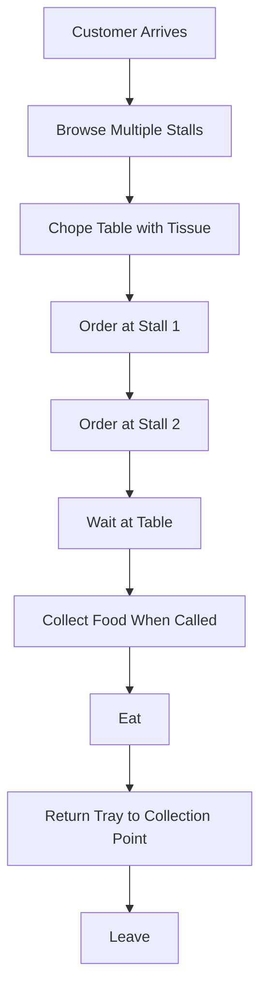
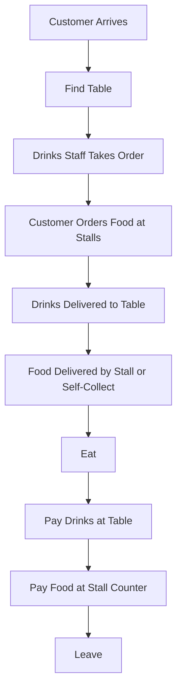

# F&B Business Processes - Southeast Asia Edition
## Complete Guide to Food & Beverage Operations in SEA

> [!IMPORTANT]
> **Why This Matters**: Understanding SEA F&B operations is essential for building relevant BI solutions for this unique market. This guide covers business models, workflows, and metrics specific to Southeast Asian food businesses.
>
> **Read this BEFORE or alongside Phase 5** of your BI curriculum.
>
> **🤖 AI-Aided Learning**: While reading this guide, use AI to:
> - **💡 Ask AI**: "Explain [any SEA F&B concept] in simple terms"
> - **⚡ AI Generate**: "Create realistic scenario showing [SEA F&B situation]"
> - **💡 Ask AI**: "Why does [metric] matter for SEA F&B profitability?"
> - **⚡ AI Generate**: "Generate sample data demonstrating [SEA F&B pattern]"
>
> See [AI_LEARNING_GUIDE.md](../ai-guided-learning_guide.md) for full AI assistance strategies.

---

## Table of Contents
1. [SEA F&B Business Overview](#sea-fb-business-overview)
2. [Front of House (FOH) Operations](#front-of-house-foh-operations)
3. [Back of House (BOH) Operations](#back-of-house-boh-operations)
4. [Supply Chain & Inventory](#supply-chain--inventory-management)
5. [Financial Management](#financial-management)
6. [Customer Journey](#customer-journey--experience)
7. [Staff Management](#staff-management)
8. [Technology Systems](#technology-systems)
9. [Daily/Weekly/Monthly Workflows](#dailyweeklymonthly-workflows)
10. [Pain Points & Where BI Helps](#pain-points--where-bi-helps)

---

## SEA F&B Business Overview

### Unique Characteristics of SEA F&B Market

**Key Differences from Western Markets**:
- **Lower price points** - Average meal: $2-8 USD (vs $10-30 Western)
- **Higher volume** - More transactions, smaller margins
- **Cash-dominant** - Though digital payments growing rapidly
- **Family-run businesses** - Multi-generational operations common
- **Street food culture** - Outdoor/semi-outdoor dining prevalent
- **Communal dining** - Sharing style, round tables
- **Wet markets** - Daily fresh ingredient sourcing
- **Hawker/kopitiam model** - Centralized seating, multiple vendors

---

### Business Models in SEA F&B

#### 1. Hawker Centers / Food Courts (Singapore, Malaysia)
**Examples**: Maxwell Food Centre (SG), Gurney Drive (MY)

**Characteristics**:
- **Centralized seating**, multiple independent stalls
- **Very low average check**: $3-6 SGD per pax
- **High volume**: 500-2000 customers/day per center
- **Minimal service**: Self-service, tissue paper "chope" system
- **Cash + digital**: Cash still dominant, QR codes growing
- **Government subsidized** (Singapore) or private (Malaysia)

**Business Model**:
- **Stall operators** pay monthly rent to center operator
- **Each stall** = independent business with own menu
- **Shared infrastructure**: tables, chairs, cleaning
- **No table service**: Customers order at stall, collect food

**Key Success Metrics**:
- Stall rental yield
- Average transaction value
- Queue time (indicator of popularity)
- Ingredient turnover (freshness)
- Repeat customer rate

**Data Generated**:
- Individual stall sales (if using POS)
- Peak hour patterns (lunch 12-2pm, dinner 6-8pm)
- Popular items (queue length proxy)
- Payment method split
- Customer dwell time

---

#### 2. Kopitiam / Coffee Shop (Malaysia, Singapore)
**Examples**: Traditional neighborhood kopitiams

**Characteristics**:
- **Coffee shop owner** rents out stall spaces
- **Multiple food vendors** + drinks stall (kopitiam operator)
- **Average check**: $4-8 per pax
- **Neighborhood clientele**: regulars, daily breakfast crowd
- **Table service** for drinks, self-service for food
- **Dine-in only**: rare takeaway culture

**Business Model**:
- **Kopitiam operator**: Owns space, operates drinks stall
- **Food stall tenants**: Pay rent + percentage/utilities
- **Revenue split**: Drinks (kopitiam) + rent from stalls
- **Social hub**: Regulars meet daily

**Key Success Metrics**:
- Drinks sales per table turn
- Stall occupancy rate
- Average customer frequency
- Rent collection vs market rate

**Data Generated**:
- Drinks orders (main revenue for kopitiam owner)
- Peak times (breakfast 7-10am, lunch, dinner)
- Regular customer patterns
- Table turnover

---

#### 3. Street Food Stalls / Roadside Vendors
**Examples**: Satay stalls, char kway teow carts, roti canai vendors

**Characteristics**:
- **Portable or semi-permanent** setup
- **Ultra-low overhead**: $500-2000/month
- **Hyper-specialized**: Often selling 1-3 items only
- **Cash only** (mostly)
- **No/minimal seating**: Plastic stools, roadside tables
- **Operating hours**: Often evening/night only
- **Permit requirements**: Varies by location

**Business Model**:
- **Minimal investment**: Cart, cooking equipment
- **Location dependent**: Foot traffic is everything
- **High turnover, low margin**: Volume game
- **Family operated**: Often husband-wife team

**Key Success Metrics**:
- Daily cash revenue
- Ingredient cost %
- Location foot traffic
- Weather dependency

**Data Generated** (mostly manual):
- Daily sales tally
- Popular items sold out times
- Ingredient usage
- Waste (unsold items)

---

#### 4. Mamak Shop (Malaysia)
**Examples**: 24-hour corner mamak restaurants

**Characteristics**:
- **Indian Muslim operated**
- **24/7 operation**: Peak at supper (11pm-2am)
- **Diverse menu**: Roti, nasi lemak, fried rice, teh tarik
- **Fast service**: 5-10 minute wait
- **Affordable**: $2-6 per meal
- **Social gathering spot**: Soccer watching, late night meals

**Business Model**:
- **Owner-operated** with hired staff
- **High volume, thin margins**
- **Open 24 hours**: Unique competitive advantage
- **Beverage profit driver**: Teh tarik, Milo
- **Dine-in + takeaway**

**Key Success Metrics**:
- Revenue by daypart (breakfast, lunch, dinner, supper)
- Beverage attach rate
- Table turnover
- Labor cost % (24hr staffing)

**Data Generated**:
- High transaction count
- Supper time revenue (competitive differentiator)
- Popular combos (roti + teh tarik)
- Staff shift productivity

---

#### 5. Warung / Warteg (Indonesia)
**Examples**: Small Indonesian eateries

**Characteristics**:
- **Display case service**: Pre-cooked dishes displayed
- **Pay by plate count**: Point at what you want
- **Very affordable**: Rp 15,000-30,000 per meal
- **Homestyle cooking**: Comfort food
- **No menu**: Visual selection
- **Rice base + sides**: Pick 2-3 dishes

**Business Model**:
- **Morning prep**: Cook all dishes before lunch rush
- **Serve until sold out**: No dinner if lunch sold well
- **Minimal staff**: Often solo owner + helper
- **Simple pricing**: Standard price per dish type

**Key Success Metrics**:
- Sell-through rate (minimize waste)
- Prep accuracy (right quantity)
- Customer throughput
- Food cost (ingredient sourcing)

**Data Generated**:
- Dishes sold out time
- Popular dish combinations
- Prep vs actual sales variance
- Daily revenue cash count

---

#### 6. Casual Dining Chains (Regional)
**Examples**: Old Town White Coffee, PappaRich, The Chicken Rice Shop

**Characteristics**:
- **Standardized menu** across locations
- **Mid-range pricing**: $8-15 per pax
- **Air-conditioned**: Indoor seating
- **Table service**: Waitstaff, POS systems
- **Franchise model**: Mix of company-operated and franchised

**Business Model**:
- **Chain operations**: Central kitchen (some items)
- **Standard recipes**: Consistent quality
- **Digital presence**: Apps, delivery integration
- **Franchise fees**: Initial + ongoing royalties

**Key Success Metrics**:
- Same-store sales growth
- Average check size
- Labor cost % (trained staff needed)
- Franchise compliance
- Delivery mix %

**Data Generated**:
- POS transaction data
- Location performance comparison
- Menu item popularity by region
- Delivery vs dine-in split
- Customer loyalty program data

---

## Front of House (FOH) Operations

### SEA-Specific FOH Workflows

#### Hawker Center Model



**Key Timing**:
- **Browse time**: 5-15 minutes (deciding what to eat)
- **Order time per stall**: 2-5 minutes
- **Food prep**: 5-15 minutes depending on item
- **Eating time**: 15-30 minutes
- **Total dwell**: 30-60 minutes

**Unique Aspects**:
- **"Chope" culture**: Reserve seats with tissue packet/umbrella
- **Tray return**: Increasingly mandatory in Singapore
- **No table service**: Customers collect own food
- **Multiple vendors**: One meal from 2-3 different stalls

---

#### Kopitiam Service Flow



**Key Timing**:
- **Table finding**: 1-5 minutes
- **Drinks order**: 1-2 minutes
- **Food ordering**: Walking to stalls, 5-10 min total
- **Drinks delivery**: 3-5 minutes
- **Food prep**: 10-20 minutes
- **Eating**: 20-40 minutes
- **Payment**: Split payment at end

**Unique Aspects**:
- **Drinks ordering first**: Table service by kopitiam staff
- **Split payment**: Drinks to kopitiam, food to stall
- **Regular orders**: Staff know regulars' usual orders
- **Cash collection**: Drinks staff carries cash pouch

---

#### Mamak Shop Service

**24-Hour Operation Shifts**:
- **Morning** (6am-2pm): Breakfast crowd, roti orders
- **Afternoon** (2pm-6pm): Slow period, prep for dinner
- **Evening** (6pm-11pm): Dinner rush
- **Supper** (11pm-6am): **Peak period** - post-pub, soccer watchers

**Service Flow**:
1. Seat yourself
2. Staff (often on roller skates!) takes order
3. Shout order to kitchen ("Roti kosong satu!")
4. Food delivered fast (5-10 min)
5. Pay at counter when leaving

**Unique Aspects**:
- **Shouted orders**: Kitchen hears orders called out
- **Roller skates**: Some mamaks have staff on skates for speed
- **Soccer viewing**: TVs showing live matches
- **Instant service**: No waiting for server, they approach quickly

---

## Back of House (BOH) Operations

### SEA-Specific Kitchen Workflows

#### Wet Market Daily Sourcing

**Morning Routine** (4am-7am for many operations):
```
4:00am - Head to wet market
4:30am - Select fresh seafood (still moving = fresh!)
5:00am - Negotiate with vegetable vendors
5:30am - Buy meat from preferred butcher
6:00am - Return to shop
6:30am - Start prep work
```

**Why Wet Markets**:
- **Ultra-fresh**: Ingredients alive that morning
- **Negotiable prices**: Bulk buying, relationships
- **Cash transactions**: No credit terms
- **Visual selection**: Pick exact fish/vegetables
- **Cultural practice**: Trust in freshness

**Data Implications**:
- **Daily cost variance**: Prices fluctuate based on supply
- **Cash management**: Significant morning cash outlay
- **Inventory tracking**: Daily zero-based (no overnight stock)
- **Supplier relationships**: Not just price, but quality trust

---

#### High-Volume Wok Cooking

**Characteristics of Hawker/Kopitiam Cooking**:
- **Made to order**: No holding/warming (usually)
- **Wok hei**: High heat, must be fresh
- **Speed critical**: 3-8 minutes per dish
- **Muscle memory**: No timers, by feel/sound
- **Continuous production**: No pause during peak

**Setup**:
- **Mise en place**: All ingredients prepped and portioned
- **Assembly line**: Woks in sequence
- **Helper system**: Main chef + assistant prep
- **Cash box**: Right at the stall for payment

**Kitchen Timing Example** (Char Kway Teow stall):
- Order received: 0:00
- Prep ingredients: 0:00-0:30 (noodles, egg, protein)
- Wok cooking: 0:30-3:30 (high heat tossing)
- Plating: 3:30-4:00
- Serve: 4:00

**4 minutes per plate × 15 plates/hour = 60 customers/hour potential**

---

#### Pre-Cooked Display Service (Warung Model)

**Morning Prep** (5am-10am):
1. Cook all dishes in large batches
2. Display in glass cases
3. Keep warm (carefully to avoid spoilage)
4. Replenish as needed

**Service** (10am-3pm typically):
1. Customer points at desired dishes
2. Scoop onto plate with rice
3. Count plates/portions
4. Calculate price
5. Serve immediately

**Key Considerations**:
- **Food safety**: Maximum 4-6 hours display time
- **Temperature control**: Keep above 60°C or below 5°C
- **Waste management**: Unsold food end of day
- **Batch sizing**: Experience-based forecasting

---

## Supply Chain & Inventory Management

### SEA-Specific Supply Chain

#### Daily Fresh Model

**Typical for**: Street stalls, warungs, small kopitiams

**Flow**:
```
Day 0 Evening: Estimate tomorrow's needs based on today's sales
Day 1 Morning 4-6am: Buy from wet market
Day 1 Morning 6-9am: Prep ingredients
Day 1 Day: Serve until sold out
Day 1 Evening: Count cash, estimate for tomorrow
```

**Characteristics**:
- **Zero inventory overnight**: Everything used or discarded
- **Cash-based purchasing**: Pay at market daily
- **Minimal storage**: Small fridges, no large cold storage
- **Waste minimization**: Buy only what you can sell
- **Price flexibility**: Can adjust based on ingredient cost

**Data Tracking** (if any):
- Daily ingredient spend (cash basis)
- Daily revenue
- Simple margin: Revenue - Ingredient Cost - Rent - Utilities
- Manual logbook common

---

#### Partner/Wholesaler Model

**Typical for**: Established restaurants, chains

**Suppliers**:
- **Wet market vendors**: Fresh produce, seafood
- **Wholesalers**: Dry goods, frozen items
- **Specialized suppliers**: Halal meat, organic produce
- **Import items**: Cheese, wine, specialty ingredients

**Ordering**:
- **Daily**: Fresh seafood, vegetables
- **2-3x week**: Perishable proteins
- **Weekly**: Dry goods, frozen
- **Monthly**: Non-food (disposables, cleaning)

**Payment Terms**:
- **Wet market**: Cash daily
- **Wholesalers**: Net 7-14 days (if established)
- **New suppliers**: COD (cash on delivery)

---

#### Unique SEA Ingredients to Manage

**High-Rotation Fresh**:
- **Seafood**: Prawns, fish, squid (daily purchase)
- **Vegetables**: Kangkung, choy sum, long beans (daily)
- **Aromatics**: Garlic, shallots, chilies (2-3 days)
- **Herbs**: Laksa leaves, Thai basil (daily)

**Medium-Rotation**:
- **Proteins**: Chicken, pork, beef (every 2-3 days)
- **Eggs**: (weekly)
- **Tofu/tempeh**: (2-3 days)

**Long-Rotation**:
- **Spices**: Dried chilies, belacan, curry powder
- **Sauces**: Soy sauce, fish sauce, oyster sauce
- **Rice**: (monthly bulk buy)
- **Cooking oil**: (weekly to monthly)

---

## Financial Management

### SEA-Specific Financial Considerations

#### Cash Flow Management

**Unique Challenges**:
- **Cash-heavy operations**: 60-80% transactions still cash in many markets
- **Daily settlement**: Count cash nightly, bank next day
- **Theft risk**: Large cash amounts on premises
- **Change management**: Need small denominations
- **Digital growing**: QR codes (DuitNow, PayNow, GoPay) increasing

**Daily Cash Routine**:
```
6:00pm - Stop taking large bills
7:00pm - Start cash count during slow period
10:00pm - Close, final count
10:30pm - Match receipts to cash + digital
11:00pm - Store cash in safe, night deposit, or take home
Next morning - Bank deposit before market run
```

---

#### Cost Structure (Typical SEA F&B)

**Hawker Stall Example**:
```
Average Daily Revenue: SGD 800
Average Monthly Revenue: SGD 20,000

Costs:
- Ingredients: 35% = SGD 7,000
- Stall Rent: SGD 1,200 (6%)
- Utilities: SGD 300 (1.5%)
- Labor: SGD 3,000 (15%) - if hiring help
- Gas/cleaning: SGD 500 (2.5%)
- Misc: SGD 500 (2.5%)
Total Costs: SGD 12,500 (62.5%)

Net Profit: SGD 7,500 (37.5%)
```

**Notes**:
- **Higher margin** possible in hawker model vs restaurant
- **Labor optional**: Owner-operated = save 15%
- **Rent much lower**: vs commercial restaurant space
- **Simpler operations**: Lower overhead

---

**Kopitiam Drinks Stall Example**:
```
Average Daily Revenue: SGD 600 (drinks only)
Average Monthly: SGD 15,000

Costs:
- Beverages/ingredients: 25% = SGD 3,750
- Labor: 30% = SGD 4,500 (need staff for table service)
- Rent + utilities: 15% = SGD 2,250
- Others: 5% = SGD 750
Total Costs: SGD 11,250 (75%)

Net Profit: SGD 3,750 (25%)

Plus: Stall rental income (if kopitiam owner)
- 4 stalls × SGD 800/month = SGD 3,200
Total Profit: SGD 6,950
```

---

#### Pricing Strategy (SEA Context)

**Key Principles**:
- **Price perception**: SGD 5 vs 5.50 matters more than Western markets
- **Round numbers**: SGD 5, 6, 8 preferred over SGD 5.95
- **Psychological thresholds**:
  * <$5: Budget/cheap
  * $5-8: Average hawker
  * $8-12: Premium hawker/casual dining
  * >$12: Restaurant pricing
- **Competitive matching**: Check neighboring stalls
- **Portion size matters**: Generous portions expected at hawker level

**Pricing Calculation**:
```
Ingredient Cost: SGD 1.80
Target Food Cost %: 30-35%
Calculated Price: SGD 1.80 / 0.30 = SGD 6.00
Market Price: Check competitors (SGD 5.50-6.50)
Final Price: SGD 6.00 (if quality justifies) or SGD 5.50 (if matching market)
```

---

## Key SEA F&B Metrics & KPIs

### Unique to SEA Context

**Daily Cash Collection**
```
Target: Match or exceed yesterday
Track: 7-day moving average
Alert: 15% below weekly average
```

**Wet Market Spend Ratio**
```
Formula: Daily Market Spend / Daily Revenue
Target: 25-35% (Fresh ingredients)
Track: Daily
Note: Fluctuates with market prices
```

**Sell-Through Rate** (for pre-cooked models)
```
Formula: Items Sold / Items Prepared × 100
Target: >90%
Importance: Minimize waste in display service
```

**Peak Hour Capacity**
```
Formula: Customers Served / Peak Hour
Track: Queue length proxy, kitchen capacity
Opportunity: If always sold out = can increase capacity/price
```

**Digital Payment Adoption**
```
Formula: QR/Digital Transactions / Total Transactions × 100
Track: Monthly
Trend: Growing 5-10% yearly in SEA
```

---

## Pain Points & Where BI Helps

### Common SEA F&B Challenges

#### 1. Inventory Wastage (Fresh Ingredients)
**Problem**: Over-purchase from wet market = waste

**BI Solution**:
- Track daily sales by item
- Forecast next-day needs based on day-of-week patterns
- Alert when projected sales < typical purchases
- **Dashboard**: "Tomorrow's Market Shopping List" based on moving average

---

#### 2. Cash Discrepancies
**Problem**: End-of-day cash doesn't match sales

**BI Solution**:
- Compare POS/manual tally vs actual cash count
- Track discrepancy patterns by staff shift
- Alert when variance >5%
- **Dashboard**: Daily cash reconciliation report

---

#### 3. Staff Productivity (24hr operations)
**Problem**: Which shifts are efficient? Overstaffed?

**BI Solution**:
- Sales per labor hour by shift
- Compare dayparts (breakfast vs supper)
- Optimal staffing recommendations
- **Dashboard**: Shift performance comparison

---

#### 4. Menu Engineering (Limited Kitchen Space)
**Problem**: Which items to keep? Which to remove?

**BI Solution**:
- Sales frequency × Profit margin matrix
- Prep time vs profit analysis
- Customer favorites vs profit drivers
- **Dashboard**: Menu optimization matrix

---

#### 5. Location Performance (Multiple Stalls/Outlets)
**Problem**: Which locations performing? Why?

**BI Solution**:
- Same-size comparison across locations
- Identify best practices from top performers
- Benchmark metrics across outlets
- **Dashboard**: Multi-location performance scorecard

---

## Technology Adoption in SEA F&B

### Current State (2026)

**POS Systems**:
- **High-end**: iPad POS (Lightspeed, Square), 20-30% adoption
- **Mid-range**: Local POS systems (StoreHub, Qashier), 30-40%
- **Low-end**: Manual cash register + notebook, 30-50%

**Digital Payments**:
- **Singapore**: PayNow, GrabPay, credit cards (70%+ digital)
- **Malaysia**: DuitNow, Touch 'n Go, GrabPay (40-50% digital)
- **Indonesia**: GoPay, OVO, QRIS (30-40% digital growing fast)
- **Thailand**: PromptPay, TrueMoney (50%+ digital)

**Delivery Integration**:
- GrabFood, Foodpanda dominant
- 30-50% of casual dining revenue
- Commission: 25-35% (heavy cost for merchants)

**Loyalty/CRM**:
- Mostly chain restaurants
- WeChat/LINE integration common
- WhatsApp business growing

---

## SEA-Specific BI Dashboard Ideas

### 1. Wet Market Optimizer Dashboard
**For**: Daily fresh ingredient buyers

**KPIs**:
- Tomorrow's recommended buy list
- Historical ingredient prices
- Sell-through rate by ingredient
- Waste cost this week
- Best-performing days to size purchases

---

### 2. Cash vs Digital Tracker
**For**: All SEA F&B operators

**KPIs**:
- Payment method split
- Digital payment trends
- Cash handling time saved
- Transaction fees vs cash risk
- Customer payment preferences

---

### 3. Multi-Stall Performance (Hawker)
**For**: Hawker center operators

**KPIs**:
- Revenue per stall
- Foot traffic patterns
- Rent vs market rate
- Cleanliness scores
- Popular food categories

---

### 4. 24-Hour Operations Dashboard
**For**: Mamak shops, 24hr eateries

**KPIs**:
- Revenue by hour of day
- Supper time performance (key differentiator)
- Labor cost by shift
- Popular items by daypart
- Peak hour staffing optimization

---

## Conclusion

SEA F&B operations have unique characteristics that require adapted BI approaches:

- **Cash management** critical
- **Daily fresh sourcing** = dynamic costs
- **High volume, low margin** = efficiency focus
- **Cultural factors** = communal dining, hawker culture
- **Digital transition** = track adoption
- **Weather dependency** = outdoor dining impact

Understanding these nuances is essential for building relevant BI dashboards for the SEA market.

---

*Last Updated: January 2026*
*Covers: Singapore, Malaysia, Indonesia, Thailand, and regional practices*
