# F&B Business Processes Masterclass
## Complete Guide to Food & Beverage Operations

> [!IMPORTANT]
> **Why This Matters**: You cannot build effective BI dashboards without understanding the business. This guide teaches you how F&B businesses actually work, what processes generate data, and where insights matter most.
>
> **Read this BEFORE or alongside Phase 5** of your BI curriculum.
>
> **🤖 AI-Aided Learning**: While reading this guide, use AI to:
> - **💡 Ask AI**: "Explain [any F&B concept] in simple terms"
> - **⚡ AI Generate**: "Create realistic scenario showing [F&B situation]"
> - **💡 Ask AI**: "Why does [metric] matter for F&B profitability?"
> - **⚡ AI Generate**: "Generate sample data demonstrating [F&B pattern]"
>
> See [AI_LEARNING_GUIDE.md](../AI_LEARNING_GUIDE.md) for full AI assistance strategies.

---

## Table of Contents
1. [F&B Business Overview](#fb-business-overview)
2. [Front of House (FOH) Operations](#front-of-house-foh-operations)
3. [Back of House (BOH) Operations](#back-of-house-boh-operations)
4. [Supply Chain & Inventory Management](#supply-chain--inventory-management)
5. [Financial Management](#financial-management)
6. [Customer Journey & Experience](#customer-journey--experience)
7. [Staff Management](#staff-management)
8. [Technology Systems](#technology-systems)
9. [Daily/Weekly/Monthly Workflows](#dailyweeklymonthly-workflows)
10. [Pain Points & Where BI Helps](#pain-points--where-bi-helps)

---

## F&B Business Overview

### Business Models in F&B

#### 1. Quick Service Restaurant (QSR) / Fast Food
**Examples**: McDonald's, Subway, Chipotle

**Characteristics**:
- High volume, low average check ($5-15)
- Speed is critical (< 5 minutes from order to delivery)
- Limited menu for operational efficiency
- Counter service, minimal table service
- High turnover, high throughput
- Standardized processes

**Key Success Metrics**:
- Speed of service
- Order accuracy
- Labor efficiency
- Food cost control

**Data Generated**:
- High transaction volume
- Precise timing data (order → fulfillment)
- Standardized portion/recipe data
- Drive-through metrics (if applicable)

---

#### 2. Fast Casual
**Examples**: Panera Bread, Five Guys, Sweetgreen

**Characteristics**:
- Higher quality than QSR ($10-20 average check)
- Fresher ingredients, customization
- Counter ordering but better ambiance
- Moderate speed expectations (5-10 minutes)
- Somewhere between fast food and full service

**Key Success Metrics**:
- Food quality perception
- Customization accuracy
- Moderate table turnover
- Customer loyalty

**Data Generated**:
- Customization patterns
- Peak hour analysis
- Quality tracking (customer feedback)
- Ingredient usage variability

---

#### 3. Casual Dining / Full Service
**Examples**: Applebee's, Olive Garden, local diners

**Characteristics**:
- Table service with servers ($15-30 average check)
- Broader menu variety
- Longer dining experience (45-90 minutes)
- Focus on experience and service quality
- Alcoholic beverage sales important

**Key Success Metrics**:
- Table turnover rate
- Server performance (sales per server)
- Average check size
- Food AND beverage mix

**Data Generated**:
- Server-level sales data
- Table timing (seat → order → serve → pay → vacate)
- Beverage attach rate
- Reservation vs. walk-in patterns

---

#### 4. Fine Dining
**Examples**: Michelin-starred restaurants, high-end establishments

**Characteristics**:
- Premium pricing ($50-300+ per person)
- Exceptional service and ambiance
- Complex preparations, seasonal menus
- Reservation-based
- Lower volume, very high quality
- Wine program emphasis

**Key Success Metrics**:
- Customer experience scores
- Food cost on premium ingredients
- Wine sales and pairing success
- Reservation fill rate

**Data Generated**:
- Detailed reservation data
- Guest preferences and history
- Complex recipe costing
- Seasonal menu performance

---

#### 5. Cafe / Bakery
**Examples**: Starbucks, local coffee shops, bakeries

**Characteristics**:
- Coffee and baked goods primary ($5-12 average)
- Morning peak heavy
- Grab-and-go + limited seating
- High volume morning, slower afternoon
- Retail component (packaged goods)

**Key Success Metrics**:
- Morning rush efficiency
- Retail vs. prepared mix
- Customer frequency
- Waste minimization (baked goods)

**Data Generated**:
- Strong daypart patterns
- Product lifecycle (fresh vs. day-old)
- Loyalty program data
- Retail inventory

---

#### 6. Cloud Kitchen / Ghost Kitchen
**Examples**: Virtual brands on DoorDash, Uber Eats

**Characteristics**:
- Delivery-only, no dine-in
- Lower overhead (no dining room)
- Menu optimized for delivery
- Multiple virtual brands from one kitchen
- 100% third-party platform orders

**Key Success Metrics**:
- Delivery partner ratings
- Food travel quality
- Order accuracy
- Prime time fulfillment speed

**Data Generated**:
- Platform performance data
- Delivery zones and times
- Virtual brand performance comparison
- Packaging costs

---

## Front of House (FOH) Operations

### The Customer Service Side

Front of House includes everything customer-facing: greeting, seating, ordering, serving, and payment.

### FOH Roles

1. **Host/Hostess**
   - Greet guests
   - Manage waitlist and reservations
   - Seat guests efficiently
   - Manage table rotation
   - **Data Generated**: Wait times, party sizes, table allocation

2. **Servers/Wait Staff**
   - Take orders
   - Serve food and beverages
   - Upsell and recommend
   - Handle guest requests
   - Process payments
   - **Data Generated**: Sales per server, tips, upsell success, table times

3. **Bartender**
   - Prepare drinks for bar and floor
   - Serve bar guests
   - Manage bar inventory
   - Check IDs
   - **Data Generated**: Drink sales, pour costs, bar vs. floor mix

4. **Busser**
   - Clear and reset tables
   - Support servers
   - Keep dining area clean
   - **Data Generated**: Table turnover support (timing)

5. **Food Runner** (some establishments)
   - Deliver food from kitchen to table
   - Ensure order accuracy
   - **Data Generated**: Kitchen-to-table timing

6. **Cashier** (counter service)
   - Take orders
   - Process payments
   - **Data Generated**: Transaction volume, speed, payment methods

---

### FOH Process Flow - Full Service Restaurant


**Key Timing Metrics**:
- **Greeting Time**: How long until server greets after seating (target: < 2 min)
- **Drink Time**: Drinks delivered (target: < 5 min)
- **Order Time**: Food order taken (target: < 10 min from seating)
- **Food Time**: Food delivered from kitchen (target: depends on items, 15-25 min)
- **Table Time**: Total time at table (varies, 45-90 min typical)
- **Turn Time**: Table cleared and ready for next guest (target: < 10 min)

---

### FOH Process Flow - Quick Service (Counter)


**Key Timing Metrics**:
- **Queue Time**: Wait in line (target: < 3 min)
- **Order Time**: Taking order and payment (target: < 2 min)
- **Fulfillment Time**: Order ready (target: < 5 min)
- **Total Time**: Entry to exit (target: < 10 min for QSR)

---

### FOH Critical Workflows & Data

#### 1. Table Management (Full Service)
**Process**:
- Host maintains table status: available, occupied, needs bussing
- Balances server sections
- Manages reservations vs. walk-ins
- Controls seating pace (not overwhelming kitchen)

**Data Captured**:
- Table number, party size, arrival time
- Server assignment
- Special requests (high chair, booth, etc.)
- Estimated wait times

**Analytics Opportunities**:
- Optimal table mix (2-top vs. 4-top usage)
- Server section balancing
- Reservation vs. walk-in patterns
- Average party size trends

---

#### 2. Order Taking
**Process**:
- Server records order via POS
- Includes modifications, allergies, preferences
- Organized by course (apps, mains, desserts)
- Sent to appropriate stations (kitchen, bar)

**Data Captured**:
- Every item ordered
- Modifications and special requests
- Order time and server ID
- Linked to table/check

**Analytics Opportunities**:
- Menu item popularity
- Modification patterns
- Upsell success rates
- Server performance (items/check)

---

#### 3. Service Execution
**Process**:
- Coordinate food delivery (all entrees together)
- Beverage refills
- Check-backs for satisfaction
- Additional orders

**Data Captured**:
- Service milestones (drinks delivered, food delivered)
- Additional/forgotten items
- Complaints or issues

**Analytics Opportunities**:
- Service quality timing
- Server efficiency
- Problem frequency by item

---

#### 4. Payment Processing
**Process**:
- Server presents check
- Guest chooses payment method
- Server processes payment
- Tip recorded (if applicable)
- Receipt provided

**Data Captured**:
- Payment method (cash, credit, split)
- Tip amount and percentage
- Discounts or comps applied
- Total transaction value

**Analytics Opportunities**:
- Server tip performance
- Payment method trends
- Average check by daypart
- Discount usage

---

## Back of House (BOH) Operations

### The Production Side

Back of House includes all food preparation, cooking, plating, and kitchen management.

### BOH Roles

1. **Executive Chef / Head Chef**
   - Menu development
   - Recipe creation and costing
   - Quality control
   - Kitchen management
   - **Data Impact**: Food cost %, menu profitability, quality standards

2. **Sous Chef**
   - Second in command
   - Direct kitchen operations
   - Scheduling and training
   - Inventory management support
   - **Data Impact**: Labor scheduling, team productivity

3. **Line Cooks** (by station)
   - **Grill**: Meats, seafood
   - **Sauté**: Pan dishes
   - **Fry**: Fried items
   - **Prep**: Vegetables, mise en place
   - **Pantry/Cold**: Salads, cold apps
   - **Expeditor**: Coordinates orders, quality check before serving
   - **Data Generated**: Station timing, waste, item accuracy

4. **Prep Cooks**
   - Daily prep work
   - Chopping, portioning, marinating
   - Stock and sauce preparation
   - **Data Generated**: Prep quantities, waste

5. **Dishwasher**
   - Clean dishes, utensils, cookware
   - Maintain sanitation
   - **Data Impact**: Operational flow (clean plates = can serve)

---

### BOH Process Flow

```mermaid
graph TD
    A[Order Received from FOH] --> B[Expeditor Reviews]
    B --> C[Tickets to Stations]
    C --> D1[Grill Station]
    C --> D2[Sauté Station]
    C --> D3[Fry Station]
    C --> D4[Cold Station]
    D1 --> E[Expeditor Checks Quality]
    D2 --> E
    D3 --> E
    D4 --> E
    E --> F{Quality OK?}
    F -->|Yes| G[Plate & Garnish]
    F -->|No| H[Refire Item]
    H --> E
    G --> I[Food Runner Pickup]
    I --> J[Delivered to Guest]
```



---

### BOH Critical Workflows & Data

#### 1. Prep Workflow (Daily)
**Process** (typically morning or between services):
- Review prep list based on:
  - Par levels (how much should be ready)
  - Today's reservations
  - Historical sales patterns
  - Upcoming events
- Prep ingredients:
  - Wash, chop, portion vegetables
  - Marinate proteins
  - Make sauces, stocks
  - Portion ingredients (measured portions for consistency)
- Store properly labeled with dates

**Data Captured**:
- Quantities prepped by item
- Prep time (labor)
- Waste during prep

**Analytics Opportunities**:
- Prep accuracy (did we make enough?)
- Labor efficiency
- Waste patterns

---

#### 2. Service/Cooking Workflow
**Process**:
- Ticket arrives at kitchen
- Expeditor calls out order and timing
- Each station prepares assigned items
- Communication to coordinate timing ("Fire table 7 mains!")
- All items for a table ready simultaneously
- Expeditor checks each plate for:
  - Correct item and modifications
  - Proper cooking (temp, doneness)
  - Presentation/plating
  - Proper temperature
- Runner takes to table

**Data Captured**:
- Ticket in/out time (cook time)
- Refires (items cooked wrong)
- Rush orders or priorities
- Order modifications

**Analytics Opportunities**:
- Kitchen efficiency (ticket times)
- Peak hour prep capacity
- Error rates by item
- Station bottlenecks

---

#### 3. Recipe Management & Portioning
**Process**:
- Every menu item has a standardized recipe:
  - Exact ingredients and quantities
  - Preparation steps
  - Plating instructions
  - Portion sizes
- Cooks must follow precisely
- Ensures consistency and controls food cost

**Example Recipe Card**:
```
Item: Grilled Salmon with Lemon Butter
Portion: 1 serving

Ingredients:
- Salmon fillet, 6 oz
- Olive oil, 0.5 oz
- Salt, pinch
- Pepper, pinch  
- Lemon butter sauce, 2 oz
- Seasonal vegetables, 4 oz
- Rice pilaf, 4 oz
- Lemon wedge, 1
- Parsley garnish

Plate Cost: $6.45
Selling Price: $24.99
Food Cost %: 25.8%
Prep Time: 2 min
Cook Time: 8 min
```

**Data Captured**:
- Every ingredient cost
- Portion sizes
- Recipe yield
- Theoretical food cost

**Analytics Opportunities**:
- Menu profitability by item
- Ingredient usage tracking
- Food cost variance (theoretical vs. actual)
- Price optimization

---

#### 4. Quality Control
**Process**:
- Visual inspection of every plate
- Temperature checks for proteins
- Taste tests throughout service
- Addressing guest complaints
- Food safety compliance

**Data Captured**:
- Food sent back
- Comp'd meals
- Quality issues noted

**Analytics Opportunities**:
- Quality issue patterns
- Which items have problems
- Cook/station error rates

---

## Supply Chain & Inventory Management

### The Lifeblood of F&B

Food cost is typically 28-35% of revenue, making supply chain management critical.

### Inventory Workflow


---

### Key Processes

#### 1. Forecasting & Ordering
**Process**:
- **Review Par Levels**: Each ingredient has a par (minimum quantity to keep on hand)
  - Example: "Keep 40 lbs of chicken breast"
- **Check Current Inventory**: Physical count or system check
- **Calculate Order Quantity**: Par - Current + Safety Buffer
- **Review Upcoming Events**: Catering, holidays, promotions
- **Place Orders** with suppliers (typically multiple suppliers):
  - Proteins: meat/seafood distributor
  - Produce: produce supplier
  - Dry goods: broadline distributor
  - Beverages: beverage distributor
  - Specialty: various specialty vendors

**Frequency**: 
- Proteins: 2-3x/week (freshness)
- Produce: Daily or every other day
- Dry goods: Weekly
- Beverages: Weekly

**Data Captured**:
- Order dates and quantities
- Supplier and pricing
- Expected delivery dates
- Special requests

**Analytics Opportunities**:
- Order pattern optimization
- Supplier performance
- Price variance tracking
- Forecast accuracy

---

#### 2. Receiving
**Process**:
- Delivery arrives at scheduled time
- Receiving staff inspects:
  - Correct items and quantities
  - Quality (temperature, freshness, damage)
  - Proper packaging
  - Match to invoice
- Reject unsuitable items
- Record receipt in system
- Move to proper storage immediately

**Data Captured**:
- Actual quantities received
- Pricing on invoice
- Quality issues/rejections
- Delivery timing

**Analytics Opportunities**:
- Supplier quality tracking
- Price fluctuations
- Shrinkage (ordered vs. received)

---

#### 3. Storage & Organization
**Process**:
- **FIFO (First In, First Out)**: Older stock used first
- Proper storage by type:
  - **Dry Storage**: Ambient, organized by category
  - **Refrigeration (36-40°F)**: Produce, dairy, prepared items
  - **Freezer (0°F or below)**: Frozen items
  - **Alcohol Storage**: Secure, organized by type
- Everything labeled with:
  - Item name
  - Receive date
  - Use-by date (if applicable)
- Organization matters: accessibility, space utilization

**Data Captured**:
- Storage locations
- Date tracking
- Temperature logs (food safety requirement)

**Analytics Opportunities**:
- Rotation compliance
- Storage space optimization
- Temperature excursions

---

#### 4. Inventory Tracking
**Process**:
- **Perpetual Inventory** (ideal): System tracks every item in/out
  - Items added when received
  - Items deducted when used in recipes
  - Real-time inventory levels
- **Periodic Inventory** (reality for many): Regular physical counts
  - Daily: High-value items (prime steaks, lobster)
  - Weekly: Most food items
  - Monthly: Dry goods, low-turnover items
- **Reconciliation**: Compare theoretical (system) vs. actual (count)
- Investigate variances

**Data Captured**:
- Opening inventory
- Purchases
- Sales (theoretical usage via recipes)
- Closing inventory
- Variance (waste, theft, errors)

**Analytics Opportunities**:
- **Inventory Turnover**: COGS / Average Inventory
  - Target: 2-4x per week for fresh items
  - Higher = fresher, less capital tied up
- Days of inventory on hand
- Variance analysis
- Slow-moving item identification

---

#### 5. Waste Management
**Process**:
- Track all waste:
  - **Prep Waste**: Unusable parts (bones, peels, trim)
  - **Spoilage**: Items that expired or went bad
  - **Mistakes**: Incorrectly prepared items
  - **Over-Prep**: Made too much, couldn't use
  - **Customer Returns**: Food sent back
- Document reason and quantity
- Weekly waste meetings to address patterns

**Data Captured**:
- Waste quantity by item
- Waste reason/category
- Waste cost
- Who recorded it (accountability)

**Analytics Opportunities**:
- Waste % by category
- Most-wasted items
- Trend analysis (improving or worsening?)
- ROI of waste reduction efforts

**Target**: Keep waste under 4-6% of total food purchases

---

## Financial Management

### The Business Side

#### Key Financial Processes

### 1. Daily Sales Reconciliation
**Process** (end of day):
- Pull total sales from POS
- Reconcile cash:
  - Starting cash (bank)
  - + Cash sales
  - - Cash paid out
  - = Expected cash
  - Count actual cash
  - Investigate variance (should be $0)
- Reconcile credit cards
- Record total sales
- Prepare bank deposit

**Data Captured**:
- Sales by payment type
- Cash overages/shortages
- Daily sales totals
- Server checkout details

---

### 2. Cost Tracking
**Process**:
- **Food Cost Calculation** (weekly or monthly):
  ```
  Beginning Inventory
  + Purchases
  - Ending Inventory
  - Employee Meals
  - Waste/Comps
  = Cost of Goods Sold (COGS)
  
  Food Cost % = COGS / Food Sales × 100
  ```
  
- **Labor Cost Calculation** (weekly/biweekly):
  ```
  Total Labor Cost (wages + taxes + benefits)
  / Total Sales × 100 = Labor Cost %
  ```
  
- **Prime Cost** (most important metric):
  ```
  Prime Cost = COGS + Labor
  Prime Cost % = Prime Cost / Sales × 100
  ```
  Target: Under 60%

**Data Captured**:
- All purchases and invoices
- Inventory values
- Payroll hours and wages
- Sales data

**Analytics Opportunities**:
- Cost trend analysis
- Budget vs. actual variance
- Cost control effectiveness
- Pricing strategy validation

---

### 3. Budgeting & Forecasting
**Process**:
- **Revenue Forecast**: Based on historical data, seasonality, events
- **Expense Budget**: 
  - Fixed costs: rent, insurance, utilities
  - Variable costs: food, labor (scale with sales)
- **Profit Projection**: Revenue - Expenses
- Monthly budget meetings
- Adjust operations to hit targets

**Data Captured**:
- Budget vs. actual (all categories)
- Forecast accuracy
- Seasonal patterns

---

### 4. Profit & Loss (P&L) Statement
**Monthly financial report showing**:

```
REVENUE
  Food Sales:              $100,000
  Beverage Sales:          $30,000
  Total Revenue:           $130,000

COST OF GOODS SOLD
  Food Cost:               $30,000    (30%)
  Beverage Cost:           $6,000     (20%)
  Total COGS:              $36,000    (27.7%)

GROSS PROFIT:              $94,000    (72.3%)

OPERATING EXPENSES
  Labor:                   $42,000    (32.3%)
  Rent:                    $8,000     (6.2%)
  Utilities:               $3,500     (2.7%)
  Marketing:               $2,000     (1.5%)
  Supplies:                $2,500     (1.9%)
  Maintenance:             $1,500     (1.2%)
  Insurance:               $1,200     (0.9%)
  Other:                   $3,300     (2.5%)
  Total Op Expenses:       $64,000    (49.2%)

EBITDA:                    $30,000    (23.1%)

Depreciation:              $2,000
Interest:                  $1,000

NET PROFIT:                $27,000    (20.8%)
```

**Analytics Opportunities**:
- Month-over-month trends
- Category deep dives
- Ratio benchmarking
- Profit improvement initiatives

---

## Customer Journey & Experience

### Understanding the Guest Perspective


### Touchpoints & Data

1. **Awareness**: Social media, reviews, ads, referrals
   - **Data**: Marketing source tracking, referral codes

2. **Consideration**: Menu browsing, reviews reading, comparing options
   - **Data**: Website analytics, review engagement

3. **Decision**: Making reservation or choosing to walk in
   - **Data**: Reservation source (phone, app, website), party size, time

4. **Pre-Arrival**: Confirmation, directions, anticipation
   - **Data**: Confirmation emails opened, SMS responses

5. **Arrival**: Parking, entrance, greeting
   - **Data**: Wait time if applicable, host notes

6. **Ordering**: Menu browsing, asking questions, ordering
   - **Data**: Time to order, items selected, modifications

7. **Dining**: Food quality, service, ambiance
   - **Data**: Service timing, refills, issues noted

8. **Payment**: Bill accuracy, payment ease, tipping
   - **Data**: Check amount, tip %, payment method

9. **Departure**: Farewell, satisfaction
   - **Data**: Host interactions, feedback forms

10. **Post-Visit**: Reviews, social sharing, returning
    - **Data**: Review sentiment, social mentions, return rate

---

## Staff Management

### People Are Your Biggest Asset (and Expense)

#### Scheduling Process
**Weekly Workflow**:
1. **Forecast Sales** for upcoming week
2. **Calculate Labor Needs** based on forecast:
   - Covers required by daypart
   - Skill mix needed (experienced vs. new staff)
3. **Build Schedule**:
   - Balance labor cost % target (typically 25-32%)
   - Employee availability and requests
   - Labor laws (breaks, max hours, overtime)
   - Fair distribution of shifts
4. **Publish Schedule** (usually 1-2 weeks advance)
5. **Adjust for Changes**: Call-outs, sudden busy/slow periods

**Data Captured**:
- Scheduled hours by role
- Actual hours worked
- Overtime hours
- Labor cost $ and %
- Sales per labor hour

**Analytics Opportunities**:
- Labor efficiency optimization
- Best performers identification
- Understaffing/overstaffing analysis
- Forecast accuracy improvement

---

#### Performance Management
**Metrics by Role**:

**Servers**:
- Sales per shift
- Average check size (upselling ability)
- Table turnover rate
- Customer complaints
- Tip average (customer satisfaction proxy)

**Cooks**:
- Ticket time (speed)
- Order accuracy
- Waste rates
- Quality complaints

**Management**:
- Overall restaurant performance
- Team retention
- Cost control
- Customer satisfaction scores

**Data Captured**:
- Individual performance metrics
- Training completion
- Attendance and punctuality
- Customer feedback by staff member

---

## Technology Systems

### The Data Generators

#### 1. Point of Sale (POS) System
**What it does**:
- Order entry
- Payment processing
- Kitchen communication
- Basic reporting

**Popular Systems**: Toast, Square, Clover, Lightspeed, Revel

**Data Generated** (the GOLD MINE):
- Every transaction:
  - Date/time (to the second)
  - Items sold with modifiers
  - Prices and discounts
  - Server/cashier
  - Table number
  - Payment method
  - Tips
- Hourly/daily sales summaries
- Menu item performance
- Server performance

**This is your primary data source for BI!**

---

#### 2. Inventory Management System
**What it does**:
- Track inventory levels
- Recipe costing
- Purchase order management
- Receiving
- Waste tracking

**Popular Systems**: MarketMan, BlueCart, Plate IQ, BevSpot (beverages)

**Data Generated**:
- Inventory quantities and values
- Purchase history and pricing
- Recipe costs
- Theoretical vs. actual usage
- Waste records
- Supplier performance

---

#### 3. Reservation System
**What it does**:
- Online reservations
- Table management
- Guest profiles
- Waitlist management

**Popular Systems**: OpenTable, Resy, Yelp Reservations

**Data Generated**:
- Reservation volume and patterns
- No-show rates
- Guest history and preferences
- Table utilization
- Peak times

---

#### 4. Employee Scheduling Software
**What it does**:
- Build schedules
- Track time and attendance
- Labor law compliance
- Communicate with staff

**Popular Systems**: 7shifts, HotSchedules, When I Work, Deputy

**Data Generated**:
- Scheduled vs. actual hours
- Labor costs
- Attendance patterns
- Overtime tracking
- Sales per labor hour

---

#### 5. Kitchen Display System (KDS)
**What it does**:
- Digital replacement for paper tickets
- Orders appear on screens by station
- Timing and coordination
- Bump orders when complete

**Data Generated**:
- Precise ticket times
- Station-level performance
- Order routing data
- Peak volume times

---

#### 6. Online Ordering & Delivery Integration
**What it does**:
- Receive orders from third-party platforms
- Direct online ordering (owned platform)
- Menu sync across platforms

**Popular Platforms**: DoorDash, Uber Eats, Grubhub

**Data Generated**:
- Delivery order volume
- Commission costs
- Delivery time performance
- Platform-specific item popularity
- Customer ratings by platform

---

#### 7. Customer Feedback & Review Management
**What it does**:
- Collect feedback
- Aggregate reviews
- Respond to reviews
- Sentiment analysis

**Sources**: Yelp, Google Reviews, internal surveys

**Data Generated**:
- Review scores and trends
- Sentiment analysis
- Common themes (positive and negative)
- Response rates

---

## Daily/Weekly/Monthly Workflows

### The Rhythm of F&B Operations

#### Daily Workflows

**Morning (Pre-Service)**:
- [ ] Review reservations and forecast for the day
- [ ] Prep work based on par levels and forecast
- [ ] Receive deliveries and put away
- [ ] Line check (ensure all stations ready)
- [ ] Pre-shift meeting (staff briefing, menu changes, reservations)

**During Service**:
- [ ] Monitor flow (kitchen pace, table turnover)
- [ ] Address issues in real-time
- [ ] Communication between FOH and BOH
- [ ] Adjust staffing if needed (send home if slow, call in if busy)

**After Service / End of Day**:
- [ ] Close POS and run reports
- [ ] Cash/credit reconciliation
- [ ] Quick inventory spot checks (high-value items)
- [ ] Review day's sales vs. forecast
- [ ] Note any issues or wins
- [ ] Prep for tomorrow

**Data Review**:
- Sales total vs. budget
- Labor hours vs. plan
- Any major variances

---

#### Weekly Workflows

- [ ] **Inventory Count** (usually Sunday/Monday)
  - Full count of all food items
  - Calculate food cost for the week
  
- [ ] **Schedule Creation** for upcoming week
  - Based on forecast
  - Submit for approval
  - Publish to staff

- [ ] **Supplier Orders**
  - Place orders for upcoming week
  - Review pricing, negotiate if needed

- [ ] **Waste Review Meeting**
  - Review waste log
  - Identify patterns
  - Implement corrective actions

- [ ] **Financial Review**
  - Sales vs. budget
  - Food cost % vs. target
  - Labor cost % vs. target
  - Prime cost check

- [ ] **Menu Changes** (if applicable)
  - Seasonal items
  - Based on sales data
  - Based on profitability analysis

**Data Review**:
- Week-over-week sales trend
- Food cost variance
- Labor efficiency
- Customer feedback themes

---

#### Monthly Workflows

- [ ] **Full Inventory** (comprehensive)
  - All food, beverage, supplies
  - Value calculation

- [ ] **P&L Statement Review**
  - Complete financial picture
  - Budget variance analysis
  - Trend analysis (vs. last month, last year)

- [ ] **Menu Engineering Analysis**
  - Item profitability vs. popularity
  - Pricing decisions
  - Menu development ideas

- [ ] **Staff Performance Reviews** (quarterly or semi-annual)
  - Review metrics
  - Feedback and development

- [ ] **Maintenance & Equipment**
  - Scheduled maintenance
  - Equipment performance check

- [ ] **Marketing Campaign Review**
  - Effectiveness of promotions
  - ROI on marketing spend
  - Plan next month's campaigns

- [ ] **Strategic Planning**
  - Progress toward goals
  - Adjustments needed
  - New initiatives

**Data Review**:
- Complete financial analysis
- Same-store sales growth
- Customer retention metrics
- Strategic KPI dashboard review

---

## Pain Points & Where BI Helps

### Common F&B Challenges & BI Solutions

#### 1. **Problem**: Unpredictable Food Costs
**Why it happens**:
- Waste
- Theft
- Inconsistent portioning
- Supplier price fluctuations
- Poor forecasting

**How BI Helps**:
- Real-time food cost % monitoring
- Waste pattern analysis
- Variance alerts (theoretical vs. actual)
- Supplier price tracking
- Recipe cost optimization
- Predictive ordering to reduce waste

---

#### 2. **Problem**: Labor Inefficiency
**Why it happens**:
- Poor scheduling
- Over/understaffing
- Inability to predict busy periods
- Not correlating labor to sales

**How BI Helps**:
- Sales forecasting → optimal scheduling
- Sales per labor hour tracking
- Labor cost % real-time monitoring
- Peak period identification
- Staff performance benchmarking

---

#### 3. **Problem**: Poor Menu Decisions
**Why it happens**:
- Don't know which items are profitable
- Confusing popularity with profitability
- Emotional attachment to items
- Not analyzing menu data

**How BI Helps**:
- Menu engineering matrix (popularity vs. profitability)
- Contribution margin analysis
- Menu mix optimization
- Dead item identification
- Pricing effectiveness analysis

---

#### 4. **Problem**: Lost Revenue Opportunities
**Why it happens**:
- Not understanding customer behavior
- Missing upsell opportunities
- Poor table turnover
- Not identifying loyal customers

**How BI Helps**:
- Market basket analysis (what sells together)
- Server upsell performance tracking
- Customer segmentation and targeting
- Loyalty program effectiveness
- Table turnover optimization
- RevPASH maximization

---

#### 5. **Problem**: Can't See Trends or Patterns
**Why it happens**:
- Data in multiple systems
- No visualization
- Too much data, no insights
- Reactive instead of proactive

**How BI Helps**:
- Unified dashboard across all data sources
- Trend visualization
- Seasonality identification
- Anomaly detection
- Predictive analytics
- Actionable alerts

---

#### 6. **Problem**: Slow Decision Making
**Why it happens**:
- Manual reporting takes days
- Data not accessible
- Stakeholders can't self-serve
- Waiting for reports

**How BI Helps**:
- Real-time dashboards
- Self-service analytics
- Mobile access
- Automated reporting
- Drill-down capabilities

---

## Key Takeaways for BI Dashboard Designers

### What You Now Understand:

1. **F&B is Complex**: Many moving parts, all generating data
   - FOH, BOH, supply chain, financial, customer, staff
   
2. **Thin Margins**: 3-5% net profit typical
   - Every percentage point of food cost or labor matters
   - Small inefficiencies compound quickly
   
3. **Data is Everywhere**:
   - POS is your richest source
   - Inventory systems track costs
   - Time tracking monitors labor
   - Customer reviews show satisfaction
   
4. **Different Stakeholders Need Different Views**:
   - Owner: High-level KPIs, profitability, growth
   - GM: Operational metrics, staff performance, costs
   - Chef: Food cost, waste, menu performance
   - Server: Their personal performance
   
5. **Speed Matters**:
   - Real-time data is valuable (adjust today, not next week)
   - Alerts prevent problems from getting worse
   
6. **Context is Critical**:
   - 30% food cost - is that good? Depends on restaurant type!
   - Slow Tuesday - compared to what? Last Tuesday? Average Tuesday?
   - Benchmarks and comparisons make data meaningful
   
7. **Actionability**:
   - "Sales are down" = not helpful
   - "Lunch sales down 15% vs. last week; dinner sales up 8%" = better
   - "Lunch appetizer sales down 25%; add lunch app special" = actionable!

---

## Next Steps: Applying This to Your BI Journey

Now that you understand F&B operations, you can:

1. **Build Realistic Sample Data**
   - Model actual business processes
   - Include the nuances (refires, voids, comps, etc.)
   
2. **Design Meaningful Dashboards**
   - You know what metrics matter and why
   - You understand who needs what information
   
3. **Ask Better Questions**
   - In your practice datasets, ask the questions that real operators ask
   
4. **Appreciate the Context**
   - Your BI skills + domain knowledge = highly valuable combination
   
5. **Test with Real Users**
   - Show to someone in F&B
   - See if your dashboard actually helps them

---

## Additional Learning Resources

### Books:
- "Setting the Table" by Danny Meyer - Restaurant culture and service
- "The Restaurant Manager's Handbook" - Comprehensive operations guide
- "Restaurant Profitability Pocketbook" - Financial management

### Online:
- National Restaurant Association (restaurant.org) - Industry data and best practices
- Toast Blog - Modern restaurant operations
- Upserve/Lightspeed Resources - Analytics case studies

### Practice:
- Ask to interview a restaurant manager about their data needs
- If possible, work a shift or shadow someone in F&B
- Visit restaurants and observe the operations with new eyes

---

**You are now equipped with the domain knowledge to build exceptional F&B BI dashboards!** 🎯

Return to your [main curriculum](./bi_curriculum.md) to continue your learning journey.
