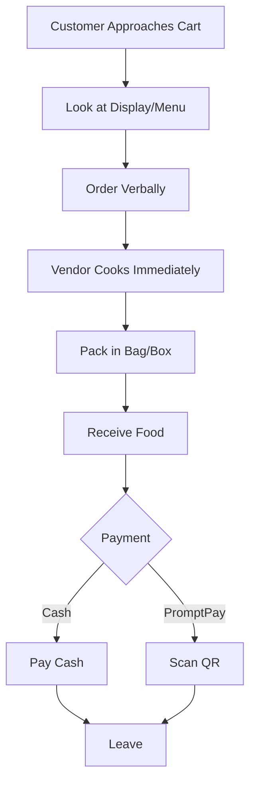
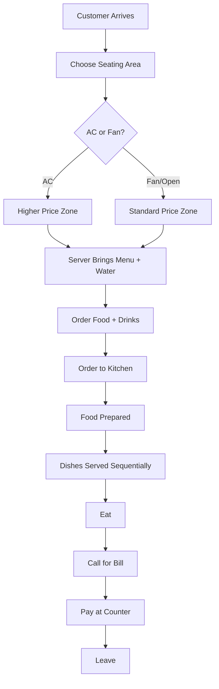

# F&B Business Processes - Thailand Edition
## Complete Guide to Food & Beverage Operations in Thailand

> [!IMPORTANT]
> **Why This Matters**: Thailand's F&B landscape is unique - from legendary street food culture to sophisticated fine dining. Understanding Thai food business operations is essential for building BI solutions that work in this market.
>
> **Read this BEFORE or alongside Phase 5** of your BI curriculum.
>
> **🤖 AI-Aided Learning**: While reading this guide, use AI to:
> - **💡 Ask AI**: "Explain [Thai F&B concept] in simple terms"
> - **⚡ AI Generate**: "Create realistic Thai restaurant scenario for [situation]"
> - **💡 Ask AI**: "Why does [metric] matter for Thai F&B profitability?"
> - **⚡ AI Generate**: "Generate sample Thai street food vendor data"
>
> See [ai-guided-learning_guide.md](../ai-guided-learning_guide.md) for full AI assistance strategies.

---

## Table of Contents
1. [Thailand F&B Overview](#thailand-fb-overview)
2. [Business Models](#business-models-in-thai-fb)
3. [Front of House Operations](#front-of-house-foh-operations)
4. [Back of House Operations](#back-of-house-boh-operations)
5. [Supply Chain & Talad (Markets)](#supply-chain--talad-markets)
6. [Financial Management](#financial-management)
7. [Technology & Digital Payments](#technology--digital-payments)
8. [Thai-Specific Metrics](#thai-specific-metrics--kpis)
9. [Pain Points & BI Solutions](#pain-points--where-bi-helps)

---

## Thailand F&B Overview

### Unique Characteristics of Thai F&B Market

**What Makes Thailand Different**:
- **Street food capital of the world**: UNESCO recognized Bangkok's street food
- **Ultra-affordable**: Meals from ฿30-60 ($1-2 USD) normal
- **All-day eating culture**: No fixed meal times, always something open
- **Cash + PromptPay**: Rapid digital adoption via QR codes
- **Fresh market culture**: Daily talad visits for ingredients
- **Night market economy**: Evening/night primary dining time
- **Vendor mobility**: Carts move locations throughout day
- **Social street dining**: Plastic stools, communal atmosphere
- **Flavor-forward**: Balance of sweet, sour, salty, spicy

**Market Size**:
- **70,000+ street food vendors** in Bangkok alone
- **Average street meal**: ฿40-80 (food) + ฿20-30 (drink)
- **Operating hours**: Often 5pm-2am (peak 7pm-10pm)
- **Cash velocity**: High volume, rapid turnover

---

## Business Models in Thai F&B

### 1. Street Food Cart / Mobile Vendor
**Thai**: ร้านเร่, แผงลอย (ran roe, phaeng loi)

**Examples**: 
- Pad Thai cart
- Som Tam (papaya salad) stand
- Grilled meat skewer (moo ping) vendor
- Boat noodles cart
- Khao mun gai (chicken rice) stand

**Characteristics**:
- **Ultra-mobile**: Cart can be pushed/motorcycled
- **Location rotation**: Different spots different times
- **Minimal overhead**: ฿500-2,000/month pitch fee
- **Highly specialized**: Often 1-3 signature dishes only
- **Peak hours only**: 4-5 hours evening service typical
- **Weather dependent**: Rain = no business
- **No seating**: Customers take away or eat standing
- **Cash dominant**: PromptPay growing rapidly

**Typical Setup**:
```
Equipment Investment: ฿30,000-80,000
- Cart/trolley: ฿10,000-20,000
- Wok burner/cooking equipment: ฿5,000-15,000
- Refrigerated display: ฿8,000-25,000
- Utensils, pots, containers: ฿3,000-8,000
- Ingredients for first week: ฿4,000-12,000
```

**Daily Routine**:
```
2:00pm - Buy ingredients at talad
3:00pm - Return home/prep area, prep ingredients
4:30pm - Load cart, travel to evening spot
5:00pm - Setup, start service
5:30pm-10:00pm - Peak service hours
10:30pm - Pack up, clean
11:00pm - Return home
11:30pm - Count cash, plan tomorrow
```

**Revenue Model** (Example - Pad Thai Cart):
```
Average Price: ฿50 per plate
Daily Sales: 80-120 plates
Daily Revenue: ฿4,000-6,000
Monthly Revenue: ฿100,000-150,000

Costs:
- Ingredients: 35% = ฿35,000-52,500
- Pitch fee/location: ฿1,500-3,000
- Gas/fuel: ฿1,000-2,000
- Motorcycle/transport: ฿1,000
- Utilities (prep at home): ฿500
- Misc supplies: ฿1,000
Total Costs: ฿40,000-60,000

Net Profit: ฿40,000-90,000/month (40-60%)
```

**Key Success Factors**:
- **Location**: High foot traffic spots (BTS exits, office buildings, universities)
- **Timing**: Being there during peak hunger hours
- **Consistency**: Same quality every night builds regulars
- **Speed**: Fast service = more customers
- **Taste**: Word of mouth is everything

---

### 2. Fresh Market Stall (Talad Sod)
**Thai**: ร้านในตลาดสด (ran nai talad sod)

**Characteristics**:
- **Permanent stall** in covered market
- **Morning operation**: 5am-12pm typically
- **Cooked-to-order**: Breakfast dishes, noodles
- **Local resident clientele**: Neighborhood regulars
- **Very affordable**: ฿30-50 per meal
- **Simple seating**: Plastic chairs, metal tables
- **Cash only** (mostly)

**Common Dishes Sold**:
- Jok (rice porridge)
- Khao tom (rice soup)
- Kuay teow (noodle soup)
- Khao gaeng (rice with curry)
- Khanom jeen (fermented rice noodles)

**Business Model**:
- **Stall rent**: ฿3,000-8,000/month
- **Operating hours**: 6-7 hours daily
- **Customer volume**: 50-150 per day
- **Average check**: ฿40-60
- **Daily revenue**: ฿2,000-6,000

**Unique Aspects**:
- **Early morning sourcing**: Buy ingredient from market vendors at 4-5am
- **Freshness premium**: Food cooked same morning
- **Regular customers**: Know orders by heart
- **Social hub**: Market gossip, community gathering

---

### 3. Night Market Food Court
**Thai**: ตลาดนัดกินเที่ยว, ตลาดโรงรถไฟ (talad nat kin tiao, talad rod fai)

**Famous Examples**: 
- Rot Fai Market (Ratchada, Srinakarim)
- Artbox Thailand
- Jodd Fairs
- Talad Neon

**Characteristics**:
- **Evening/night operation**: 5pm-12am
- **Mix of food + shopping + entertainment**
- **Hipster/trendy vibe**: Instagram-worthy
- **Higher prices**: ฿60-150 (vs street ฿40-80)
- **Young demographic**: Students, young professionals
- **Digital friendly**: PromptPay common
- **Seasonal/rotating vendors**: Vendors change

**Vendor Stall Setup**:
- **Stall rent**: ฿8,000-25,000/month (prime markets)
- **Setup**: Canopy tent, folding tables, signage
- **Branding important**: Attractive presentation matters
- **Menu variety**: Can offer more items than street cart
- **Seating area**: Shared communal tables

**Revenue Model** (Example - Fusion Food Stall):
```
Average Price: ฿80-120
Daily Sales: 60-100 orders
Operating Days: 4-5 nights/week
Daily Revenue: ฿6,000-10,000
Monthly Revenue: ฿120,000-200,000

Costs:
- Ingredients: 35-40% = ฿48,000-80,000
- Stall rent: ฿15,000-25,000
- Labor (1-2 helpers): ฿15,000-30,000
- Equipment maintenance: ฿3,000
- Marketing (social media): ฿2,000
- Misc: ฿5,000
Total Costs: ฿88,000-145,000

Net Profit: ฿32,000-55,000/month (25-28%)
```

**Success Factors**:
- **Social media presence**: Instagram, Facebook essential
- **Visual appeal**: Photogenic food and presentation
- **Unique offering**: Stand out from other vendors
- **Consistent quality**: Build follower base

---

### 4. Shop House Restaurant (Ran Aa Haan)
**Thai**: ร้านอาหารตึกแถว (ran aa haan tuk thaew)

**Characteristics**:
- **Ground floor shophouse**: Residential above, restaurant below
- **Family-run**: Multi-generational often
- **Neighborhood institution**: Decades-old some
- **Air-con optional**: Mix of open-air and AC sections
- **Moderate pricing**: ฿60-150 per dish
- **Full menu**: 30-80 dishes typically
- **Lunch + dinner service**

**Typical Layout**:
```
Front: Open-air seating (cheaper, ฿)
Middle: Semi-open with fans (moderate, ฿฿)
Back: Air-conditioned (premium, ฿฿฿)
Kitchen: Visible wok station, energy
```

**Operating Model**:
- **Lunch**: 11am-2:30pm
- **Dinner**: 5pm-10pm
- **Day off**: Usually Monday or Tuesday
- **Staff**: 3-8 (family + hired)
- **Seating**: 30-80 covers

**Revenue** (Mid-size shophouse):
```
Average Check: ฿120 per person
Daily Covers: 100-150 (lunch + dinner)
Daily Revenue: ฿12,000-18,000
Monthly Revenue: ฿300,000-450,000

Costs:
- Ingredients: 32% = ฿96,000-144,000
- Rent: ฿25,000-50,000 (or own building)
- Labor: 25% = ฿75,000-112,500
- Utilities: ฿15,000-25,000
- Marketing: ฿5,000
- Misc: ฿10,000
Total Costs: ฿226,000-346,500

Net Profit: ฿74,000-103,500/month (20-25%)
```

**Key Features**:
- **Signature dishes**: Known for 2-3 specialties
- **Regular customers**: Locals eat here weekly
- **Family atmosphere**: Often kids doing homework while parents work
- **Cash + PromptPay**: Increasingly digital

---

### 5. Mall Food Court
**Thai**: ศูนย์อาหาร (soon aa haan)

**Examples**: Terminal 21, Central World, Siam Paragon food courts

**Characteristics**:
- **Coupon system**: Buy coupons, exchange for food
- **Centralized payment**: Modern malls digital
- **AC environment**: Premium over street
- **Moderate pricing**: ฿60-120 per meal
- **Mix of vendors**: 15-40 stalls per court
- **Food variety**: Thai, Japanese, Western
- **Mall hour operation**: 10am-10pm

**Vendor Perspective**:
- **Stall rental**: ฿35,000-100,000/month (depends on mall tier)
- **Revenue sharing**: Some malls take % of sales
- **Centralized service**: Mall cleans, maintains AC
- **Standardization required**: Follow mall guidelines
- **Higher operating cost**: But stable foot traffic

**Customer Flow**:
```
1. Buy coupons/load card (฿100-500)
2. Browse stalls
3. Order with coupons/card
4. Receive number
5. Pick up when called
6. Return unused coupons (if any)
```

---

### 6. Modern Thai Casual Dining Chain
**Examples**: After You, Cafe Chilli, Somtum Der

**Characteristics**:
- **Instagram-worthy**: Design-focused interiors
- **Mid-range pricing**: ฿150-350 per person
- **Full service**: Table service, AC
- **Urban locations**: Malls, shopping districts
- **Young professional target**: 25-40 age group
- **Digital savvy**: Apps, delivery, LINE integration

**Operating Model**:
- **Multi-location**: 5-50+ branches
- **Standardized**: Central kitchen for some items
- **POS systems**: Full digital integration
- **Delivery**: 30-50% of revenue often
- **Social media marketing**: Essential

---

## Front of House (FOH) Operations

### Thai Street Food Service Flow



**Timing**:
- **Order to food**: 3-8 minutes (made fresh)
- **Total interaction**: 5-10 minutes
- **No seating** typically

---

### Shophouse Restaurant Service



**Timing**:
- **Greeting**: Immediate
- **Order taking**: 5-10 minutes
- **Food delivery**: 15-25 minutes
- **Eating**: 30-60 minutes
- **Total dwell**: 50-90 minutes

**Unique Thai Aspects**:
- **Shared dishes**: Family-style ordering
- **Sequential serving**: Dishes come as ready (not all at once)
- **Counter payment**: Pay when leaving, not at table
- **Name/phone order**: "Khun Nok, Pad Krapow Gai" called out

---

## Back of House (BOH) Operations

### Thai Street Food Kitchen (Cart-Based)

**Setup** (Typical Pad Thai Cart):
```
Equipment:
- 2-burner LPG stove
- Large wok (28-30cm)
- Prep containers with ingredients
- Sauce bottles (organized by type)
- Ice box (fresh ingredients)
- Cutting board
- Serving containers

Ingredient Organization:
Left side: Proteins (shrimp, egg, tofu)
Center: Noodles (pre-soaked)
Right side: Vegetables (bean sprouts, chives)
Sauces: Tamarind, fish sauce, palm sugar, chili
```

**Cooking Process** (Pad Thai example):
```
Time 0:00 - Order received
0:00-0:30 - Heat wok, add oil
0:30-1:00 - Stir-fry protein
1:00-2:00 - Add noodles, sauce, scramble egg
2:00-3:00 - Add vegetables, toss
3:00-3:30 - Plate, garnish (peanuts, lime, bean sprouts)
3:30-4:00 - Pack (if takeaway) or serve

Total: 4 minutes per order
Capacity: 12-15 orders per hour max
```

**Prep Work** (Done at home 2-4pm):
```
Daily Prep:
- Soak rice noodles (2-3 hours advance)
- Clean and devein shrimp
- Cut tofu into cubes
- Chop garlic, shallots
- Prepare sauce mix (measure daily portions)
- Pack ingredients into portable containers
- Check gas cylinder level
```

---

### Shophouse Restaurant Kitchen

**Wok Station Setup**:
- **3-5 wok burners**: High heat (kwarn fai)
- **Main chef + 2-3 assistants**
- **Mise en place stations**: Everything prepped, portioned
- **Rapid fire cooking**: Made to order, no holding
- **Sequential production**: Appetizers first, mains, then rice/noodles

**Kitchen Stations**:
```
Cold Station: Som tam, yam (salads)
Wok Station 1: Stir-fries (pad dishes)
Wok Station 2: Curries, soups
Grill Station: Grilled meats, seafood
Rice/Noodle Station: Plain rice, fried rice, noodle soups
Deep Fry: Spring rolls, fried chicken
```

**Order Flow**:
1. Order ticket prints in kitchen
2. Chef calls out order
3. Each station prepares their items
4. Cold dishes served first (Thai custom)
5. Hot dishes follow as ready
6. Rice/noodles last

---

## Supply Chain & Talad (Markets)

### Daily Fresh Market Sourcing

**Talad Sod (Fresh Market) Ecosystem**:

**Vendor Types in Market**:
- **Wet section**: Fresh seafood, meat
- **Produce**: Vegetables, fruits, herbs
- **Dry goods**: Rice, noodles, sauces
- **Prepared ingredients**: Curry pastes, coconut cream
- **Equipment sellers**: Woks, utensils

**Street Vendor Morning Routine**:
```
4:00am - Wake up
4:30am - Arrive at talad (motorcycle or taxi)
4:30-5:30am - Source ingredients:

Shopping List (Pad Thai cart example):
- Rice noodles: 5kg (฿150)
- Shrimp: 2kg (฿600)
- Eggs: 30 eggs (฿100)
- Tofu: 10 blocks (฿100)
- Bean sprouts: 3kg (฿60)
- Chives: 1kg (฿40)
- Tamarind paste: 1kg (฿80)
- Palm sugar: 1kg (฿60)
- Fish sauce: 2L (฿80)
- Cooking oil: 5L (฿120)
- Garlic, shallots: (฿80)
- Peanuts: 2kg (฿160)
- Limes: 3kg (฿90)

Total Daily Ingredient Cost: ฿1,720
Target to serve: 100 plates
Cost per plate: ฿17.20
```

**Negotiation Culture**:
- **Regular customers get better prices**
- **Buy in bulk = discount**
- **Cash transactions**
- **Credit for established vendors** (settle weekly)
- **Quality inspection**: Smell, touch, examine
- **Seasonal price fluctuations**: Accept and adapt

---

### Ingredient Characteristics

**Must-be-Fresh Daily**:
- Seafood (prawns, fish, squid)
- Leafy vegetables (basil, mint)
- Bean sprouts
- Lime, fresh chilies
- Fresh coconut milk

**2-3 Day Rotation**:
- Chicken, pork
- Hard vegetables (cabbage, carrots)
- Eggs
- Tofu

**Weekly/Bi-weekly**:
- Rice
- Dried noodles
- Sauces and condiments
- Curry pastes
- Cooking oil

**Monthly**:
- Large bags of rice
- Bulk dry goods
- Equipment replacements

---

## Financial Management

### Thai Street Vendor Economics

**Cash Flow** (Daily Cycle):
```
Morning Outlay:
฿1,500-2,500 - Market purchase (cash)
฿200 - Transportation
฿100 - Pitch fee (if applicable)
Total: ฿1,800-2,800 out-of-pocket

Evening Revenue:
100 plates × ฿50 = ฿5,000 (cash received)

End of Night:
Revenue: ฿5,000
Less morning spend: -฿2,500
Less daily costs: -฿200
= ฿2,300 take home (daily profit)

Weekly: ฿2,300 × 6 days = ฿13,800
Monthly: ฿55,000-60,000 typical profit
```

**Cash Management**:
- **All cash business** (mostly)
- **Daily settlement**: Count cash nightly
- **No bank account** for many small vendors
- **Savings**: Keep cash at home or send to family
- **Working capital**: ฿3,000-5,000 rolling daily

---

### PromptPay Revolution

**PromptPay Adoption** (Growing Rapidly):
```
2020: ~30% of street vendors
2023: ~60% of street vendors
2026: ~75%+ (especially younger vendors)
```

**Benefits for Vendors**:
- **No cash handling**: Safer, no change needed
- **Instant transfer**: Real-time confirmation
- **Bank record**: Easier accounting
- **Customer convenience**: Scan QR, done
- **Government push**: Free QR generation

**Typical Setup**:
- **Sign up with bank**: Bangkok Bank, Kasikorn, SCB
- **Get QR code**: Print and laminate
- **Display prominently**: On cart
- **Instant notification**: Via mobile banking app
- **Settlement**: Money in bank account immediately

---

## Technology & Digital Payments

### Payment Ecosystem in Thailand

**Current State** (2026):

**Street Food** (฿30-80 meals):
- Cash: 40%
- PromptPay/QR: 55%
- Credit Card: 5%

**Casual Dining** (฿150-400):
- Cash: 25%
- PromptPay: 35%
- Credit/Debit Card: 35%
- Rabbit LINE Pay / TrueMoney: 5%

**Mall Food Courts**:
- Food court card: 40%
- PromptPay: 30%
- Credit card: 25%
- Cash: 5%

---

### POS & Technology Adoption

**Street Vendors**:
- **No POS**: 60% (cash book/mental tally)
- **Mobile POS app**: 30% (simple free apps)
- **Proper POS**: 10% (larger operations)

**Shophouse Restaurants**:
- **Traditional manual**: 40% (handwritten orders)
- **Basic POS**: 40% (local Thai systems)
- **Modern cloud POS**: 20% (Foodstory, PEAK)

**Chains & Modern**:
- **Full POS**: 100%
- **Delivery integration**: GrabFood, LINE MAN, foodpanda
- **Loyalty apps**: LINE integration common
- **Analytics**: Basic to advanced depending on size

---

## Thai-Specific Metrics & KPIs

### Street Vendor Metrics

**Daily Revenue Targets**:
```
Good Day: ฿5,000-7,000
Average Day: ฿3,500-5,000
Slow Day: ฿2,000-3,500
Rain Day: ฿0-1,500
```

**Volume Metrics**:
```
Plates/Hour (Peak): 12-15
Peak Hours: 6pm-9pm (3 hours)
Target Peak Sales: 40-50 plates
Off-peak filler: 20-30 plates
Total Daily: 60-80 plates good day
```

**Ingredient Waste Rate**:
```
Target: <8% daily waste
Fresh vegetables: Accept 10-15% (high turnover)
Proteins: <5% (expensive, careful management)
Prepped items: Minimize (prep based on expected volume)
```

**Cash Collection**:
```
Morning Spend: ฿2,000-3,000 (ingredient purchase)
Evening Revenue: ฿4,000-8,000

Net Cash: ฿1,500-5,000 daily take-home
Weekly: ฿10,000-35,000
Montly Target: ฿50,000-80,000 (profit)
```

---

### Shophouse Restaurant Metrics

**Table Turnover**:
```
Lunch Service (11am-2pm): 
- Target: 2 turns per table
- 30 tables × 2 turns = 60 covers
- Avg check ฿120 = ฿7,200

Dinner Service (6pm-10pm):
- Target: 1.5 turns per table
- 30 tables × 1.5 = 45 covers
- Avg check ฿180 = ฿8,100

Daily Target: 105 covers, ฿15,300
```

**Labor Efficiency**:
```
Revenue per Labor Hour:
Formula: Daily Revenue / Total Labor Hours

Example:
฿15,000 revenue / 60 labor hours = ฿250 per labor hour

Target: >฿200 per labor hour
Alert: <฿150 (overstaffed or under-revenue)
```

**Talad Spend Ratio**:
```
Formula: Daily Talad Purchase / Daily Revenue × 100

Target: 30-38% for Thai food
Alert: >42% (pricing issue or waste)
Track: Daily in cash book
```

---

## Pain Points & Where BI Helps

### Thai F&B Specific Challenges

#### 1. Weather Dependency (Street Vendors)
**Problem**: Rain = zero revenue, but already bought ingredients

**BI Solution**:
- Track weather vs sales correlation
- Forecast using 7-day weather + historical
- Adjust next-day ingredient purchase based on forecast
- **Dashboard**: Weather-adjusted buying recommendation

---

#### 2. Location Optimization (Mobile Vendors)
**Problem**: Which spot makes most money?

**BI Solution**:
- Track revenue by location-time combination
- Compare Monday 6pm Silom vs Tuesday 6pm Sathorn
- Factor: Setup/travel cost, competition, foot traffic
- **Dashboard**: Optimal weekly schedule by location

---

#### 3. Cash vs PromptPay Analysis
**Problem**: Are digital payments costing or helping?

**BI Solution**:
- Transaction time: Cash vs QR
- Customer preference trends
- Bank fees vs cash handling risk
- Volume increase from accepting digital
- **Dashboard**: Payment method impact analysis

---

#### 4. Talad Price Fluctuation
**Problem**: Shrimp ฿250/kg yesterday, ฿380/kg today

**BI Solution**:
- Track ingredient prices daily
- Alert when spike >20%
- Suggest menu adjustment (temporary out of stock)
- Calculate break-even price if continue
- **Dashboard**: Ingredient cost tracker + pricing recommendations

---

#### 5. Peak Hour Capacity
**Problem**: Queue too long, losing customers

**BI Solution**:
- Track queue length (proxy: orders/hour)
- Analyze sold-out times (demand > capacity)
- Calculate revenue lost to queue
- ROI of hiring helper or second cart
- **Dashboard**: Capacity optimization analysis

---

## Thai Cultural Business Practices

### Important Considerations

**Concept of "Sanook" (Fun)**:
- Work should be enjoyable
- Friendly atmosphere = repeat customers
- Stress management different than Western
- Family involvement common

**Face (Naa)**:
- Indirect feedback
- Preserve vendor dignity when giving suggestions
- Public praise, private criticism
- Relationship-based business

**Mai Pen Rai (Never Mind) Attitude**:
- Flexibility valued
- Last-minute changes acceptable
- Less rigid scheduling
- Go with flow mentality

**Buddhist Calendar**:
- Monk feeding (tak bat) in mornings
- Buddhist holidays affect operations
- Vegetarian "Jay" festival (September/October)
- New Year (Songkran) closures

---

## Seasonal Patterns in Thai F&B

### High Season (November - February)
- **Best weather**: Cool, dry
- **Tourist high**: International visitors
- **Revenue peak**: +30-50% for tourist areas
- **Longer operating hours**: Can serve later
- **Price flexibility**: Can charge slightly more

### Hot Season (March - May)
- **Extreme heat**: 35-40°C
- **Lower foot traffic**: Afternoon dead zone
- **Ice beverage sales**: Surge
- **Evening peak concentrated**: 7pm-10pm
- **Food court preference**: AC seekers

### Rainy Season (June - October)
- **Inconsistent revenue**: Rain dependent
- **Evening uncertainty**: Thunder scares customers
- **Covered location premium**: Mall food courts busier
- **Delivery surge**: People order in
- **Hot soup spike**: Comfort food preference

---

## BI Dashboard Ideas for Thai F&B

### 1. Street Vendor Daily Optimizer
**For**: Mobile food cart vendors

**KPIs**:
- Today's recommended ingredient buy (based on weather forecast)
- This week's optimal location schedule
- Peak hour performance (plates/hour)
- Ingredient cost alerts (talad price spikes)
- PromptPay vs Cash comparison

---

### 2. Weather-Revenue Correlation
**For**: Outdoor vendors

**KPIs**:
- 7-day revenue forecast (weather-adjusted)
- Rainy day revenue recovery strategies
- Best backup locations (covered areas)
- Seasonal pattern analysis
- Break-even scenarios

---

### 3. Talad Purchase Optimization
**For**: All vendors sourcing from fresh markets

**KPIs**:
- Historical ingredient prices (30/60/90 day)
- Today's recommended purchase quantity
- Waste rate by ingredient
- Supplier price comparison
- Seasonal ingredient calendar

---

### 4. Multi-Location Performance (Chains)
**For**: Shops with 3+ branches

**KPIs**:
- Same-store sales by location
- Labor efficiency by branch
- Food cost % variance
- Delivery vs dine-in by location
- Customer rating correlation

---

## Conclusion

Thai F&B operations have distinct characteristics requiring adapted BI approaches:

**Key Factors**:
- **Street food dominance** = mobile, weather-dependent operations
- **Daily fresh sourcing** = talad ecosystem critical
- **Cash + digital hybrid** = PromptPay transformation
- **Peak hour concentration** = evening economy
- **Flavor consistency** = balance of taste elements
- **Cultural flexibility** = "mai pen rai" business style
- **Seasonal weather** = major revenue driver

Understanding these nuances creates BI dashboards that actually help Thai food businesses thrive.

---

**Useful Thai Terms**:
- **Talad** (ตลาด): Market
- **Ran aa haan** (ร้านอาหาร): Restaurant
- **Phaeng** (แผง): Food stall/cart
- **Aa haan tam sang** (อาหารตามสั่ง): Made-to-order food
- **Khao gaeng** (ข้าวแกง): Rice with curry (display service)
- **PromptPay** (พร้อมเพย์): Thai QR payment system
- **Sanook** (สนุก): Fun/enjoyable
- **Aroy** (อร่อย): Delicious

---

*Last Updated: January 2026*
*Covers: Thailand food business operations, street food culture, and digital payment ecosystem*
