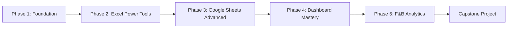

# Spreadsheet-Powered BI Curriculum
## Master Business Intelligence Using Excel & Google Sheets

> [!IMPORTANT]
> **Philosophy**: Why spend months learning SQL and Python when spreadsheets can do 90% of what small to medium F&B businesses need? This curriculum teaches you to build professional-grade BI dashboards using tools the "everyman" already knows and trusts.
> 
> **Goal**: Build beautifully working, easy-to-use, and engaging BI dashboards using ONLY spreadsheets (or primarily spreadsheets with minimal additional tools).
> 
> **Estimated Timeline**: 4-6 months
>
> **🤖 AI-Aided Learning**: Throughout this curriculum, you'll find AI assistance markers showing exactly where and how to use AI to accelerate your learning. Look for these icons:
> - **💡 Ask AI**: Questions to ask AI for explanations
> - **⚡ AI Generate**: Tasks AI can generate for you (data, formulas, code)
> - **🔍 AI Explain**: Concepts AI can explain in different ways
> - **🤖 AI Debug**: When to use AI for debugging
> - **🤖 AI Review**: Have AI review your work
>
> See [AI_LEARNING_GUIDE.md](../AI_LEARNING_GUIDE.md) for full details on effective AI-aided learning.

---

## Why Spreadsheets for BI?

### ✅ Advantages:
- **Universal**: Everyone knows Excel/Sheets basics already
- **No Installation**: Google Sheets is cloud-based and free
- **Familiar**: Lower learning curve = faster deployment
- **Powerful**: Modern spreadsheet features rival dedicated BI tools
- **Accessible**: Stakeholders can edit and explore without special training
- **Cost-Effective**: Excel comes with Office; Sheets is free
- **Self-Contained**: Data + analysis + visualization in one file

### ⚠️ Limitations (and how we'll work around them):
- **Data Size Limits**: Excel (1M rows), Google Sheets (10M cells)
  - *Solution*: Data connections, summarized imports, archiving strategies
- **Performance**: Slower with very large datasets
  - *Solution*: Optimization techniques, caching, smart formulas
- **Collaboration**: Excel is single-user unless using OneDrive/SharePoint
  - *Solution*: Use Google Sheets for collaboration, Excel for power
- **Automation**: Less built-in automation
  - *Solution*: Google Apps Script, Excel VBA/Power Automate

**Bottom Line**: For 80% of F&B businesses, spreadsheets are perfect. This curriculum shows you how.

---

## Curriculum Structure



---

## Phase 1: Spreadsheet Foundations (Weeks 1-3)

### Module 1.1: Data & BI Fundamentals
**Duration**: 3 days

**Same as original curriculum Module 1.1** - Understanding BI concepts, KPIs, stakeholder needs

**Reading**: Review [BI Curriculum Module 1.1](./bi_curriculum.md#module-11-understanding-data--business-intelligence)

> **🤖 AI Assistance**:
> - **💡 Ask AI**: "Explain the difference between data analysis, data analytics, and business intelligence in simple terms"
> - **💡 Ask AI**: "Give me 5 real-world examples of how BI helps F&B businesses"
> - **🔍 AI Explain**: Have AI explain KPIs with F&B-specific examples: "Explain what KPIs are and give 5 examples for restaurants"

---

### Module 1.2: Spreadsheet Mastery Fundamentals
**Duration**: 1.5 weeks

**Excel or Google Sheets?** You'll learn BOTH, but pick your primary platform:
- **Excel**: More powerful features, better for heavy analysis
- **Google Sheets**: Better collaboration, free, cloud-based
- **Recommendation**: Learn Google Sheets first (accessible), then Excel power features

#### Week 1: Core Skills

**Essential Formulas**:
- `SUM`, `AVERAGE`, `COUNT`, `COUNTA`, `COUNTBLANK`
- `MIN`, `MAX`, `MEDIAN`, `MODE`
- `IF`, `IFS`, `AND`, `OR`, `NOT`
- `SUMIF`, `SUMIFS`, `AVERAGEIF`, `AVERAGEIFS`, `COUNTIF`, `COUNTIFS`
- Date/Time: `TODAY()`, `NOW()`, `DATE()`, `YEAR()`, `MONTH()`, `DAY()`, `WEEKDAY()`, `EOMONTH()`
- Text: `CONCATENATE`/`&`, `LEFT`, `RIGHT`, `MID`, `LEN`, `TRIM`, `UPPER`, `LOWER`, `SUBSTITUTE`

**References**:
- Relative (`A1`), Absolute (`$A$1`), Mixed (`$A1`, `A$1`)
- Named ranges for readability
- Structured references (Excel Tables)

**Data Management**:
- Sorting and filtering
- Data validation (dropdowns, rules)
- Conditional formatting (color scales, data bars, icon sets, rules)
- Find & Replace (including wildcards and regex in Sheets)

**Hands-on Project**: Sales data cleanup and basic analysis

> **🤖 AI Assistance**:
> - **⚡ AI Generate**: "Create a practice CSV with 100 sales transactions (date, product, category, amount, payment_method)"
> - **💡 Ask AI**: "Show me 5 examples of using SUMIFS with different conditions"
> - **💡 Ask AI**: "Explain absolute vs relative cell references like I'm new to spreadsheets"
> - **🤖 AI Debug**: When formulas error, paste: "Why does this formula return #N/A? Formula: [paste]. Data: [describe]"

---

#### Week 2: Intermediate Skills

**Lookup Functions** (CRITICAL for BI):
- `VLOOKUP` (vertical lookup - the workhorse)
- `HLOOKUP` (horizontal lookup - rarely used)
- `INDEX` + `MATCH` (more flexible than VLOOKUP)
- `XLOOKUP` (Excel 365 - the new standard)
- `LOOKUP` (for sorted data)

**Array Formulas**:
- **Google Sheets**: `ARRAYFORMULA()` for applying formulas to ranges
- **Excel**: `Ctrl+Shift+Enter` arrays (legacy) or dynamic arrays (365)

**Pivot Tables** (YOUR BEST FRIEND):
- Creating pivot tables
- Rows, columns, values, filters
- Grouping data (dates, numbers)
- Calculated fields in pivot tables
- Pivot table design and formatting
- **Pivot Charts**: Automatic visualizations from pivots
- Slicers for interactive filtering
- Timelines (Excel) for date filtering

**Data Cleaning**:
- Removing duplicates
- Text-to-columns
- Flash Fill (Excel)
- Handling blanks and errors: `IFERROR()`, `IFNA()`, `ISBLANK()`

**Hands-on Projects**:
1. Build a sales analysis: revenue by product, by region, by month
2. Customer analysis: repeat customers, average order value
3. Create your first interactive pivot table dashboard

> **🤖 AI Assistance**:
> - **🔍 AI Explain**: "Explain VLOOKUP step-by-step with a restaurant menu price lookup example"
> - **💡 Ask AI**: "What's the difference between VLOOKUP and INDEX/MATCH? When should I use each?"
> - **⚡ AI Generate**: "Create practice data: Products table (id, name, price) and Sales table (product_id, quantity) for VLOOKUP practice"
> - **🔍 AI Explain**: "Explain pivot tables like I'm 10, then show me an F&B example"
> - **⚡ AI Generate**: "Give me 20 beginner-level VLOOKUP practice problems"

---

### Module 1.3: Data Thinking for F&B
**Duration**: 4 days

**Same as original curriculum Module 1.3** - Business metrics, F&B KPIs, analytical thinking

**Reading**: Review [BI Curriculum Module 1.3](./bi_curriculum.md#module-13-data-thinking--business-metrics) and [F&B Business Processes](./fb_business_processes.md)

**Hands-on Project**: Create a KPI calculator in a spreadsheet:
- Input fields for sales, costs, labor hours
- Calculated fields for all major F&B KPIs
- Visual indicators (conditional formatting) for targets

> **🤖 AI Assistance**:
> - **💡 Ask AI**: "Why is food cost % more important than absolute food cost dollars?"
> - **💡 Ask AI**: "What are typical target ranges for food cost %, labor cost %, and prime cost % in restaurants?"
> - **⚡ AI Generate**: "Create formulas for a complete F&B KPI calculator (food cost %, labor cost %, prime cost %, RevPASH)"
> - **🤖 AI Review**: "I think these are the top 5 KPIs for a restaurant: [list]. Am I missing critical ones?"

---

## Phase 2: Excel Power Tools (Weeks 4-7)

> [!NOTE]
> These modules focus on Excel's advanced features. If you're Google Sheets-only, you can skip to Phase 3, but I recommend learning these concepts anyway - they're incredibly powerful.

### Module 2.1: Power Query (Get & Transform Data)
**Duration**: 1.5 weeks

**What is Power Query?**
- Excel's ETL (Extract, Transform, Load) tool
- Visual interface for data cleaning and transformation
- Refreshable data connections
- **Game-changer for BI**: Automate data prep!

**Access**: Data tab → Get Data (Excel 2016+) or Power Query tab (2013)

#### Topics:

**Week 1 - Basics**:
- **Importing Data**:
  - From files: CSV, Excel, text
  - From folders (combine multiple files!)
  - From web (scraping tables)
  - From databases (if available)
- **Basic Transformations**:
  - Remove/rename columns
  - Change data types
  - Filter rows
  - Sort data
  - Remove duplicates
  - Fill down/up
  - Replace values
- **Text Transformations**:
  - Split columns
  - Extract text
  - Clean text
  - Merge columns
- **Number Transformations**:
  - Math operations
  - Rounding
  - Statistics (group by)

**Week 2 - Advanced**:
- **Append Queries**: Stack data from multiple sources
- **Merge Queries**: JOIN data (like SQL!)
  - Left/Right/Inner/Full Outer/Cross joins
  - Understanding relationships
- **Grouping & Aggregation**: Like SQL GROUP BY
- **Conditional Columns**: Custom logic
- **Custom Columns**: M language formulas (basic)
- **Parameters**: Dynamic data sources
- **Refresh**: Update data with one click

**Why This Matters**:
- Your POS exports CSV daily → Power Query automatically imports and cleans
- Multiple locations? Combine all files automatically
- Data messy? Clean it once, apply to all future imports
- **Repeatable, automated data pipeline**

**Hands-on Project**:
- Import sample POS data (CSV)
- Clean and transform it with Power Query
- Set up automatic refresh
- Create a pivot table on the query result
- **Simulate daily data update** - see it refresh automatically

**Resources**:
- Excel Power Query documentation (Microsoft)
- ExcelIsFun YouTube channel
- MyOnlineTrainingHub tutorials

> **🤖 AI Assistance**:
> - **🔍 AI Explain**: "Explain what Power Query does and why it's better than manual data cleaning"
> - **💡 Ask AI**: "What's the difference between Append and Merge in Power Query? Give F&B examples"
> - **⚡ AI Generate**: "Create a messy CSV file with wrong date formats, duplicates, and missing values for Power Query practice"
> - **🤖 AI Debug**: "This Power Query M code gives error: [paste code]. What's wrong?"
> - **💡 Ask AI**: "Walk me through merging two tables in Power Query: Sales (product_id, amount) and Products (product_id, name, cost)"

---

### Module 2.2: Power Pivot & Data Modeling
**Duration**: 1.5 weeks

**What is Power Pivot?**
- Excel's in-memory data engine
- Handle millions of rows (beyond Excel's 1M limit)
- Create relationships between tables
- DAX formulas for advanced calculations
- **True BI capabilities in Excel**

**Access**: Power Pivot tab (may need to enable in Excel Options → Add-ins)

**Requirements**: Excel 2013+ (Windows), not available on Mac

#### Topics:

**Week 1 - Data Modeling**:
- **Importing Data into Data Model**:
  - Add to Data Model option
  - From Power Query to Data Model
- **Creating Relationships**:
  - Primary key / Foreign key concepts
  - One-to-many relationships
  - Star schema design (fact & dimension tables)
  - Review: [Data Modeling from main curriculum](./bi_curriculum.md#module-43-data-modeling-for-bi)
- **Calculated Columns**:
  - DAX formulas for column calculations
  - Row context
- **Hierarchies**:
  - Date hierarchies (Year → Quarter → Month → Day)
  - Product hierarchies (Category → Subcategory → Item)
  - Drill-down in pivot tables

**Week 2 - DAX (Data Analysis Expressions)**:
- **Measures** (calculated fields that aggregate):
  - `SUM()`, `AVERAGE()`, `COUNT()`, etc.
  - `CALCULATE()` - the most powerful DAX function
  - Filter context
- **Time Intelligence**:
  - `TOTALYTD()`, `TOTALMTD()`, `TOTALQTD()`
  - `SAMEPERIODLASTYEAR()`
  - `DATEADD()` for custom periods
  - Year-over-year comparisons
  - Month-over-month growth
- **Common Patterns**:
  - Sales = `SUM(Transactions[Amount])`
  - Prior Year Sales = `CALCULATE([Sales], SAMEPERIODLASTYEAR(Calendar[Date]))`
  - YoY Growth = `DIVIDE([Sales] - [Prior Year Sales], [Prior Year Sales])`
  - Food Cost % = `DIVIDE([Total Food Cost], [Food Sales])`

**Why This Matters**:
- POS data (millions of transactions) → Power Pivot handles it
- Proper data model → easier analysis, better performance
- DAX measures → sophisticated calculations in pivot tables
- **Professional-grade BI in Excel**

**Hands-on Project**:
- Build a data model for F&B:
  - Sales fact table (transactions)
  - Products dimension (menu items)
  - Dates dimension (calendar)
  - Servers dimension (staff)
- Create relationships
- Build 10 DAX measures (sales, food cost %, YoY growth, etc.)
- Create pivot tables using the model

**Resources**:
- SQLBI.com (DAX patterns)
- "The Definitive Guide to DAX" by Marco Russo & Alberto Ferrari
- PowerPivotPro blog

> **🤖 AI Assistance**:
> - **🔍 AI Explain**: "Explain DAX CALCULATE function in simple terms with an F&B example"
> - **💡 Ask AI**: "What's the difference between calculated column and measure in DAX? When do I use each?"
> - **⚡ AI Generate**: "Write DAX measures for: YoY sales growth, food cost %, and MTD revenue"
> - **💡 Ask AI**: "Explain filter context vs row context in DAX like I'm new to this"
> - **🤖 AI Debug**: "This DAX measure returns wrong value: [paste DAX]. Expected: X, Got: Y. Why?"
> - **⚡ AI Generate**: "Give me 10 common DAX patterns for F&B analytics"

---

### Module 2.3: Advanced Excel Visualization
**Duration**: 1 week

**Beyond Basic Charts**: Creating dashboard-worthy visuals in Excel

#### Topics:

**Chart Types**:
- Column/Bar charts (with data labels, colors)
- Line charts (multiple series, trendlines)
- Combo charts (column + line)
- Area charts (stacked for composition)
- Scatter plots (for correlation)
- Waterfall charts (great for P&L visualization!)
- Funnel charts
- Treemaps and Sunburst (hierarchy visualization)
- **Sparklines**: Mini charts in cells

**Advanced Techniques**:
- **Dynamic Charts**: Charts that update based on selections
  - Using named ranges with `OFFSET()` or `INDEX()`
  - Chart data from filtered lists
- **Conditional Formatting as Visualization**:
  - Data bars in cells
  - Color scales
  - Icon sets (up/down arrows, traffic lights)
- **Custom Chart Formatting**:
  - Removing chartjunk
  - Custom colors (brand colors)
  - Clean axis labels
  - Annotations and callouts
  - Professional styling

**Interactivity**:
- **Slicers**: Visual filters for pivot tables
- **Form Controls**: Buttons, dropdowns, scroll bars
  - Link to cells
  - Drive calculations and charts
- **Timeline** (Excel 2013+): Date range selector

**Hands-on Project**:
- Create 5 different chart types from your F&B data
- Make one fully interactive chart (dropdown changes what's displayed)
- Design a chart following visualization best practices

**Resources**:
- Jon Peltier's Chart Blog
- Chandoo.org charting tutorials
- Peltier Tech Charts for Excel (add-in)

---

### Module 2.4: Excel Dashboard Design & Build
**Duration**: 1.5 weeks

**Creating Professional Dashboards in Excel**

#### Topics:

**Dashboard Design Principles**:
- Review: [Dashboard Design from main curriculum](./bi_curriculum.md#module-32-dashboard-design-principles)
- Excel-specific considerations:
  - Sheet as canvas
  - Grid-based layout
  - Print vs. screen design

**Layout Techniques**:
- **Sheet Setup**:
  - Zoom level (85% often works well)
  - Gridlines off (View → Gridlines uncheck)
  - Headers/row numbers off for cleaner look
- **Positioning**:
  - Using cells as grid (merge cells for containers)
  - Shapes for backgrounds and containers
  - Aligning charts and controls (Alt+drag to snap to grid)
- **Color Schemes**:
  - Custom color palette
  - Consistent use across dashboard
  - Theme colors for maintainability

**Components**:
- **KPI Cards**: Large numbers with context
  - Using large fonts
  - Conditional formatting for up/down
  - Sparklines for trends
- **Charts**: Right chart for the insight
- **Tables**: For detailed data
- **Filters/Slicers**: User controls
- **Headers/Titles**: Context and branding

**Interactivity**:
- **Slicers**: Connect to all pivot tables
- **Timelines**: Date filtering
- **Form Controls**: 
  - Dropdown to select metric
  - Option buttons for views
  - Scroll bar for date range
- **Hyperlinks**: Navigate between dashboard pages

**Data Refresh**:
- Manual: Right-click pivot → Refresh
- **Automatic**: File → Options → Data → Refresh on open
- **VBA**: Auto-refresh on schedule (advanced)

**Protection**:
- Lock dashboard cells (users can't accidentally break it)
- Unlock only filter cells
- Protect sheet (Review → Protect Sheet)

**Hands-on Project**:
- **Build Your First Excel Dashboard**:
  - One-page overview: 4-6 KPIs, 4-6 charts
  - Slicers for date range and category
  - Professional design
  - Data refreshes with one click
  - Protected (can't be broken by user)

**Resources**:
- Chandoo.org Excel Dashboards course
- Dashboard design templates (search "Excel dashboard templates")
- "Dashboarding and Reporting with Power Pivot and Excel" by Kasper de Jonge

---

## Phase 3: Google Sheets Advanced (Weeks 8-10)

> [!NOTE]
> Google Sheets has different strengths than Excel. This phase focuses on Sheets-specific features that make it excellent for collaborative BI.

### Module 3.1: Google Sheets Power Features
**Duration**: 1.5 weeks

**Why Google Sheets for BI?**
- Free and cloud-based
- Real-time collaboration (multiple users)
- Automatic save and version history
- Share with permissions (view/comment/edit)
- Access anywhere (mobile, tablet, web)
- Apps Script for automation
- Built-in integrations (Google Analytics, Forms, etc.)

#### Week 1: Advanced Functions

**Google Sheets Exclusive Functions**:

1. **QUERY()** - SQL-like querying in Sheets!
   ```
   =QUERY(A1:E100, "SELECT A, SUM(E) WHERE B='Food' GROUP BY A ORDER BY SUM(E) DESC", 1)
   ```
   - SELECT, WHERE, GROUP BY, ORDER BY, LIMIT
   - Pivot-like aggregation without pivot tables
   - Dynamic data analysis

2. **ARRAYFORMULA()** - Apply formula to entire column
   ```
   =ARRAYFORMULA(IF(A2:A="",,A2:A*B2:B))
   ```
   - No more dragging formulas down
   - Automatic expansion
   - Faster calculation

3. **FILTER()** - Dynamic filtering
   ```
   =FILTER(A2:E100, B2:B100="Food", E2:E100>100)
   ```
   - Multiple conditions
   - Returns array of matching rows
   - Refreshes automatically

4. **UNIQUE()** - Extract unique values
   ```
   =UNIQUE(A2:A100)
   ```
   - Automatic deduplication
   - Great for creating filter lists

5. **SORT()** and **SORTN()**
   ```
   =SORT(A2:E100, 5, FALSE)  // Sort by column 5, descending
   =SORTN(A2:E100, 10, 0, 5, FALSE)  // Top 10 by column 5
   ```

6. **IMPORTRANGE()** - Pull data from other Sheets
   ```
   =IMPORTRANGE("spreadsheet_url", "Sheet1!A1:E100")
   ```
   - Centralize data from multiple files
   - Auto-updates when source changes

7. **IMPORTDATA()**, **IMPORTHTML()**, **IMPORTXML()**, **IMPORTFEED()**
   - Pull data from web sources
   - CSV URLs, HTML tables, XML, RSS

8. **GOOGLETRANSLATE()**, **GOOGLEFINANCE()** - Google service integrations

**Combining Functions** (The Magic):
```
// Top 10 food items by sales, formatted as table
=QUERY(
  FILTER(Sales!A:E, Sales!B:B="Food"),
  "SELECT A, SUM(E) GROUP BY A ORDER BY SUM(E) DESC LIMIT 10",
  1
)
```

#### Week 2: Data Connections & Automation

**Connected Sheets** (Google Workspace):
- Connect to BigQuery databases
- Analyze billions of rows in Sheets interface
- Enterprise feature but good to know

**Google Forms Integration**:
- Forms → Sheets (automatic data collection)
- Build custom feedback forms
- Survey data directly into your dashboard

**Apps Script Basics** (Google's JavaScript):
- Automate repetitive tasks
- Custom functions
- Triggered scripts (time-based, on edit, etc.)
- Connect to external APIs
- Email reports automatically

**Simple Apps Script Examples**:
```javascript
// Custom function: Calculate food cost %
function foodCostPercent(cost, sales) {
  return (cost / sales) * 100;
}

// Auto-timestamp when row is edited
function onEdit(e) {
  var sheet = e.source.getActiveSheet();
  var range = e.range;
  if(range.getColumn() == 2) {
    sheet.getRange(range.getRow(), 1).setValue(new Date());
  }
}

// Send email report every Monday
function sendWeeklyReport() {
  var sheet = SpreadsheetApp.getActiveSpreadsheet().getSheetByName("Dashboard");
  var data = sheet.getRange("A1:E10").getValues();
  // Format email with data...
  MailApp.sendEmail("manager@restaurant.com", "Weekly Sales Report", emailBody);
}
```

**Add-ons**:
- Supermetrics (import marketing data)
- Data Connector (various sources)
- Power Tools (enhanced data manipulation)

**Hands-on Projects**:
1. Build a sales analysis using `QUERY()` - no pivot tables!
2. Create a dynamic dropdown filter using `UNIQUE()` and `FILTER()`
3. Import data from a CSV URL with `IMPORTDATA()`
4. Write a simple Apps Script to auto-timestamp entries
5. Create a Google Form that feeds into your analysis sheet

> **🤖 AI Assistance**:
> - **🔍 AI Explain**: "Explain Google Sheets QUERY function syntax with examples"
> - **⚡ AI Generate**: "Write QUERY formula: Get all items where category='Food' and price>10, sorted by price descending"
> - **🤖 AI Debug**: "My QUERY formula has syntax error: [paste formula]. What's wrong?"
> - **⚡ AI Generate**: "Write Apps Script function to auto-timestamp when cell B is edited"
> - **⚡ AI Generate**: "Write Apps Script to send email when daily sales drop below $1000"
> - **💡 Ask AI**: "Show me 5 powerful combinations of FILTER + SORT + UNIQUE"

**Resources**:
- Ben Collins (Google Sheets expert) - benlcollins.com
- Google Sheets function reference
- Apps Script documentation

---

### Module 3.2: Google Sheets Dashboard Design
**Duration**: 1 week

**Building Dashboards in Google Sheets**

**Similarities to Excel**:
- Grid-based layout
- Charts and tables
- Conditional formatting
- Data validation for filters

**Differences**:
- **Collaboration**: Multiple viewers/editors simultaneously
- **Publish to Web**: Share public dashboard (read-only)
- **Embed**: Embed in websites or internal tools
- **Mobile-Friendly**: Works on phones/tablets
- **Checkboxes**: Native checkboxes (no form controls needed)
- **Filters**: Built-in filter views (save filter states)

**Dashboard Components**:
- **KPI Cards**: Using merged cells, large fonts, conditional formatting
- **Charts**: Google Charts (similar to Excel but with some differences)
- **Tables**: Formatted ranges or QUERY() results
- **Slicers**: Available for pivot tables
- **Dropdowns**: Data validation lists linked to formulas

**Interactivity Techniques**:
- **Data Validation Dropdowns** linked to `FILTER()` formulas
- **Checkboxes** for show/hide sections
- **Protected Ranges**: Lock dashboard structure, allow filter inputs
- **Filter Views**: Different users can have different views

**Sharing & Permissions**:
- **Viewer**: Can see, can't edit (perfect for stakeholders)
- **Commenter**: Can suggest but not change
- **Editor**: Full access
- **Link Sharing**: Anyone with link, restricted, public

**Hands-on Project**:
- **Build a Google Sheets Dashboard**:
  - Sales overview with KPIs
  - Interactive charts with dropdown filters
  - Uses `QUERY()` and `FILTER()` for dynamic data
  - Share with "view-only" link (simulate stakeholder access)
  - Test on mobile device

**Resources**:
- Google Sheets dashboard templates
- Ben Collins dashboard tutorials
- Template Gallery in Google Sheets

---

### Module 3.3: Spreadsheet Integration & Automation
**Duration**: 1 week

**Making Your Spreadsheet BI System Work Like a Real BI Tool**

#### Data Pipeline Automation

**Option 1: Manual but Structured**
- Weekly CSV export from POS
- Upload to Google Drive folder
- Sheets imports with `IMPORTDATA()` from Drive link
- Refresh dashboard

**Option 2: Semi-Automated (Recommended for Most)**
- **Google Apps Script scheduled trigger**:
  - Fetch data from email attachments
  - Import from cloud storage
  - Refresh pivot tables/queries
  - Send email when done
- **Excel Power Query scheduled refresh**:
  - Power Automate (formerly Flow) triggers refresh
  - OneDrive/SharePoint for data files

**Option 3: Fully Automated (Advanced)**
- POS exports to cloud storage automatically (many POS systems can do this)
- Zapier/Make.com/n8n connects POS → Sheets
- Apps Script processes incoming data
- Dashboard updates in real-time

**Connecting to Data Sources**:
- **CSV/Excel Files**: Import from Drive/OneDrive
- **Google Forms**: Automatic feed
- **APIs**: Apps Script to fetch data (Yelp reviews, weather, etc.)
- **Databases**: Apps Script JDBC connection (advanced)
- **Other Sheets**: `IMPORTRANGE()`

**Scheduled Tasks with Apps Script**:
```javascript
// Set up in Apps Script → Triggers
function dailyRefresh() {
  // Refresh all data connections
  SpreadsheetApp.flush();
  
  // Recalculate formulas
  var sheet = SpreadsheetApp.getActiveSpreadsheet();
  sheet.getSheetByName("Data").getDataRange().setValue(""); // Force recalc
  
  // Send notification
  MailApp.sendEmail("you@email.com", "Dashboard Updated", "Daily refresh complete");
}

// Set trigger: dailyRefresh(), Time-driven, Day timer, 6-7am
```

**Multi-User Workflows**:
- Viewer dashboard (stakeholders)
- Editor data entry sheet (staff input)
- Admin master sheet (you maintain)
- All connected via `IMPORTRANGE()`

**Version Control**:
- Google Sheets: Built-in version history
- Excel: OneDrive version history or manual versioning

**Backup Strategy**:
- Export important sheets monthly (Google Takeout or manual)
- Keep template copies
- Document your formulas and logic

**Hands-on Project**:
- Set up a mini automated pipeline:
  - Create a "Data Entry" sheet (simulates POS export)
  - Create a "Dashboard" sheet that pulls from Data Entry
  - Add new data to Data Entry → Dashboard updates automatically
  - Write an Apps Script that emails you when a KPI threshold is hit
  - Schedule a weekly "refresh" script

**Resources**:
- Apps Script tutorials
- Zapier University
- Power Automate documentation

---

## Phase 4: Dashboard Mastery (Weeks 11-13)

### Module 4.1: Data Storytelling with Spreadsheets
**Duration**: 1 week

**Same core concepts as original curriculum Module 4.1**, adapted for spreadsheets

**Spreadsheet-Specific Storytelling**:
- **Multiple Sheets as Story Chapters**:
  - Sheet 1: Executive Summary
  - Sheet 2: Sales Deep Dive
  - Sheet 3: Cost Analysis
  - Sheet 4: Recommendations
- **Navigation**: Hyperlinks between sheets, table of contents
- **Progressive Disclosure**: Start broad, drill down
- **Annotations**: Text boxes, callouts on charts
- **Narrative Formatting**: Use colors, fonts, spacing to guide the eye

**Presenting from Spreadsheets**:
- Full-screen mode (View → Full Screen)
- Hide gridlines and headers
- Print to PDF for distribution
- Publish to web for live sharing

**Hands-on Project**:
- Take your dashboard and create a 5-minute data story
- Multiple sheets telling a cohesive narrative
- Present to someone and get feedback

> **🤖 AI Assistance**:
> - **💡 Ask AI**: "I have this data: [describe]. What story could I tell with it?"
> - **🤖 AI Review**: "Review my data story flow: [describe sequence]. Is it compelling?"
> - **💡 Ask AI**: "How do I structure a dashboard presentation for non-technical restaurant owners?"

**Resources**:
- "Storytelling with Data" by Cole Nussbaumer Knaflic

---

### Module 4.2: Advanced Dashboard Techniques
**Duration**: 1.5 weeks

**Taking Your Dashboards to the Next Level**

#### Advanced Interactivity

**Excel**:
- **Dynamic Named Ranges**: Expand automatically
  ```
  =OFFSET(Data!$A$1,0,0,COUNTA(Data!$A:$A),5)
  ```
- **INDEX-MATCH-MATCH**: 2D lookups for dynamic charts
- **INDIRECT()**: Reference cell values as cell addresses
- **Combo Boxes & List Boxes**: Form controls for user input
- **VBA Buttons**: Run macros (e.g., refresh all, change view)

**Google Sheets**:
- **Nested QUERY()**: Complex analysis
- **FILTER() + SORT() + UNIQUE()**: Chained functions
- **Checkboxes**: Show/hide sections
  ```
  =IF(A1=TRUE, [show this data], "")
  ```
- **Apps Script Custom Menus**: Dashboard → Refresh Data menu item

**Visual Enhancements**:
- **Sparklines**: Trends next to numbers
  - Excel: Insert → Sparklines
  - Google Sheets: `=SPARKLINE(data)`
- **KPI Cards with Icons**:
  - Shapes + text
  - Conditional formatting for colors
  - Unicode symbols (▲▼●◆) or emoji
- **Progress Bars**: Conditional formatting data bars or formulas
  ```
  =REPT("█", A1/100*10)  // Simple text-based bar
  ```
- **Heatmaps**: Color scales on table data

**Performance Optimization**:
- **Reduce Volatile Functions**: `INDIRECT()`, `OFFSET()`, `NOW()` recalculate constantly
- **Break Mega-Formulas**: Intermediate calculations in helper columns
- **Use Tables** (Excel): Structured references are faster
- **Limit Conditional Formatting**: Too many rules slow things down
- **Calculate on Manual** (Excel): Formulas → Calculation Options → Manual (then F9 to refresh)

**Mobile Optimization**:
- Vertical layout (phone screens)
- Larger fonts
- Simpler visuals
- Test on actual mobile device

**Hands-on Projects**:
1. Add advanced interactivity to your dashboard:
   - Multi-select capabilities
   - Dynamic chart switching
   - Drill-down functionality
2. Create a mobile-friendly version
3. Optimize a slow dashboard for performance

> **🤖 AI Assistance**:
> - **⚡ AI Generate**: "Create formula for dynamic chart that switches metrics based on dropdown value"
> - **💡 Ask AI**: "My dashboard is slow with 50k rows. What optimization strategies work best?"
> - **💡 Ask AI**: "How do I create drill-down functionality in Excel/Google Sheets?"
> - **🤖 AI Review**: "Review my dashboard for performance issues: [describe setup]"

---

### Module 4.3: Multi-Workbook BI Systems
**Duration**: 1 week

**Scaling Beyond a Single File**

**Architecture**:
```
1. Raw Data Workbook(s)
   ↓
2. ETL/Cleaning Workbook (Power Query or Apps Script)
   ↓
3. Analysis Workbook (Power Pivot or QUERY())
   ↓
4. Dashboard Workbook (for end users)
```

**Or in Google Sheets**:
```
1. Data Entry/Import Sheet (editors)
   ↓ =IMPORTRANGE()
2. Processing Sheet (formulas, QUERY, hidden from users)
   ↓ =IMPORTRANGE()
3. Dashboard Sheet (view-only for stakeholders)
```

**Benefits**:
- **Separation of Concerns**: Data vs. analysis vs. presentation
- **Security**: Stakeholders only see dashboards, not raw data
- **Performance**: Smaller files load faster
- **Collaboration**: Different people manage different parts
- **Maintenance**: Update data without breaking dashboard

**Connecting Workbooks**:
- **Excel**: External references `='[OtherWorkbook.xlsx]Sheet1'!A1`
  - Both files must be open, or use Power Query
- **Google Sheets**: `=IMPORTRANGE("URL", "Sheet!Range")`
  - Always live connection

**Challenges**:
- Broken links if files move
- Circular references
- Complexity management

**Best Practices**:
- Document the flow (diagram)
- Version control / naming conventions
- Regular testing
- Error handling (`IFERROR()`)

**Hands-on Project**:
- Create a 3-file system:
  1. Raw data file (simulated POS exports)
  2. Processing file (cleans and aggregates)
  3. Dashboard file (pretty & user-friendly)
- Simulate a data update flowing through the system

---

## Phase 5: F&B Analytics in Spreadsheets (Weeks 14-17)

### Module 5.1-5.2: F&B Business & Metrics
**Duration**: 2 weeks

**Same content as original curriculum Modules 5.1-5.2**:
- [F&B Industry Deep Dive](./bi_curriculum.md#module-51-fb-industry-deep-dive)
- [F&B Specific Metrics & KPIs](./bi_curriculum.md#module-52-fb-specific-metrics--kpis)

**Additional: Building F&B Calculators in Spreadsheets**

**Project**: Create a comprehensive F&B Metrics Calculator:
- **Input Section**:
  - Sales (food, beverage, by daypart)
  - COGS (food cost, beverage cost)
  - Inventory (beginning, ending)
  - Labor (hours, wages, by role)
  - Other costs (rent, utilities, etc.)
  - Covers/seats/hours data
- **Calculated Metrics** (auto-update):
  - Food Cost %
  - Beverage Cost %
  - Prime Cost %
  - Labor Cost %
  - Average Check
  - RevPASH
  - Table Turnover
  - Gross Profit %, Net Profit %
  - All key F&B KPIs
- **Visual Indicators**:
  - Green/yellow/red based on benchmarks
  - Sparklines for trends
  - Comparison to budget/targets

**Make it Reusable**: Template that any restaurant can use

---

### Module 5.3: F&B Dashboards in Spreadsheets
**Duration**: 2 weeks

**Building Real F&B Dashboards**

#### Dashboard Gallery (Build These):

**1. Executive Dashboard**
- **Audience**: Owner, GM
- **Contents**:
  - Revenue (today, WTD, MTD, YTD) with variance to prior
  - Prime Cost % with target line
  - Net Profit % trend (sparkline)
  - Top 5 items sold
  - Sales by channel (dine-in, takeout, delivery)
  - Labor hours vs. budget
- **Interactivity**: Date range selector
- **Refresh**: Daily

**2. Sales Analysis Dashboard**
- **Audience**: Management, marketing
- **Contents**:
  - Sales trend (last 30 days)
  - Sales by daypart (breakfast, lunch, dinner, late night)
  - Sales by day of week (pattern identification)
  - Top items (quantities & revenue)
  - Category mix (food vs. beverage, appetizers vs. entrees)
  - Server performance (sales per server)
- **Interactivity**: Date range, server filter, category filter
- **Refresh**: Daily or real-time

**3. Kitchen/Chef Dashboard**
- **Audience**: Chef, kitchen management
- **Contents**:
  - Food Cost % (current vs. target)
  - Waste $ and % (by category)
  - Recipe profitability (contribution margin)
  - Inventory turnover
  - Variance: Theoretical vs. Actual usage
  - Top waste items (action list)
  - Menu engineering matrix (popularity vs. profitability)
- **Interactivity**: Date range, category filter
- **Refresh**: Weekly (after inventory count)

**4. Labor Dashboard**
- **Audience**: GM, scheduling manager
- **Contents**:
  - Labor Cost % (current vs. target)
  - Sales per Labor Hour
  - Scheduled vs. actual hours
  - Overtime hours
  - Labor cost by role (FOH vs. BOH)
  - Staff productivity (sales per person)
- **Interactivity**: Date range, role filter
- **Refresh**: Weekly (after payroll)

**5. Customer Dashboard**
- **Audience**: Management, marketing
- **Contents**:
  - Cover count trends
  - Average check trend
  - Repeat customer %
  - Customer acquisition (new vs. returning)
  - Review scores (Yelp, Google)
  - Sentiment analysis (if you have review text)
  - Loyalty program stats
- **Interactivity**: Date range
- **Refresh**: Weekly

#### Implementation Workflow:
1. **Get Sample Data**:
   - Use provided F&B datasets or create realistic synthetic data
   - POS exports (transactions)
   - Inventory data
   - Labor data
2. **Build Data Model** (if using Excel Power Pivot) or data tables (Sheets)
3. **Create Calculations**: All KPIs and metrics
4. **Design Layout**: Sketch on paper first
5. **Build Dashboard**: Charts, tables, KPIs
6. **Add Interactivity**: Slicers, filters
7. **Test with Users**: Get feedback from someone in F&B if possible
8. **Iterate**: Refine based on feedback

**Hands-on Project**:
Choose 2-3 dashboards from the gallery and build them completely.

> **🤖 AI Assistance**:
> - **⚡ AI Generate**: "Create realistic POS transaction CSV: 500 records, 3 months, weekend peaks, lunch/dinner rushes"
> - **💡 Ask AI**: "What KPIs should go on executive vs kitchen vs server dashboards?"
> - **⚡ AI Generate**: "Generate realistic menu data with costs for 30 F&B items (burgers, pizza, salads, drinks)"
> - **🤖 AI Review**: "Review my F&B dashboard layout: [describe all components]. What's missing?"

**Resources**:
- Sample F&B data: Kaggle, restaurant industry sites
- POS system demo data (Toast, Square often provide)

---

### Module 5.4: Advanced F&B Analytics
**Duration**: 1 week

**Sophisticated Analysis in Spreadsheets**

#### Techniques:

**1. Menu Engineering Matrix**
- **Concept**: Classify items by popularity AND profitability
- **Categories**:
  - **Stars**: High popularity, high profit (promote!)
  - **Plow Horses**: High popularity, low profit (raise price or improve cost)
  - **Puzzles**: Low popularity, high profit (market better)
  - **Dogs**: Low popularity, low profit (remove from menu)
- **In Spreadsheet**:
  - Calculate popularity (% of items sold)
  - Calculate profitability (contribution margin)
  - Use scatter plot to visualize
  - Quadrants with conditional formatting or manual classification

**2. Forecasting**
- **Simple Moving Average**: `=AVERAGE(last 7 days)`
- **Weighted Moving Average**: More weight to recent data
- **Excel**: Forecast Sheet (Data → Forecast Sheet) - automatic time series forecasting
- **Google Sheets**: `=FORECAST()` function or trendline in charts
- **Seasonal Adjustment**: Account for patterns (weekend vs. weekday)

**3. Market Basket Analysis** (What Sells Together?)
- Pivot table: Rows = Item A, Columns = Item B, Values = Count of transactions with both
- Identify combos (e.g., "people who order steak often order wine")
- **Action**: Create combo deals, train servers to upsell

**4. ABC Analysis** (Inventory Prioritization)
- **A Items**: High value, tight control needed (20% of items, 80% of value)
- **B Items**: Moderate value
- **C Items**: Low value (track loosely)
- In Spreadsheet:
  - Sort items by annual usage value
  - Calculate cumulative % of total value
  - Classify: 0-80% = A, 80-95% = B, 95-100% = C

**5.Cohort Analysis** (Customer Retention)
- Group customers by first visit date
- Track return behavior over time
- In Spreadsheet: Pivot table with customer cohorts vs. months since first visit

**6. Break-Even Analysis**
- Fixed Costs: Rent, salaries, etc.
- Variable Costs: Food, hourly labor
- Break-Even Point = Fixed Costs / (Average Check - Variable Cost per Customer)
- **What-If**: Scenario analysis with data tables

**Hands-on Projects**:
1. Build a menu engineering matrix with visual classification
2. Create a sales forecast (next 30 days) using historical data
3. Perform market basket analysis - find top 5 product pairs
4. Build a break-even calculator with scenario analysis

> **🤖 AI Assistance**:
> - **⚡ AI Generate**: "Create formulas for menu engineering matrix (popularity vs profitability quadrants)"
> - **💡 Ask AI**: "How do I calculate 7-day moving average for sales forecasting in spreadsheets?"
> - **⚡ AI Generate**: "Write formula for sales forecast using historical average with seasonal adjustment"
> - **💡 Ask AI**: "Explain market basket analysis for restaurants. How do I find item pairs that sell together?"
> - **💡 Ask AI**: "Build break-even calculator: inputs (fixed costs, variable cost per customer, avg check), output (break-even covers)"

**Resources**:
- Menu engineering guides (restaurant consultants' blogs)
- Excel forecasting tutorials
- "Restaurant Financial Basics" by Raymond Goodman

---

## Phase 6: Capstone Project (Weeks 18-20)

### The Ultimate Project: Complete F&B BI System in Spreadsheets

**Goal**: Build a production-ready, beautifully working, easy-to-use BI dashboard system for an F&B business using ONLY spreadsheets (and minor automation tools if needed).

**Project Specifications**:

#### 1. Choose Your Platform
- **Excel + Power Tools** (Power Query, Power Pivot, DAX)
- **Google Sheets + Apps Script**
- **Hybrid**: Excel for heavy lifting, Google Sheets for sharing

#### 2. Data Requirements
- **Option A**: Use realistic synthetic F&B data (you create or generate)
- **Option B**: Use actual data from a restaurant (anonymized, with permission)
- **Option C**: Use public F&B datasets (Kaggle, etc.)

**Minimum Data**:
- 6+ months of sales transactions
- Product/menu data with costs
- Inventory data
- Labor data (hours, wages)

#### 3. Build Multi-File System

**File 1: Data Layer**
- Raw data imports
- Power Query cleaning (Excel) or QUERY() processing (Sheets)
- Data model setup (if using Power Pivot)
- Automated refresh capability

**File 2: Analytics Layer** (Optional, can combine with File 3)
- All calculations and KPIs
- Advanced analysis (forecasts, menu engineering, etc.)
- Hidden from end users

**File 3: Dashboard Layer**
- **Executive Summary Dashboard**: One-page overview
- **Sales Dashboard**: Deep-dive on revenue
- **Operations Dashboard**: Food cost, labor, efficiency
- **Customer Dashboard**: Behavior and satisfaction

**Requirements**:
- Minimum 4 dashboards (or 4 pages in one file)
- 20+ KPIs calculated
- 15+ visualizations
- Full interactivity (date filters, category filters minimum)
- Mobile-friendly (at least one dashboard)
- Auto-refresh or easy refresh process
- Designed for "everyman" - no BI expertise needed to use

#### 4. Deliverables

**Technical**:
- Complete working file(s)
- Sample data (if not using real data)
- Refresh instructions (step-by-step)
- Formula documentation (what each key formula does)
- Data dictionary (what each field means)

**User-Facing**:
- **User Guide** (1-2 pages):
  - How to refresh data
  - How to use filters
  - What each dashboard shows
  - How to interpret KPIs
- **Quick Reference Card**: Key metrics definitions
- **Video Walkthrough** (5-10 minutes):
  - Demo of dashboard
  - Show interactivity
  - Explain key insights
  - Show refresh process

**Presentation**:
- **10-minute presentation** covering:
  - Problem you're solving
  - Who this is for
  - Tour of the dashboards
  - Key features
  - Sample insights from the data
  - Why spreadsheets vs. traditional BI
  - Lessons learned

#### 5. Evaluation Criteria

**Functionality** (30%):
- [ ] Calculations are correct
- [ ] Dashboards refresh without breaking
- [ ] Filters work properly
- [ ] No errors visible to user

**Design** (25%):
- [ ] Professional appearance
- [ ] Clear hierarchy and layout
- [ ] Appropriate chart types
- [ ] Consistent color scheme
- [ ] Readable fonts and labels

**Usability** (25%):
- [ ] Non-technical person can use it
- [ ] Intuitive navigation
- [ ] Clear instructions
- [ ] Obvious what to do
- [ ] Context provided (benchmarks, targets)

**Business Value** (20%):
- [ ] Answers real F&B questions
- [ ] Insights are actionable
- [ ] Metrics matter to stakeholders
- [ ] Solves actual pain points

**Bonus Points**:
- [ ] Automated data pipeline
- [ ] Mobile optimization
- [ ] Advanced analytics (forecasting, etc.)
- [ ] Outstanding design
- [ ] Tested with real F&B users

#### 6. Timeline

**Week 1: Planning & Setup**
- [ ] Define scope and users
- [ ] Gather/create data
- [ ] Sketch wireframes
- [ ] Set up file structure
- [ ] Build data model/connections

**Week 2: Building**
- [ ] All calculations and KPIs
- [ ] Build visualizations
- [ ] Create dashboard layouts
- [ ] Add interactivity
- [ ] Initial testing

**Week 3: Polish & Present**
- [ ] Refine design
- [ ] User testing (if possible)
- [ ] Bug fixes
- [ ] Documentation
- [ ] Video walkthrough
- [ ] Final presentation prep
- [ ] Present!

---

## Comparison: Spreadsheets vs. Traditional BI Stack

| Feature | Spreadsheets | SQL + Python + BI Tool |
|---------|-------------|------------------------|
| **Learning Curve** | Low (familiar) | High (3 tools to learn) |
| **Setup Time** | Minutes | Days to weeks |
| **Cost** | $0-150/year | $100-1000s/year |
| **Data Size Limit** | 1-10M rows | Billions of rows |
| **Speed** | Good for small data | Fast for any size |
| **Collaboration** | Good (especially Sheets) | Varies |
| **Customization** | High | Very High |
| **Automation** | Moderate | High |
| **User Accessibility** | Anyone | Requires training |
| **Mobile** | Good (Sheets), OK (Excel) | Varies |
| **Best For** | SMB, departmental, rapid prototyping | Enterprise, big data, complex modeling |

**Bottom Line**: For 80% of small to medium F&B businesses, spreadsheets are perfect. They're accessible, powerful enough, and cost-effective. You can always graduate to traditional BI later if you outgrow spreadsheets.

---

## When to Graduate Beyond Spreadsheets

**Signs You Need a Traditional BI Tool**:
- [ ] Data exceeds 500K rows regularly
- [ ] Performance is too slow
- [ ] Need complex ETL from many sources
- [ ] Real-time dashboards required (second-by-second)
- [ ] Machine learning / advanced predictive analytics needed
- [ ] Dozens of users need different dashboards
- [ ] Enterprise security requirements
- [ ] Integration with data warehouse

**Graduation Path**:
1. Continue using spreadsheets for prototyping and personal analysis
2. Move to **Power BI** (natural extension of Excel + Power tools)
3. Or **Google Data Studio/Looker** (extends Google Sheets)
4. Or **Tableau** (if budget allows)
5. Keep spreadsheets for ad-hoc analysis even after adopting BI tools

---

## Additional Resources

### Excel-Specific:
- **Chandoo.org**: Excel dashboards and BI
- **ExcelJet**: Quick reference
- **Mr. Excel**: Forums and tips
- **Power Pivot Pro**: Advanced Excel BI

### Google Sheets-Specific:
- **Ben Collins** (benlcollins.com): Sheets expert
- **Sheets Help**: Official documentation
- **Better Sheets**: Community and templates

### General:
- **r/excel** and **r/googlesheets**: Reddit communities
- **YouTube**: Search "[Excel/Sheets] + [feature]" for video tutorials
- **Template Galleries**: Pre-built dashboards to learn from

### Books:
- "Excel Dashboards and Reports" by Michael Alexander
- "Dashboarding and Reporting with Power Pivot and Excel" by Kasper de Jonge
- "Google Sheets for Marketers" by Nico Prins

---

## Your Learning Path Checklist

- [ ] Complete Phase 1: Foundations (3 weeks)
- [ ] Complete Phase 2: Excel Power Tools (4 weeks) OR skip to Phase 3 if Sheets-only
- [ ] Complete Phase 3: Google Sheets Advanced (3 weeks)
- [ ] Complete Phase 4: Dashboard Mastery (3 weeks)
- [ ] Complete Phase 5: F&B Analytics (4 weeks)
- [ ] Complete Phase 6: Capstone Project (3 weeks)
- [ ] **Total: 4-5 months** (faster than the sql/python track!)

---

## Final Thoughts

**You don't need fancy tools to do professional BI work.** Spreadsheets, when used expertly, can deliver 90% of the value at 10% of the cost and complexity. For the "everyman" running a restaurant, a beautiful, working spreadsheet dashboard they can actually use is infinitely better than a sophisticated Tableau dashboard they don't understand.

**Your competitive advantage**: You'll bridge the gap between technical BI and business users. You speak both languages. That's incredibly valuable.

Now... are you ready to start? 🚀

---

*This curriculum is your roadmap. Adapt it to your pace, your context, and your goals. The best way to learn is by doing. Start building!*
