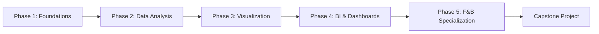

# Data Analysis & Business Intelligence Curriculum
## Your Complete Learning Path to Building Exceptional BI Dashboards

> [!IMPORTANT]
> **Your Goal**: Build a beautifully working, easy-to-use, and engaging business intelligence & analytics dashboard for the everyman.
> 
> **Estimated Timeline**: 6-9 months of focused learning (adjustable based on your pace)
>
> **🤖 AI-Aided Learning**: Throughout this curriculum, you'll find AI assistance markers showing exactly where and how to use AI to accelerate your learning. Look for these icons:
> - **💡 Ask AI**: Questions to ask AI for explanations
> - **⚡ AI Generate**: Tasks AI can generate for you (data, code, queries)
> - **🔎 AI Explain**: Concepts AI can explain in different ways
> - **🤖 AI Debug**: When to use AI for debugging
> - **🤖 AI Review**: Have AI review your work
>
> See [AI_LEARNING_GUIDE.md](../AI_LEARNING_GUIDE.md) for full details on effective AI-aided learning.
> 
> **Philosophy**: Learn by doing. Each module includes hands-on projects that build toward your final dashboard.

---

## 📊 Curriculum Overview

This curriculum is structured in **5 Phases**, progressing from foundational skills to specialized expertise:

---

## Phase 1: Data Foundations (Weeks 1-3)

### Module 1.1: Understanding Data & Business Intelligence
**Duration**: 3 days

**Learning Objectives**:
- Understand what Business Intelligence is and why it matters
- Learn the BI ecosystem: data sources → storage → analysis → visualization → insights
- Understand the difference between data analysis, data analytics, and business intelligence
- Identify stakeholder needs and how BI serves them

**Topics**:
- The BI value chain
- Types of analytics: Descriptive, Diagnostic, Predictive, Prescriptive
- Understanding business questions and KPIs
- The role of dashboards in decision-making
- Introduction to the "everyman" user: designing for non-technical audiences

**Hands-on Project**: 
- Create a concept map of how BI would work in a small restaurant
- Define 10 key questions a restaurant owner would want answered
- Sketch (paper/digital) what insights would be most valuable

#### Resources

- "Storytelling with Data" by Cole Nussbaumer Knaflic
- "The Data Warehouse Toolkit" by Kimball (Chapters 1-2)
- "Business Intelligence Guidebook" by Rick Sherman (Chapters 1-3)
- Introduction to Business Intelligence courses (YouTube/Coursera/edX)
- Gartner "What is Business Intelligence?" articles
- The BI Survey for industry trends and tool comparisons

#### Common Pitfalls

❌ **BI Understanding Mistakes**:
- Confusing BI with just reporting (BI is broader)
- Thinking BI is only for big companies
- Not understanding stakeholder needs first
- Building solutions looking for problems

❌ **Getting Started Errors**:
- Jumping into tools before understanding concepts
- Skipping the "why" to focus on "how"
- Article: "What is Business Intelligence?" by Gartner
- Book: "Business Intelligence Guidebook" by Rick Sherman (Chapters 1-3)
- Online Course: "Introduction to Data Science" (e.g., Coursera, edX) for foundational concepts
- Blog: "The BI Survey" for industry trends and tool comparisons
- Case Study: Analyze a public BI case study (e.g., how a retail chain uses BI)

❌ **Beginner Mistakes**:
- Jumping into tools before understanding the business problem
- Creating dashboards nobody asked for or needs
- Not talking to stakeholders early and often
- Analysis paralysis (over-analyzing without delivering value)
- Focusing on aesthetics over actionable insights
- Building reports that don't answer business questions

❌ **Data Mistakes**:
- Trusting data blindly without validation or spot-checks
- Not understanding data lineage (where data comes from)
- Ignoring data quality issues and dirty data
- Using wrong data sources or outdated information
- Not documenting data assumptions and limitations

❌ **Communication Mistakes**:
- Using technical jargon with business stakeholders
- Presenting too much detail without a clear narrative
- Not tailoring insights to the audience
- Failing to explain "so what" - the business impact
- Over-complicating analysis (simple often better)
- Not validating results with domain knowledge

#### Assessment Checklist

Before moving forward, you should be able to:
- [ ] Explain what BI is and how it differs from data science/analytics
- [ ] Identify stakeholder needs and translate them into BI requirements
- [ ] Distinguish between metrics, KPIs, dimensions, and measures
- [ ] Understand the complete BI workflow (data → analysis → insights → action)
- [ ] Recognize good vs bad metrics (actionable, accessible, auditable)
- [ ] Articulate the value of BI to business stakeholders
- [ ] Identify when BI is the right solution vs other approaches
- [ ] Understand ethical considerations in data analysis and reporting

---

### Module 1.2: Spreadsheet Mastery - Excel/Google Sheets
**Duration**: 2 weeks

**Learning Objectives**:
- Master spreadsheet fundamentals for data manipulation
- Understand data types, structures, and cleanliness
- Perform basic to intermediate analysis
- Create simple visualizations

**Topics**:

**Week 1 - Fundamentals**:
- Data entry and formatting best practices
- Cell references (relative, absolute, mixed)
- Essential functions: SUM, AVERAGE, COUNT, MIN, MAX
- Logical functions: IF, AND, OR, NOT, IFS
- Text functions: CONCATENATE, LEFT, RIGHT, MID, TRIM, UPPER, LOWER
- Date/Time functions: TODAY, NOW, DATE, DATEDIF

**Week 2 - Intermediate Skills**:
- Lookup functions: VLOOKUP, HLOOKUP, INDEX, MATCH, XLOOKUP
- Data validation and dropdown lists
- Conditional formatting for visual insights
- Pivot Tables and Pivot Charts
- Data cleaning: removing duplicates, handling blanks
- Named ranges for cleaner formulas
- Introduction to array formulas

**Hands-on Projects**:
1. **Week 1**: Sales data cleanup - Take messy sales data and clean it properly
2. **Week 2**: Create a sales analysis with pivot tables showing revenue by product, region, and time
3. **Mini-Dashboard**: Build a simple Excel dashboard using pivot tables and charts

**Practice Datasets**:
- Retail sales data (provided/found online)
- Restaurant transaction logs (simulated)
- Kaggle datasets for spreadsheet practice

> - **🔍 AI Explain**: "Explain VLOOKUP step-by-step with a restaurant menu price lookup example"
> - **💡 Ask AI**: "What's the difference between VLOOKUP and INDEX/MATCH? When should I use each?"
> - **⚡ AI Generate**: "Create practice data: Products table (id, name, price) and Sales table (product_id, quantity) for VLOOKUP practice"
> - **🔍 AI Explain**: "Explain pivot tables like I'm 10, then show me an F&B example"
> - **⚡ AI Generate**: "Give me 20 beginner-level VLOOKUP practice problems"

#### Resources

- Excel official documentation (Microsoft Learn)
- Google Sheets function reference
- freeCodeCamp spreadsheet tutorials
- Chandoo.org (Excel tips and tricks)
- ExcelJet keyboard shortcuts and formulas guide
- "Excel 2022 Bible" by Michael Alexander
- YouTube: ExcelIsFun channel for video tutorials

#### Common Pitfalls

❌ **Spreadsheet Mistakes**:
- Not using Excel Tables (makes formulas harder and data less structured)
- Hardcoding values instead of using cell references or named ranges
- Mixing raw data and presentation/dashboard in the same sheet
- Not documenting assumptions, formulas, and data sources
- Saving everything in one monolithic file
- Not using version control or consistent naming conventions

❌ **Formula Errors**:
- Not understanding absolute ($A$1) vs relative (A1) references
- Creating circular references accidentally
- Not handling errors (#REF!, #VALUE!, #N/A) with IFERROR
- Overly complex nested formulas that are impossible to debug
- Not breaking complex calculations into intermediate steps
- Using volatile functions (NOW, TODAY, OFFSET) excessively

❌ **Data Organization**:
- Empty rows/columns in data tables breaking formulas
- Merged cells causing copy/paste and formula issues
- Inconsistent data formatting (dates, numbers, text)
- Multiple unrelated data tables on the same sheet
- Not using proper headers or structured data
- Mixing different grain levels (daily vs monthly) in one table

#### Assessment Checklist

Before moving forward, you should be able to:
- [ ] Use all essential Excel/Sheets functions proficiently (SUM, IF, VLOOKUP, etc.)
- [ ] Master absolute vs relative cell references
- [ ] Create and manage pivot tables for data analysis
- [ ] Clean messy data efficiently (duplicates, blanks, formatting)
- [ ] Apply conditional formatting for visual insights
- [ ] Use VLOOKUP, INDEX-MATCH, and XLOOKUP for data merging
- [ ] Build simple interactive dashboards with dropdowns and filters
- [ ] Understand when to use spreadsheets vs databases
- [ ] Organize data using Excel Tables and named ranges

---

### Module 1.3: Data Thinking & Business Metrics
**Duration**: 4 days

**Learning Objectives**:
- Think like an analyst: question → data → insight → action
- Understand common business metrics across industries
- Learn to identify meaningful KPIs
- Understand data granularity and aggregation

**Topics**:
- The analytics mindset: curiosity + skepticism
- Common business metrics:
  - Revenue metrics: Total revenue, revenue growth, revenue per customer
  - Profitability: Gross margin, net margin, operating margin
  - Customer metrics: CAC, LTV, churn rate, retention rate
  - Operational metrics: Inventory turnover, labor cost %, efficiency ratios
- Metrics specific to F&B (preview):
  - Table turnover rate
  - Average check size
  - Food cost percentage
  - Labor cost percentage
  - RevPASH (Revenue Per Available Seat Hour)
- How to define a "good" metric: actionable, accessible, auditable

**Hands-on Project**:
- Take a real business scenario (e.g., coffee shop) and define:
  - 5 critical KPIs to track
  - How you'd calculate each
  - What questions each answers
  - What actions might result from insights

> **🤖 AI Assistance**:
> - **💡 Ask AI**: "What metrics matter most for a small restaurant owner? Explain each one"
> - **⚡ AI Generate**: "Create examples of 5 interactive dashboard features for F&B analytics"
> - **🤖 AI Review**: "Review my dashboard design. Does it follow best practices?"

#### Resources

- Advanced dashboard design tutorials and courses
- Dynamic named ranges Excel documentation
- Dashboard interactivity best practices guides
- BI tool-specific advanced features documentation
- Performance optimization techniques for dashboards
- Real-world dashboard case studies
- "Lean Analytics" by Alistair Croll
- Industry-specific KPI guides
- F&B Business Processes guide (for F&B context)
- "Measure What Matters" by John Doerr (for OKRs and KPIs)
- Harvard Business Review articles on analytics and metrics
- Online courses on business analysis and KPI definition (e.g., LinkedIn Learning)

#### Common Pitfalls

❌ **Metric Mistakes**:
- Tracking too many metrics (analysis paralysis)
- Using vanity metrics (look good but not actionable)
- Not understanding what "good" looks like
- Comparing apples to oranges (different contexts)
- Not clearly defining the metric's calculation
- Focusing on outputs instead of outcomes

❌ **Analytical Thinking Errors**:
- Jumping to conclusions without data
- Ignoring context (seasonality, market changes)
- Not asking "so what?" about findings
- Correlation vs causation confusion
- Confirmation bias (seeking data that supports pre-existing beliefs)
- Failing to consider alternative explanations for observed trends

❌ **Advanced Dashboard Mistakes**:
- Overcomplicating with too many interactive features
- Performance issues from inefficient calculations
- Confusing UX with unclear navigation
- Not testing with actual users before deployment
- Missing mobile responsiveness
- Over-reliance on complex parameters confusing end users

#### Assessment Checklist

Before moving to Phase 2, you should be able to:
- [ ] Think analytically about business problems
- [ ] Define meaningful KPIs for different industries
- [ ] Understand common business metrics
- [ ] Identify what makes a good metric (actionable, accessible, auditable)
- [ ] Apply analytical mindset to real scenarios
- [ ] Translate business questions into data questions
- [ ] Distinguish between leading and lagging indicators
- [ ] Understand the importance of data granularity for different analyses
- [ ] Articulate the difference between a metric and a KPI

---

## Phase 2: Data Analysis Deep Dive (Weeks 4-7)

### Module 2.1: Statistical Thinking for Business
**Duration**: 1.5 weeks

**Learning Objectives**:
- Understand descriptive statistics
- Identify trends, patterns, and outliers
- Make data-driven comparisons
- Understand correlation vs. causation

**Topics**:
- Measures of central tendency: mean, median, mode
- Measures of dispersion: range, variance, standard deviation, percentiles
- Distributions: normal, skewed, bimodal
- Understanding outliers and when they matter
- Time series basics: trends, seasonality, cycles
- Correlation and its limitations
- Statistical significance (conceptual understanding)

**Hands-on Project**:
- Analyze restaurant sales data:
  - Calculate summary statistics
  - Identify seasonal patterns
  - Find outliers and investigate why
  - Determine which products correlate with high revenue days
  
**Tools**: Excel/Google Sheets, introduction to Google Data Studio

#### Resources

- "Statistics for Business and Economics" by Paul Newbold
- Khan Academy Statistics and Probability course (free)
- StatQuest YouTube channel (intuitive explanations)
- "Naked Statistics" by Charles Wheelan (accessible introduction)
- Excel/Google Sheets statistical functions documentation
- Online statistics courses (Coursera, edX)
- "Naked Statistics" by Charles Wheelan (accessible statistics introduction)
- Khan Academy Statistics and Probability course (free, comprehensive)
- "Statistics Done Wrong" by Alex Reinhart (common statistical mistakes)
- "How to Lie with Statistics" by Darrell Huff (classic on misuse)
- Seeing Theory (interactive statistics visualizations)
- StatQuest YouTube channel (statistics explained simply)

> **🤖 AI Assistance**:
> - **🔍 AI Explain**: "Explain standard deviation and why it matters for business analytics with F&B examples"
> - **💡 Ask AI**: "When should I use median vs mean for restaurant sales analysis?"
> - **⚡ AI Generate**: "Generate sample restaurant sales data (100 days) with seasonal patterns and outliers"

#### Common Pitfalls

❌ **Statistical Misunderstandings**:
- Confusing correlation with causation (classic mistake)
- Ignoring sample size (small samples = unreliable conclusions)
- Not understanding statistical significance vs practical significance
- Cherry-picking data to support preconceived conclusions
- Misinterpreting p-values and confidence intervals
- Assuming normal distribution without checking

❌ **Data Interpretation Errors**:
- Not considering confounding variables and external factors
- Extrapolating beyond the data range (forecasting too far)
- Ignoring outliers without investigation
- Comparing incomparable groups (different contexts)
- Not accounting for seasonality and trends
- Survivorship bias (only analyzing successful cases)

❌ **Visualization Mistakes**:
- Misleading y-axis scales (not starting at zero when appropriate)
- Cherry-picked date ranges to show desired trend
- Using wrong chart types for the data
- 3D charts that distort perceptions

#### Assessment Checklist

Before moving forward, you should be able to:
- [ ] Calculate and interpret mean, median, mode, standard deviation
- [ ] Identify outliers and understand their impact
- [ ] Perform correlation analysis
- [ ] Choose appropriate statistical measures for different scenarios
- [ ] Understand when statistical significance matters

---

### Module 2.2: Data Cleaning & Preparation
**Duration**: 1 week

**Learning Objectives**:
- Master the data cleaning process (80% of analyst work!)
- Handle missing data, inconsistencies, and errors
- Transform data into analysis-ready formats
- Document your data pipeline

**Topics**:
- The data cleaning workflow
- Identifying data quality issues:
  - Missing values
  - Duplicates
  - Inconsistent formatting
  - Incorrect data types
  - Outliers and errors
- Techniques for handling missing data
- Data normalization and standardization
- Reshaping data: wide vs. long format
- Creating derived fields
- Data documentation best practices

**Hands-on Project**:
- **The Messy Dataset Challenge**: Clean a deliberately messy F&B dataset
  - Fix date formats
  - Handle missing values
  - Standardize product names
  - Create calculated fields (profit margin, etc.)
  - Document all transformations

**Tools**: Excel Power Query, Google Sheets, introduction to SQL concepts

#### Resources
- "Data Cleaning" by Ihab Ilyas and Xu Chu
- OpenRefine tutorials (powerful data cleaning tool)
- Kaggle's "Data Cleaning Challenge" courses
- "Tidy Data" paper by Hadley Wickham
- Excel/Google Sheets data validation documentation
- Regular expressions (regex) tutorials for text cleaning

> **🤖 AI Assistance**:
> - **💡 Ask AI**: "What are the best practices for handling missing values in sales data?"
> - **🤖 AI Debug**: "My data has inconsistent date formats (MM/DD/YYYY and DD-MM-YY). How do I standardize them?"
> - **⚡ AI Generate**: "Create a checklist for data quality assessment"

#### Common Pitfalls

❌ **Data Cleaning Mistakes**:
- Not creating backups before cleaning (destructive changes)
- Deleting "bad" data without understanding why it's bad
- Automated cleaning without spot-checking results
- Not documenting cleaning steps (can't reproduce)
- Mixing cleaning with analysis (keep separate)
- Assuming all duplicates are errors (some may be valid)

❌ **Common Errors**:
- Inconsistent null handling (blank vs "NULL" vs 0)
- Wrong data types (dates as text, numbers as strings)
- Not standardizing formats (dates, phone numbers, addresses)
- Leading/trailing spaces breaking matches
- Special characters causing encoding issues
- Not validating after cleaning

❌ **Process Mistakes**:
- Cleaning in production data (always use copies)
- No quality checks after transformation
- Not keeping raw data untouched
- No audit trail of changes made or outdated information
- Not documenting data assumptions and limitations

#### Assessment Checklist

Before moving forward, you should be able to:
- [ ] Identify common data quality issues (missing, duplicates, inconsistencies)
- [ ] Apply systematic data cleaning techniques (e.g., imputation, standardization)
- [ ] Handle various types of missing data (e.g., mean, median, mode, deletion)
- [ ] Transform data into analysis-ready formats (e.g., wide to long, creating derived fields)
- [ ] Document cleaning processes for reproducibility and auditability
- [ ] Validate cleaning results against source data or business rules
- [ ] Understand the importance of data backups and version control in cleaning

---

### Module 2.3: Introduction to SQL & Databases
**Duration**: 1.5 weeks

**Learning Objectives**:
- Understand relational database concepts
- Write SQL queries to extract and analyze data
- Join multiple data sources
- Use SQL for aggregation and analysis

**Topics**:

**Week 1 - SQL Basics**:
- What is a database and why use one?
- Relational database concepts: tables, rows, columns, primary keys, foreign keys
- SQL SELECT statements
- Filtering with WHERE
- Sorting with ORDER BY
- Basic aggregations: COUNT, SUM, AVG, MIN, MAX, GROUP BY
- HAVING clause for filtered aggregations

**Week 2 - Intermediate SQL**:
- JOINs: INNER, LEFT, RIGHT, FULL OUTER
- Subqueries
- CASE statements for conditional logic
- Date/time functions in SQL
- String manipulation in SQL
- CTEs (Common Table Expressions) for readable queries
- Window functions: ROW_NUMBER, RANK, LAG, LEAD

**Hands-on Projects**:
1. Set up a sample database (restaurant operations)
2. Write queries to answer business questions:
   - What are our top 10 selling items?
   - Which servers generate the most revenue?
   - What's our daily average check size by day of week?
   - Calculate month-over-month growth rates
3. Build a data extract that could feed a dashboard

**Tools**: 
- SQLite (lightweight, easy to start)
- PostgreSQL (industry standard)
- DB Browser for SQLite (GUI tool)
- Online SQL playgrounds

#### Resources

- SQLZoo (interactive SQL tutorial)
- Mode Analytics SQL tutorial
- PostgreSQL documentation
- W3Schools SQL reference
- "SQL for Data Analysis" by Cathy O'Neil and Rachel Schutt (conceptual understanding)
- LeetCode / HackerRank SQL problems (for practice)
- "Practical SQL" by Anthony DeBarros (hands-on guide)

#### Common Pitfalls

❌ **SQL Mistakes**:
- Not using WHERE to filter (slow queries on large datasets)
- Forgetting JOIN conditions (Cartesian product)
- Using SELECT * (select only needed columns)
- Not understanding NULL behavior (NULL != 0)

❌ **Query Errors**:
- Aggregating without GROUP BY properly
- Mixing aggregate and non-aggregate columns
- Not ordering results (ORDER BY) when needed
- Complex nested queries when CTEs would be clearer
- Incorrect use of DISTINCT (often overused)
- Misunderstanding the order of SQL operations (FROM, WHERE, GROUP BY, HAVING, SELECT, ORDER BY)

❌ **Performance Issues**:
- No indexes on join columns
- Not limiting results during development
- Running expensive queries on production
- Not using EXPLAIN to understand query plans
- Suboptimal JOIN types for the specific data relationship
- Excessive use of subqueries where JOINs or CTEs would be more efficient

#### Assessment Checklist

Before moving forward, you should be able to:
- [ ] Write complex SELECT statements with WHERE, ORDER BY, and LIMIT clauses
- [ ] Perform various types of JOINs (INNER, LEFT, RIGHT, FULL) correctly
- [ ] Use aggregate functions (COUNT, SUM, AVG, MIN, MAX) with GROUP BY and HAVING
- [ ] Write and understand subqueries and Common Table Expressions (CTEs)
- [ ] Apply CASE statements for conditional logic within queries
- [ ] Utilize SQL date/time and string manipulation functions
- [ ] Understand basic query performance optimization concepts (e.g., indexing)
- [ ] Debug common SQL syntax and logical errors
- [ ] Design a simple relational database schema (tables, keys, relationships)

> **🤖 AI Assistance**:
> - **🔍 AI Explain**: "Explain JOIN types (INNER, LEFT, RIGHT, FULL) with restaurant order/customer example"
> - **⚡ AI Generate**: "Write SQL query: Get each server's total sales for last month, sorted highest first. Tables: sales(id, date, server_id, total), servers(id, name)"
> - **💡 Ask AI**: "Show me 5 examples of GROUP BY with HAVING clause"
> - **🤖 AI Debug**: "This SQL gives syntax error: [paste query]. What's wrong?"
> - **⚡ AI Generate**: "Create sample restaurant database schema with sales, products, servers, customers tables"
> - **💡 Ask AI**: "Explain what this SQL query does line by line: [paste complex query]"

---

### Module 2.4: Introduction to Python for Data Analysis (Optional but Recommended)
**Duration**: 2 weeks

> [!NOTE]
> This module is optional but highly recommended. Python will give you superpowers for data manipulation and can complement your dashboard building. You can skip this if you want to focus purely on BI tools, but revisit it later.

**Learning Objectives**:
- Use Python for data manipulation
- Leverage pandas for analysis
- Create basic visualizations
- Automate repetitive data tasks

**Topics**:

**Week 1 - Python Basics**:
- Python syntax fundamentals
- Data types: numbers, strings, lists, dictionaries
- Control flow: if/elif/else, loops
- Functions
- Reading/writing files
- Introduction to libraries

**Week 2 - Pandas & Data Analysis**:
- pandas DataFrames
- Reading data: CSV, Excel, SQL
- Data selection and filtering
- Grouping and aggregation
- Merging and joining data
- Handling missing values
- Creating visualizations with matplotlib/seaborn

**Hands-on Project**:
- Recreate your spreadsheet analysis in Python
- Build a data pipeline that:
  - Loads raw data
  - Cleans it
  - Calculates KPIs
  - Outputs a clean dataset for visualization
  - Generates a simple report

**Tools**: 
- Jupyter Notebooks
- pandas, numpy, matplotlib, seaborn libraries

#### Resources

- Python for Data Analysis by Wes McKinney (the "pandas bible")
- Kaggle Learn Python course (interactive and practical)
- pandas documentation (official and comprehensive)
- Real Python tutorials (in-depth articles and guides)
- "Automate the Boring Stuff with Python" by Al Sweigart (for automation mindset)
- Towards Data Science (blog with many Python data analysis examples)
- Stack Overflow (for specific coding challenges and solutions)

#### Common Pitfalls

❌ **Python Beginner Mistakes**:
- Not using virtual environments (dependency conflicts)
- Modifying data in place unintentionally
- Not handling exceptions (code crashes)
- Inefficient loops when vectorized operations exist
- Misunderstanding mutable vs. immutable data types
- Poor code readability and lack of comments

❌ **pandas Errors**:
- Chained assignment warnings (SettingWithCopyWarning)
- Not resetting index after operations
- Memory issues with large datasets (not using chunks)
- Mixing loc/iloc incorrectly
- Misunderstanding `copy()` vs view behavior
- Inefficient data type conversions (e.g., object to datetime)

❌ **Data Analysis Issues**:
- Not exploring data first (jumping to analysis)
- Ignoring data types (numeric as object)
- Not validating assumptions
- Over-complicating when SQL would be simpler
- Misinterpreting aggregation results (e.g., mean of categorical data)
- Failing to handle edge cases or missing data gracefully

#### Assessment Checklist

Before moving to Phase 3, you should be able to:
- [ ] Write basic Python scripts for data loading, cleaning, and transformation
- [ ] Effectively use pandas DataFrames for data manipulation and analysis
- [ ] Read and write data from various formats (CSV, Excel, SQL databases)
- [ ] Perform data cleaning tasks (missing values, duplicates, type conversion) using pandas
- [ ] Conduct basic statistical analysis and aggregations with pandas
- [ ] Create informative visualizations using matplotlib and seaborn
- [ ] Debug common Python and pandas errors independently
- [ ] Understand when Python is a suitable tool for a data analysis task versus other tools
- [ ] Structure a simple data analysis pipeline in Python (e.g., using Jupyter Notebooks)

> **🤖 AI Assistance**:
> - **⚡ AI Generate**: "Write Python code to: 1) Load restaurant_sales.csv, 2) Convert date to datetime, 3) Calculate daily total sales, 4) Plot trend. Use pandas and matplotlib"
> - **🤖 AI Debug**: "This pandas code throws KeyError: [paste code]. Why?"
> - **💡 Ask AI**: "Show me 5 common pandas operations for analyzing sales data" or "What's the difference between fact and dimension tables? Give F&B examples"
> - **⚡ AI Generate**: "Write pandas code to group by category and calculate sum, mean, and count" or "Design a data model for a restaurant: what tables are needed, relationships, sample ERD"
> - **🔍 AI Explain**: "Explain pandas DataFrames in simple terms with restaurant data example" or "Explain star schema vs snowflake schema with an F&B restaurant example"

#### Resources

- "The Data Warehouse Toolkit" by Ralph Kimball (the dimensional modeling bible)
- Star schema vs snowflake schema comparison guides
- Database normalization tutorials (1NF, 2NF, 3NF)
- ERD (Entity-Relationship Diagram) tools and best practices
- Data modeling patterns and anti-patterns articles
- SQL Server/PostgreSQL data modeling documentation

#### Common Pitfalls

❌ **Modeling Mistakes**:
- Not understanding business requirements before modeling
- Modeling only for current state (no future scalability)
- Unclear grain definition (mixing detail levels in fact tables)
- Missing or incorrect foreign key relationships
- Not documenting model assumptions and business rules
- Over-normalizing (slow queries) or under-normalizing (data inconsistency)

❌ **Schema Design Errors**:
- Fact tables without proper surrogate keys
- Missing date/time dimensions (critical for time-based analysis)
- Dimension tables without Slowly Changing Dimension (SCD) handling
- Conformed dimensions not actually conformed across data marts
- Poor naming conventions making schema hard to understand
- Overuse of snowflaking creating unnecessary complexity

❌ **Performance Issues**:
- Missing indexes on foreign keys and frequently queried columns
- Fact tables that are too wide (too many columns)
- Not partitioning large tables appropriately
- Materialized views not refreshed properly or efficiently

#### Assessment Checklist

Before moving forward, you should be able to:
- [ ] Design star schema data models for business scenarios
- [ ] Identify and define fact vs dimension tables correctly
- [ ] Define appropriate grain for fact tables
- [ ] Create comprehensive ERD diagrams
- [ ] Understand normalization trade-offs for BI
- [ ] Apply data modeling best practices and naming conventions
- [ ] Explain slowly changing dimensions and when to use them
- [ ] Model data for both current needs and future scalability
- [ ] Document data models clearly for other developers

---

## Phase 3: Data Visualization & Design (Weeks 8-11)

### Module 3.1: Data Visualization Principles
**Duration**: 1 week

**Learning Objectives**:
- Understand how humans perceive visual information
- Learn when to use which chart type
- Design visualizations that communicate clearly
- Avoid common visualization mistakes

**Topics**:
- **The Purpose of Visualization**: exploration vs. explanation
- **Visual Perception**:
  - Preattentive attributes (color, size, position)
  - Gestalt principles (proximity, similarity, enclosure)
  - How we compare: position, length, angle, area, color
- **Chart Types & When to Use Them**:
  - Comparison: bar charts, column charts
  - Distribution: histograms, box plots
  - Composition: pie charts (used sparingly!), stacked bars, treemaps
  - Relationship: scatter plots, bubble charts
  - Trends over time: line charts, area charts
  - Part-to-whole: waterfall charts, funnel charts
- **Color Theory**:
  - Color psychology in business
  - Accessibility (colorblind-friendly palettes)
  - Using color meaningfully (not decoratively)
  - Sequential vs. diverging vs. categorical palettes
- **Common Mistakes to Avoid**:
  - Misleading axes
  - Chartjunk and clutter
  - 3D charts (almost always bad)
  - Using pie charts for many categories
  - Poor color choices

**Hands-on Project**:
- **Visualization Makeover**: Take 5 poorly designed charts and redesign them
- Create a chart type selection guide for your own reference
- Design a color palette for your future dashboard

> **🤖 AI Assistance**:
> - **💡 Ask AI**: "When should I use bar chart vs line chart vs scatter plot? Give decision criteria"
> - **🤖 AI Review**: Share chart image: "Is this the right chart type for showing sales trends? What could be better?"
> - **💡 Ask AI**: "Give me a colorblind-friendly color palette for business dashboards (5 colors with hex codes)"
> - **💡 Ask AI**: "What are the most common data visualization mistakes and how to avoid them?"

#### Resources

- "Storytelling with Data" by Cole Nussbaumer Knaflic (MUST READ)
- "The Visual Display of Quantitative Information" by Edward Tufte
- From Data to Viz (website - chart selection guide)
- "Good Charts" by Scott Berinato (Harvard Business Review Press)
- Data Viz Project (catalog of visualization types)
- ColorBrewer (color palette tool for data visualization)
- PolicyViz blog and podcast (practical data viz advice)
- "Show Me the Numbers" by Stephen Few (practical guide to quantitative information)

#### Common Pitfalls

❌ **Chart Selection Mistakes**:
- Using pie charts for more than 5 categories (hard to compare)
- 3D charts that distort perception and make comparison difficult
- Dual-axis charts with incomparable scales (misleading)
- Using the wrong chart type for the data relationship
- Overusing donuts, gauges, and other "business" charts
- Not considering how data will be consumed (print vs digital, size)

❌ **Design Errors**:
- Too many colors causing visual noise and confusion
- Not starting bar chart y-axis at zero (misleading comparisons)
- Inconsistent color meanings across visualizations
- Chart junk and unnecessary decoration (Tufte's critique)
- Poor contrast and readability (especially for colorblind users)
- Not labeling axes and data points clearly

❌ **Perception Issues**:
- Using area/volume when length would be clearer
- Truncated axes exaggerating small differences
- Rainbow color scales instead of sequential/diverging
- Not accounting for color blindness (~8% of men)
- Animations and transitions that distract rather than clarify

#### Assessment Checklist

Before moving forward, you should be able to:
- [ ] Choose appropriate chart types for different data scenarios
- [ ] Apply visual perception principles to design
- [ ] Design clear, honest, and effective visualizations
- [ ] Avoid common visualization mistakes and misleading practices
- [ ] Make charts accessible to all users, including those with color blindness
- [ ] Explain data visualization best practices and justify design choices

---

### Module 3.2: Dashboard Design Principles
**Duration**: 1.5 weeks

**Learning Objectives**:
- Understand what makes a dashboard effective
- Learn dashboard design patterns
- Design for your audience (the everyman!)
- Create wireframes and mockups

**Topics**:
- **Dashboard Types**:
  - Strategic (executive) dashboards: high-level KPIs, trends
  - Analytical dashboards: deep-dive exploration
  - Operational dashboards: real-time monitoring
  - Tactical dashboards: department-specific metrics
- **Design Principles for Dashboards**:
  - The 5-second rule: can you grasp the main insight in 5 seconds?
  - Information hierarchy: most important info gets prime real estate
  - White space is your friend
  - Consistency in design language
  - Progressive disclosure: overview first, details on demand
- **Layout Best Practices**:
  - F-pattern and Z-pattern reading
  - Grid systems for alignment
  - Grouping related metrics
  - Effective use of space
- **Interactivity Design**:
  - When to use filters
  - Drill-down patterns
  - Tooltips and details
  - Reset and refresh patterns
- **Designing for "The Everyman"**:
  - Avoid jargon
  - Provide context (comparisons, benchmarks, targets)
  - Use familiar metaphors
  - Include help/guidance
  - Make insights obvious
- **Mobile Considerations**: responsive dashboard design

**Hands-on Projects**:
1. **Analyze Existing Dashboards**: Review 10 public dashboards, critique them
2. **Wireframe Creation**: Design wireframes for 3 different dashboard types
3. **User Persona Development**: Create personas for your target "everyman" users
4. **Dashboard Mockup**: Create a detailed mockup (Figma/Sketch/Paper) for an F&B dashboard

**Tools**:
- Figma or Adobe XD (for mockups)
- Pen and paper (wireframing)
- Dashboard inspiration sites

#### Resources

- "Information Dashboard Design" by Stephen Few
- Andy Kriebel's Makeover Monday
- Dashboard design pattern libraries (e.g., from Tableau, Power BI)
- Figma/Sketch dashboard templates (for practical application)
- Nielsen Norman Group (NN/g) articles on dashboard usability
- Dribbble, Behance (for design inspiration)

> **🤖 AI Assistance**:
> - **🤖 AI Review**: Share wireframe/mockup: "Review this dashboard layout for an F&B operator. Is the hierarchy clear?"
> - **💡 Ask AI**: "What data sources are critical for F&B BI that operators often overlook?" or "What are the best practices for designing mobile-responsive dashboards?"
> - **⚡ AI Generate**: "Create a data source inventory template for an F&B business" or "Generate 3 dashboard wireframe layout ideas for restaurant operations"

#### Common Pitfalls

❌ **Design Mistakes**:
- Too many metrics (information overload, cognitive strain)
- Poor visual hierarchy (everything looks equal importance, no clear focal point)
- Not mobile-responsive (poor user experience on smaller screens)
- Ignoring user workflows and decision-making processes
- Lack of context for metrics (e.g., no comparisons, targets, or trends)
- Over-reliance on complex charts when simple ones suffice

❌ **Layout Issues**:
- Poor use of whitespace (cluttered appearance)
- Inconsistent spacing and alignment (unprofessional look)
- Important data buried below the fold (requires scrolling to see key insights)
- No clear entry point for eyes (users don't know where to start)
- Inconsistent navigation or lack thereof
- Mixing too many different chart types on one screen

❌ **F&B Industry Understanding Mistakes**:
- Not understanding operational workflows and stakeholder needs
- Ignoring service model differences (QSR vs fine dining vs fast casual)
- Missing critical F&B data sources (waste, labor scheduling, reservations)
- Not accounting for perishability and food cost volatility
- Treating all revenue streams the same (dine-in vs delivery vs catering)
- Ignoring local market factors and regulatory considerations

#### Assessment Checklist

Before moving forward, you should be able to:
- [ ] Design effective dashboard wireframes and mockups
- [ ] Apply visual hierarchy principles to guide user attention
- [ ] Create user-centered layouts that align with audience needs
- [ ] Design for different screen sizes and mobile responsiveness
- [ ] Get and incorporate user feedback into design iterations
- [ ] Follow dashboard design best practices for clarity and impact
- [ ] Differentiate between strategic, analytical, and operational dashboards

---

### Module 3.3: BI Tools - Hands-on with Visualization Platforms
**Duration**: 2.5 weeks

**Learning Objectives**:
- Master at least one major BI tool
- Create interactive visualizations
- Build your first dashboard
- Understand tool selection criteria

**Topics**:

**Week 1 - Tool Overview & Selection**:
- **Popular BI Tools Comparison**:
  - Tableau: powerful, intuitive, expensive
  - Power BI: Microsoft ecosystem, affordable, growing
  - Google Data Studio: free, cloud-based, limited
  - Metabase: open-source, simple, self-hosted
  - Apache Superset: open-source, powerful, technical
- Choosing the right tool for your project
- Tool setup and environment

**Weeks 2-3 - Deep Dive (Pick Your Tool)**:

**For Tableau/Power BI**:
- Connecting to data sources
- Creating calculated fields
- Building individual visualizations
- Using filters and parameters
- Creating dashboards
- Adding interactivity
- Publishing and sharing
- Performance optimization

**For Google Data Studio**:
- Data source connections
- Blending data
- Creating charts
- Filters and date ranges
- Calculated fields with formulas
- Dashboard creation
- Sharing and permissions

**For Open-Source (Metabase/Superset)**:
- Installation and setup
- Database connections
- Query builder
- Creating questions/charts
- Building dashboards
- User management
- Embedding options

**Hands-on Projects**:
1. **Connect to Your Data**: Use your cleaned dataset from Phase 2
2. **Build Individual Visualizations**: Create 10-15 different charts exploring your data
3. **First Dashboard**: Build a complete dashboard with:
   - 5-7 key visualizations
   - Filters for interactivity
   - Clear title and context
   - Consistent design
4. **User Testing**: Show to a non-technical friend, get feedback, iterate

**Recommended Focus**: **Power BI** or **Tableau** for career prospects, **Google Data Studio** for free/quick solutions, **Metabase** for open-source/customizable needs

**Tools**: Your chosen BI platform (Tableau Public/Power BI/Google Data Studio/Metabase)

#### Resources

- Official tool documentation (Tableau/Power BI/Looker)ials for your chosen tool
- Udemy/Coursera courses specific to your chosen BI tool
- Tool-specific blogs and forums (e.g., Tableau Zen Masters, Power BI Community)
- Data visualization challenges (e.g., Makeover Monday, Workout Wednesday)
- Tableau Public gallery
- Power BI community
- Official tool documentation
- YouTube tutorials for your chosen tool

> **🤖 AI Assistance**:
> - **💡 Ask AI**: "Compare Tableau vs Power BI vs Data Studio for small business BI needs"
> - **⚡ AI Generate**: "Create step-by-step tutorial for building first Tableau dashboard"
> - **🤖 AI Debug**: "My Power BI visual shows wrong totals. Dataset: [describe]. Measure: [DAX]. What's wrong?"

#### Common Pitfalls

❌ **Tool Selection Mistakes**:
- Choosing based on hype not needs (e.g., picking a complex tool for simple reporting)
- Not considering total cost (licenses, training, maintenance, infrastructure)
- Lock-in without evaluating alternatives and future scalability
- Over-engineering for simple needs (using a sledgehammer to crack a nut)
- Ignoring data source compatibility and integration capabilities

❌ **Learning Curve Issues**:
- Trying to master everything at once (leading to overwhelm)
- Not following tutorials properly or skipping fundamental concepts
- Skipping fundamentals like data types, relationships, and aggregation
- Not practicing with real data and diverse use cases
- Relying solely on drag-and-drop without understanding underlying logic

#### Assessment Checklist

Before moving to Phase 4, you should be able to:
- [ ] Build interactive dashboards in at least one major BI tool (e.g., Tableau, Power BI)
- [ ] Connect to various data sources (e.g., CSV, Excel, SQL databases) within the tool
- [ ] Create a variety of visualizations (charts, tables, maps) using the tool's features
- [ ] Add interactivity such as filters, drill-downs, and parameters
- [ ] Publish and share dashboards with stakeholders securely
- [ ] Choose appropriate BI tools for different use cases and organizational needs
- [ ] Understand basic performance optimization techniques within the chosen tool

---

## Phase 4: Business Intelligence & Advanced Dashboards (Weeks 12-15)

### Module 4.1: Data Storytelling
**Duration**: 1 week

**Learning Objectives**:
- Transform data into compelling narratives
- Structure insights for maximum impact
- Present to different audiences
- Create action-oriented recommendations

**Topics**:
- **The Data Story Arc**:
  - Setting: context and background
  - Rising action: the problem or question
  - Climax: the insight or finding
  - Resolution: the recommendation
- **Structuring Your Story**:
  - Start with the ending (the "so what?")
  - Support with evidence
  - Anticipate questions
  - Call to action
- **Audience Adaptation**:
  - Executives: concise, strategic, business impact
  - Managers: actionable, operational, detailed
  - Peers: technical, methodological
  - Non-technical: simplified, visual, relatable
- **Visual Storytelling Techniques**:
  - Annotation and highlighting
  - Progressive reveal
  - Comparison and context
  - Using metaphors and analogies
- **Presenting Insights**:
  - Structure of a data presentation
  - Handling questions
  - Live demos vs. static reports

**Hands-on Project**:
- **Create a Data Story**: Take your dashboard and create a presentation
  - 5-minute presentation
  - Tell a story with your data
  - Include recommendations
  - Practice presenting to someone

**Tools**: 
- Presentation software (PowerPoint, Google Slides, Keynote)
- Data visualization tools for screenshots/exports
- Screen recording software (for practice)
- Storytelling frameworks and templates

#### Resources
- "Storytelling with Data" by Cole Nussbaumer Knaflic (essential reading)
- "The Visual Display of Quantitative Information" by Edward Tufte (classic)
- "Good Charts" by Scott Berinato (Harvard Business Review Press)
- Data Viz Project (catalog of visualization types)
- ColorBrewer (color palette tool for data visualization)
- PolicyViz blog and podcast (practical data viz advice)
- "Show Me the Numbers" by Stephen Few (practical guide to quantitative information)
- TED talks about data (for inspiration on compelling presentations)
- Data journalism examples (The Pudding, FiveThirtyEight - for narrative structure)

> **🤖 AI Assistance**:
> - **⚡ AI Generate**: "Create a data story outline for declining restaurant sales: setup, conflict, resolution structure" or "Write presentation script explaining food cost increase to restaurant owner"
> - **🔍 AI Explain**: "Explain the classic story structure (setup-conflict-resolution) applied to data presentations" or "Explain executive summary vs detailed analysis - when to use each"
> - **💡 Ask AI**: "How do I present negative findings (declining sales) in a constructive way?" or "What storytelling techniques make data memorable for non-technical audiences?"
> - **🤖 AI Review**: "Review my data presentation outline. Is the story clear and compelling?" or "Review this dashboard narrative. Does it follow good storytelling principles?"
> - **🔧 AI Debug**: "My stakeholders zone out during presentations. How to engage them better with data stories?"

#### Common Pitfalls

❌ **Storytelling Mistakes**:
- Showing all the data instead of the insight (information overload)
- No clear narrative arc (beginning, middle, end)
- Too technical for the audience
- Burying the lede (key insight not obvious)

❌ **Presentation Errors**:
- Reading directly from slides/dashboard
- Not anticipating questions
- Going over time limit
- No call to action at the end

#### Assessment Checklist

Before moving forward, you should be able to:
- [ ] Craft a compelling data narrative with clear beginning, middle, end
- [ ] Identify the "so what" of your analysis
- [ ] Present to different audience types (technical vs executive)
- [ ] Handle questions and objections confidently
- [ ] Use storytelling techniques to make data memorable

---

### Module 4.2: Advanced Dashboard Techniques
**Duration**: 1.5 weeks

**Learning Objectives**:
- Implement advanced interactivity
- Create dynamic and responsive dashboards
- Optimize dashboard performance
- Build reusable templates

**Topics**:
- **Advanced Interactivity**:
  - Drill-down/drill-through patterns
  - Cross-filtering across visuals
  - Dynamic titles and text
  - Bookmarks and saved views
  - Mobile layouts
- **Parameters and Dynamic Elements**:
  - What-if analysis
  - Date range selectors
  - Dynamic measure selection
  - Dynamic benchmarking
- **Calculated Fields & DAX/Formulas**:
  - Time intelligence: YTD, MTD, prior period
  - Ratio and percentage calculations
  - Moving averages and trends
  - Ranking and top N
  - Conditional formatting based on logic
- **Performance Optimization**:
  - Data model design
  - Reducing query load
  - Efficient calculations
  - Extract vs. live connections
- **Dashboard Organization**:
  - Multiple pages/tabs
  - Navigation design
  - Consistent style guides
  - Reusable templates

**Hands-on Project**:
- **Dashboard 2.0**: Rebuild your earlier dashboard with:
  - Advanced interactivity
  - Multiple pages
  - Dynamic date filtering
  - Drill-through functionality
  - Performance optimizations
  - Professional polish

**Tools**: Your chosen BI platform (Tableau/Power BI/etc.)

> **🤖 AI Assistance**:
> - **⚡ AI Generate**: "Write DAX formula to calculate: Prior Year same month sales for comparison" or "Create drill-through action setup for Power BI dashboard"
> - **🔍 AI Explain**: "Explain the difference between calculated columns and measures in Power BI with examples" or "Explain time intelligence in BI: YTD, MTD, rolling averages with F&B examples"
> - **💡 Ask AI**: "What are best practices for dashboard performance optimization in Tableau/Power BI?" or "How do I implement what-if analysis parameters in my dashboard?"
> - **🤖 AI Debug**: "My dashboard is slow with 100k rows. How to optimize: [describe setup]?" or "This DAX measure returns wrong values: [paste formula]. Debug it"
> - **🔧 AI Review**: "Review my dashboard navigation structure. Is it intuitive for restaurant managers?"

#### Resources

- Advanced dashboard design tutorials for your BI tool
- DAX/calculation language documentation (Power BI, Tableau LOD)
- Dashboard performance optimization guides
- Interactive dashboard pattern libraries
- Advanced BI tool features documentation
- Real-world advanced dashboard case studies

#### Common Pitfalls

❌ **Advanced Dashboard Mistakes**:
- Overcomplicating with too many interactive features
- Performance issues from inefficient calculations or data models
- Confusing UX with unclear navigation between pages
- Not testing with actual users before deployment
- Missing mobile responsiveness considerations
- Over-reliance on complex parameters confusing end users

❌ **Technical Errors**:
- Inefficient DAX/calculated fields causing slow performance
- Circular dependencies in calculations
- Breaking existing functionality when adding new features
- Not optimizing data model before building dashboards
- Ignoring cross-filtering impacts on performance
- Missing error handling in dynamic calculations

#### Assessment Checklist

Before moving forward, you should be able to:
- [ ] Implement advanced dashboard interactivity
- [ ] Create drill-down and drill-through functionality
- [ ] Build dynamic date filters and parameters
- [ ] Write DAX formulas or calculated fields
- [ ] Optimize dashboard performance
- [ ] Design multi-page dashboard navigation

---

### Module 4.3: Data Modeling for BI
**Duration**: 1.5 weeks

**Learning Objectives**:
- Understand dimensional modeling
- Design star and snowflake schemas
- Build efficient data models
- Understand ETL concepts

**Topics**:
- **Dimensional Modeling Concepts**:
  - Fact tables vs. dimension tables
  - Grain of a fact table
  - Star schema design
  - Snowflake schema design
  - Slowly changing dimensions (SCD)
- **Building a Data Model**:
  - Identifying facts and dimensions
  - Creating relationships
  - Surrogate keys
  - Date dimensions
  - Role-playing dimensions
- **Data Warehousing Basics**:
  - OLTP vs. OLAP
  - ETL (Extract, Transform, Load) concepts
  - Data refresh strategies
  - Historical data tracking
- **Best Practices**:
  - Naming conventions
  - Documentation
  - Data lineage
  - Testing and validation

**Hands-on Project**:
- **Design a Data Model for F&B**:
  - Create a dimensional model for a restaurant
  - Identify fact tables (Sales, Inventory, etc.)
  - Design dimension tables (Products, Customers, Time, Location, etc.)
  - Implement in your BI tool
  - Load sample data
  - Build a dashboard on top of it

**Resources**:
- "The Data Warehouse Toolkit" by Ralph Kimball
- Dimensional modeling patterns

> **🤖 AI Assistance**:
> - **⚡ AI Generate**: "Create a star schema design for F&B analytics (fact and dimension tables)"
> - **🔍 AI Explain**: "Explain slowly changing dimensions (SCD) with restaurant menu example (prices change over time)"
> - **💡 Ask AI**: "When should I use snowflake schema vs star schema for BI?"

---

### Module 4.4: Data Modeling
**Duration**: 1.5 weeks

**Learning Objectives**:
- Understand different data models (star, snowflake)
- Design effective data models for BI
- Identify fact and dimension tables
- Apply normalization and denormalization principles

**Topics**:
- **Relational Databases Review**:
  - Tables, columns, primary/foreign keys
  - Relationships (one-to-one, one-to-many, many-to-many)
- **Data Warehousing Concepts**:
  - OLTP vs. OLAP
  - Data marts
- **Dimensional Modeling**:
  - Star Schema: Fact tables, Dimension tables
  - Snowflake Schema
  - Conformed dimensions
- **Fact Table Types**:
  - Transactional fact tables
  - Periodic snapshot fact tables
  - Accumulating snapshot fact tables
- **Dimension Table Types**:
  - Slowly Changing Dimensions (SCD Type 1, 2, 3)
  - Junk dimensions, role-playing dimensions
- **Grain**:
  - Defining the level of detail for fact tables
- **Data Modeling Best Practices**:
  - Naming conventions
  - Documentation (ERDs)

**Hands-on Project**:
- Design a star schema for a given F&B business scenario
- Create an Entity-Relationship Diagram (ERD)
- Identify fact and dimension tables, define their grain
- Implement a simple data model in a database (e.g., PostgreSQL)

**Tools**: 
- Your BI tool + potentially Python for modeling
- Forecasting features in Tableau/Power BI

> **🤖 AI Assistance**:
> - **🔍 AI Explain**: "Explain star schema vs snowflake schema with F&B restaurant example"
> - **⚡ AI Generate**: "Design a data model for restaurant: tables needed, relationships, sample ERD"
> - **💡 Ask AI**: "What are best practices for naming tables and columns in a data warehouse?"

#### Resources

- "The Data Warehouse Toolkit" by Ralph Kimball (the bible of dimensional modeling)
- Star schema vs snowflake schema guides and comparisons
- Database normalization tutorials (1NF, 2NF, 3NF)
- SQL Server/PostgreSQL data modeling best practices
- ERD (Entity-Relationship Diagram) tools and tutorials
- Data modeling patterns and anti-patterns articles

#### Common Pitfalls

❌ **Modeling Mistakes**:
- Not understanding business requirements before modeling
- Modeling for current state only (not future scalability)
- Too normalized (slow queries) or too denormalized (data inconsistency)
- Unclear grain definition (mixing detail levels)
- Missing or incorrect foreign key relationships
- Not documenting model assumptions and business rules

❌ **Schema Design Errors**:
- Fact tables without proper surrogate keys
- Dimension tables without slowly changing dimension (SCD) handling
- Missing date/time dimensions (critical for analytics)
- Conformed dimensions not actually conformed across data marts
- Overuse of snowflaking (unnecessary complexity)
- Poor naming conventions making tables hard to understand

❌ **Performance Issues**:
- Missing indexes on foreign keys and frequently queried columns
- Fact tables that are too wide (too many columns)
- Not partitioning large tables appropriately
- Materialized views not refreshed properly

#### Assessment Checklist

Before moving forward, you should be able to:
- [ ] Design star schema data models
- [ ] Identify fact vs dimension tables
- [ ] Define appropriate grain for facts
- [ ] Create ERD diagrams
- [ ] Understand normalization trade-offs
- [ ] Apply data modeling best practices

---

### Module 4.5: Dashboard Implementation
**Duration**: 2 weeks

**Learning Objectives**:
- Translate design mockups into functional dashboards
- Implement interactivity and drill-down features
- Optimize dashboard performance
- Apply advanced visualization techniques

**Topics**:
- **Connecting to Data Sources**:
  - Live connections vs. extracts/imports
  - Blending multiple data sources
- **Building Basic Visualizations**:
  - Review of chart types and best practices
  - Creating calculated fields and parameters
- **Dashboard Layout and Design**:
  - Containers, floating vs. tiled objects
  - Responsive design for different devices
- **Interactivity**:
  - Filters (quick filters, action filters)
  - Parameters for user control
  - Drill-down and drill-through actions
- **Advanced Visualizations**:
  - Custom charts (e.g., Sankey, Chord diagrams if applicable)
  - Small multiples, sparklines
- **Performance Optimization**:
  - Data source filters, context filters
  - Efficient calculations
  - Reducing marks and complexity
- **Security and Sharing**:
  - Row-level security
  - Publishing and embedding dashboards

**Hands-on Project**:
- Implement a multi-tab F&B dashboard based on a provided design
- Incorporate at least 5 interactive elements (filters, parameters, actions)
- Optimize the dashboard for performance
- Document the implementation choices and challenges

**Tools**:
- Your chosen BI platform (Tableau, Power BI, Google Data Studio, Metabase)
- SQL client for data source verification

> **🤖 AI Assistance**:
> - **⚡ AI Generate**: "Provide a step-by-step guide to create an interactive sales dashboard in Tableau/Power BI"
> - **💡 Ask AI**: "What are common performance bottlenecks in BI dashboards and how to fix them?"
> - **🔍 AI Explain**: "Explain the difference between live connection and data extract in Tableau/Power BI"

#### Resources

- Official documentation for your chosen BI tool
- Online communities and forums (Tableau Public, Power BI Community)
- "Information Dashboard Design" by Stephen Few (revisit)

#### Common Pitfalls

❌ **Implementation Mistakes**:
- Poorly organized layouts (cluttered dashboards)
- Inconsistent design elements (fonts, colors)
- Lack of clear navigation or user guidance
- Overuse of interactivity leading to confusion
- Slow loading dashboards due to inefficient design

❌ **Technical Errors**:
- Incorrect data connections or joins
- Errors in calculated fields or aggregations
- Security misconfigurations
- Broken drill-down actions

#### Assessment Checklist

Before moving forward, you should be able to:
- [ ] Build interactive dashboards in your chosen BI tool
- [ ] Connect to various data sources
- [ ] Create calculated fields and parameters
- [ ] Implement drill-down and filtering
- [ ] Optimize dashboard performance
- [ ] Publish and share dashboards securely

---

### Module 4.6: Testing & Iteration
**Duration**: 1 week

**Learning Objectives**:
- Develop a systematic approach to testing dashboards
- Gather and incorporate user feedback effectively
- Understand the iterative nature of BI development
- Document changes and version control

**Topics**:
- **Importance of Testing**:
  - Ensuring data accuracy and integrity
  - Validating calculations and logic
  - Checking user experience and functionality
- **Types of Testing**:
  - **Data Validation**: Comparing dashboard data to source data
  - **Functional Testing**: Checking filters, drill-downs, actions
  - **Performance Testing**: Load times, responsiveness
  - **User Acceptance Testing (UAT)**: End-user feedback
  - **Regression Testing**: Ensuring new changes don't break old features
- **Feedback Collection**:
  - Structured interviews, surveys
  - Usability testing sessions
  - A/B testing (for specific elements)
- **Iteration and Refinement**:
  - Prioritizing feedback
  - Agile development principles in BI
  - Version control for dashboards and data models
- **Documentation of Changes**:
  - Change logs
  - User guides updates
  - Technical documentation updates

**Hands-on Project**:
- Conduct a testing cycle for a previously built dashboard
- Create a test plan and test cases
- Gather feedback from at least two "mock" users
- Implement a round of iterations based on feedback
- Document the testing process and changes made

**Tools**:
- Spreadsheet for test cases and feedback tracking
- Version control system (e.g., Git for code, or BI tool's versioning)
- Communication tools for feedback (e.g., Slack, email)

> **🤖 AI Assistance**:
> - **⚡ AI Generate**: "Create a test plan template for a new F&B sales dashboard"
> - **💡 Ask AI**: "What are best practices for collecting and prioritizing user feedback for a BI dashboard?"
> - **🔍 AI Explain**: "Explain the concept of User Acceptance Testing (UAT) in the context of BI dashboards"

#### Resources

- Software testing methodologies (e.g., Agile testing)
- User experience (UX) design principles
- Version control best practices

#### Common Pitfalls

❌ **Testing Mistakes**:
- Skipping testing phases (especially UAT)
- Not validating data against source systems
- Testing only "happy paths" and ignoring edge cases
- Not documenting test results or bugs

❌ **Iteration Challenges**:
- Ignoring or misinterpreting user feedback
- Making changes without understanding the impact
- Lack of version control leading to lost work or conflicts
- Endless iteration without a clear scope or goal

#### Assessment Checklist

Before moving forward, you should be able to:
- [ ] Create a comprehensive test plan for a dashboard
- [ ] Perform data validation and functional testing
- [ ] Collect and analyze user feedback
- [ ] Prioritize and implement iterative changes
- [ ] Document testing and iteration processes
- [ ] Understand the importance of version control

---

## Phase 5: F&B Operations Management & Analytics Specialization (Weeks 16-20)

### Module 5.1: F&B Industry Deep Dive
**Duration**: 1 week

**Learning Objectives**:
- Understand F&B business operations
- Learn industry-specific metrics and challenges
- Identify key data sources in F&B
- Understand regulatory and compliance aspects

**Topics**:
- **F&B Business Models**:
  - Quick Service (QSR)
  - Fast Casual
  - Full Service / Fine Dining
  - Cafes & Bakeries
  - Catering
  - Cloud kitchens
- **Operational Workflows**:
  - Front of house: ordering, serving, payment
  - Back of house: prep, cooking, inventory
  - Supply chain: ordering, receiving, storage
  - Staff management: scheduling, performance
- **Key Stakeholders & Their Needs**:
  - Owner/GM: profitability, growth
  - Chef: food cost, waste, menu performance
  - Front-of-house manager: service quality, table turnover
  - Marketing: customer behavior, promotions effectiveness
- **Data Sources in F&B**:
  - POS (Point of Sale) systems
  - Inventory management systems
  - Employee scheduling systems
  - Reservation systems
  - Customer feedback (reviews, surveys)
  - Third-party delivery platforms
- **Industry Challenges**:
  - Thin margins (3-5% typical)
  - High labor turnover
  - Seasonality
  - Food waste
  - Competition

**Hands-on Activity**:
- **Shadow a Restaurant**: If possible, spend a day observing a restaurant
- Interview someone in F&B about their data needs
- Map out the complete data flow in a restaurant
- Identify 20 questions a dashboard should answer

> **🤖 AI Assistance**:
> - **💡 Ask AI**: "What are the key differences in metrics between QSR, fast casual, and fine dining?"
> - **⚡ AI Generate**: "Create list of 30 questions an F&B dashboard should answer for different stakeholder roles"

#### Resources

- F&B Business Processes guide (in this repository)
- National Restaurant Association industry reports and benchmarks
- "Restaurant Financial Basics" by Raymond Goodman
- "Setting the Table" by Danny Meyer (hospitality philosophy)
- Toast, Square, Upserve restaurant analytics platform case studies
- Reddit r/restaurateur for real-world operator insights
- Local market F&B industry associations and chambers of commercells

❌ **F&B Understanding Mistakes**:
- Not understanding kitchen vs front-of-house operations and workflows
- Ignoring service models (fine dining vs quick service vs fast casual)
- Not considering different revenue streams (dine-in, takeout, delivery, catering)
- Missing the impact of perishability and food waste on profitability
- Not understanding labor regulations and scheduling constraints
- Ignoring local market factors (demographics, competition, seasonality)

❌ **Context Errors**:
- Applying retail/e-commerce metrics directly to F&B without adaptation
- Not accounting for F&B-specific costs (COGS 28-35%, labor 25-35%)
- Ignoring regulations (health codes, alcohol licensing, labor laws)
- Missing cultural and regional differences in dining habits
- Not understanding the importance of turn time and table turnover
- Failing to account for operational hours and day-part variations

❌ **Data Collection Issues**:
- Not integrating POS, inventory, and labor systems for complete visibility
- Missing reservation and waitlist data for capacity planning
- No customer feedback loop or sentiment analysis
- Inadequate tracking of waste and spoilageg margins
- Not accounting for waste and shrinkage

#### Assessment Checklist

Before moving forward, you should be able to:
- [ ] Explain different F&B business models
- [ ] Map complete F&B operational workflows
- [ ] Identify all F&B data sources
- [ ] Understand stakeholder-specific dashboard needs
- [ ] Know industry challenges and metrics
- [ ] Ask the right questions for F&B analytics

---

### Module 5.2: F&B Specific Metrics & KPIs
**Duration**: 1 week

**Learning Objectives**:
- Master F&B specific metrics
- Calculate and interpret these metrics
- Understand benchmarks and targets
- Build a comprehensive F&B KPI framework

**Topics**:
- **Revenue Metrics**:
  - Total sales (by time period, location, channel)
  - Average check / ticket size
  - Revenue per table
  - RevPASH (Revenue Per Available Seat Hour)
  - Sales mix by category (food vs. beverage)
  - Dine-in vs. takeout vs. delivery split
- **Cost Metrics**:
  - **Food Cost %**: (COGS / Food Revenue) × 100
    - Target: 28-35% typically
    - By item, category, overall
  - **Beverage Cost %**: similar to food cost
    - Target: 18-24% for beer/wine, 15-20% for liquor
  - **Prime Cost**: (COGS + Labor) × 100 / Revenue
    - Target: under 60%
  - **Labor Cost %**: (Total Labor / Revenue) × 100
    - Target: 25-35% depending on service model
  - **Occupancy/Rent %**: typically 6-10%
- **Profitability Metrics**:
  - Gross profit margin
  - Operating profit margin
  - Net profit margin
  - EBITDA
  - Break-even point
- **Operational Efficiency**:
  - Table turnover rate: sittings per table per shift
  - Seat occupancy rate
  - Average wait time
  - Order fulfillment time
  - Service time (from order to delivery)
  - Staff productivity (revenue per labor hour)
- **Inventory Metrics**:
  - Inventory turnover ratio: COGS / Average Inventory
  - Days of inventory on hand
  - Waste percentage
  - Theft/variance
- **Customer Metrics**:
  - Customer acquisition cost (CAC)
  - Customer lifetime value (CLV)
  - Repeat customer rate
  - Average frequency
  - Net Promoter Score (NPS)
  - Review ratings (Yelp, Google, etc.)
- **Menu Analytics**:
  - Menu item popularity (itemsold)
  - Menu item profitability (profit per item)
  - Menu engineering matrix (star/plow horse/puzzle/dog)
  - Pricing analysis
  - Contribution margin by item

**Hands-on Projects**:
1. Build a KPI calculator in Excel for each metric
2. Analyze sample F&B data and calculate all key metrics
3. Create benchmarks and alerts (what's good vs. concerning)
4. Build a "KPI Dashboard" in your BI tool

> **🤖 AI Assistance**:
> - **💡 Ask AI**: "Explain why prime cost % is more important than just food cost % or labor cost % alone"
> - **💡 Ask AI**: "What are typical target ranges for food cost %, labor cost %, and prime cost % by restaurant type?"
> - **⚡ AI Generate**: "Create formula templates for calculating all major F&B KPIs (food cost %, RevPASH, table turnover, etc.)"
> - **💡 Ask AI**: "Explain menu engineering matrix - how to classify items as Stars, Plow Horses, Puzzles, and Dogs"

#### Resources

- "Restaurant Financial Basics" by Raymond Goodman
- National Restaurant Association benchmarks and industry standards
- Toast/Square/Upserve analytics platform documentation and case studies
- "Restaurant Profit and Loss Statements" guides
- F&B KPI benchmark databases and industry reports
- ModernRestaurantManagement.com for industry insights
- Local F&B industry associations for regional benchmarks

#### Common Pitfalls

❌ **Metric Calculation Errors**:
- Wrong formulas for F&B-specific metrics (e.g., Prime Cost calculation errors)
- Not including all relevant costs in COGS or labor calculations
- Missing waste, comps, and discounts in revenue calculations
- Incorrect revenue recognition (gross vs net of delivery fees)
- Not handling taxes consistently across metrics
- Mixing cash vs accrual accounting methods

❌ **Benchmarking Mistakes**:
- Comparing incomparable concepts (QSR vs fine dining benchmarks)
- Not adjusting for location, market, and concept differences
- Using outdated or irrelevant benchmarks
- Ignoring that benchmarks are guidelines, not absolute targets
- Not considering business lifecycle stage (startup vs mature)
- Missing seasonal adjustment in comparisons

❌ **Context Issues**:
- Not segmenting metrics by daypart, day of week, or season
- Ignoring the impact of external factors (weather, events, economy)
- Missing service channel breakdown (dine-in vs delivery performance)
- Not tracking cohort behavior and customer lifetime value

#### Assessment Checklist

Before moving forward, you should be able to:
- [ ] Calculate all major F&B KPIs accurately
- [ ] Interpret metric values correctly
- [ ] Apply menu engineering concepts
- [ ] Know industry benchmarks by type
- [ ] Build comprehensive F&B KPI dashboards
- [ ] Explain metrics to operators

---

### Module 5.3: F&B Analytics & Dashboards
**Duration**: 2 weeks

**Learning Objectives**:
- Design dashboards for different F&B roles
- Implement F&B specific analyses
- Create actionable insights for F&B operations
- Build a complete F&B BI solution

**Topics**:

**Week 1 - Analytics Use Cases**:
- **Sales Analysis**:
  - Sales trends (daily, weekly, monthly, seasonal)
  - Day-part analysis (breakfast, lunch, dinner)
  - Product mix analysis
  - Promotion effectiveness
- **Menu Optimization**:
  - Menu engineering (profitability vs. popularity matrix)
  - Pricing analysis
  - Cross-sell and upsell patterns
  - Menu item lifecycle
- **Operational Analysis**:
  - Labor scheduling optimization
  - Peak hour identification
  - Service speed analysis
  - Capacity planning
- **Financial Analysis**:
  - Prime cost tracking and alerts
  - Variance analysis (actual vs. budget)
  - Cash flow monitoring
  - Profitability by location/channel
- **Customer Analysis**:
  - Customer segmentation
  - Behavior patterns
  - Loyalty program effectiveness
  - Feedback analysis

**Week 2 - Dashboard Building**:
- **Executive Dashboard**: High-level KPIs for owner/GM
- **Operations Dashboard**: Real-time operational metrics
- **Kitchen/Chef Dashboard**: Food cost, waste, menu performance
- **Marketing Dashboard**: Customer behavior and promotions
- **Financial Dashboard**: Detailed P&L and financial health

**Hands-on Project**:
- **Build a Complete F&B Analytics Solution**:
  - Get/create realistic F&B dataset (or use real anonymized data)
  - Design data model
  - Build 3-5 specialized dashboards
  - Include drill-down capabilities
  - Add alerts and notifications
  - Create a user guide
  - Present to a mock stakeholder

**Tools**: Your chosen BI platform + potential integrations

#### Resources

- F&B dashboard templates (Tableau Public, Power BI gallery)
- Case studies from BI vendors (Toast Analytics, Avero, MarginEdge)
- Restaurant analytics platforms for inspiration (Upserve, Square, TouchBistro)
- Dashboard design patterns from "Information Dashboard Design" by Stephen Few
- F&B-specific BI case studies and white papers
- Industry forums and communities for dashboard sharing

> **🤖 AI Assistance**:
> - **⚡ AI Generate**: "Generate realistic F&B transaction dataset (1000 rows) with: date, item, category, price, quantity, payment method"
> - **🤖 AI Review**: "Review my F&B dashboard design. Does it answer the key operational questions?"
> - **💡 Ask AI**: "What alerts/thresholds should I set for F&B KPI monitoring?"

- F&B dashboard templates (Tableau Public, Power BI gallery)
- Case studies from BI vendors
- Restaurant analytics platforms (Toast, Upserve) for inspiration
- F&B Business Processes guide

#### Common Pitfalls

❌ **F&B Analytics Mistakes**:
- Generic dashboards not tailored to F&B
- Missing operational context
- Too technical for F&B operators
- Not actionable insights

❌ **Implementation Issues**:
- Poor data integration from POS
- Missing critical F&B metrics
- Not updating in real-time
- No mobile access

#### Assessment Checklist

Before moving forward, you should be able to:
- [ ] Build F&B-specific analytics dashboards
- [ ] Integrate multiple F&B data sources
- [ ] Create role-specific dashboards (owner, chef, FOH manager)
- [ ] Generate actionable F&B insights
- [ ] Design for F&B operator usability
- [ ] Apply F&B domain knowledge to analytics

---

### Module 5.4: Advanced F&B Analytics
**Duration**: 1 week

**Learning Objectives**:
- Implement predictive analytics for F&B
- Conduct basket analysis
- Build forecasting models
- Optimize inventory and pricing

**Topics**:
- **Demand Forecasting**:
  - Time series forecasting for sales
  - Seasonality adjustment
  - Event impact analysis
  - Weather impact correlation
- **Inventory Optimization**:
  - Par level calculations
  - Reorder point optimization
  - ABC analysis (high/medium/low value items)
  - Waste reduction strategies
- **Pricing Optimization**:
  - Price elasticity analysis
  - Dynamic pricing opportunities
  - Combo deal effectiveness
- **Market Basket Analysis**:
  - Item affinity (what sells together)
  - Upsell opportunities
  - Menu bundling recommendations
- **Predictive Maintenance**:
  - Equipment failure prediction
  - Maintenance scheduling optimization
- **Staff Analytics**:
  - Performance scoring
  - Optimal scheduling
  - Turnover prediction

**Hands-on Project**:
- Choose 2-3 advanced topics and implement:
  - Sales forecasting model
  - Market basket analysis
  - Inventory optimization recommendation engine
  - Build a dashboard showing the predictions/recommendations

**Tools**: 
- Your BI tool + potentially Python for modeling
- Forecasting features in Tableau/Power BI

> **🤖 AI Assistance**:
> - **🔍 AI Explain**: "Explain market basket analysis for restaurants - how to find which items sell together"  
- Not validating models
- Over-complicated approaches

#### Assessment Checklist

Before moving to Capstone, you should be able to:
- [ ] Implement sales forecasting
- [ ] Conduct market basket analysis
- [ ] Build predictive models
- [ ] Apply advanced analytics to F&B scenarios
- [ ] Communicate model insights to non-technical stakeholders

---

## Phase 6: Capstone Project - Your BI Dashboard for the Everyman (Weeks 21-24)

### The Ultimate Project: Build Your Production-Ready BI Dashboard

**Objective**: Create a beautifully working, easy-to-use, and engaging business intelligence & analytics dashboard specifically designed for F&B operators who are not data experts.

**Project Requirements**:

1. **Target User**: Small to medium F&B business owner or manager (the "everyman")
2. **Use Case**: Complete operational and financial oversight
3. **Features**:
   - Multiple dashboard views (summary, sales, operations, financial, customer)
   - Interactive filtering and drill-down
   - Mobile-friendly design
   - Automated data refresh (if possible)
   - Alerts for important thresholds
   - Export/share capabilities
   - Help/onboarding for new users

**Deliverables**:
1. **Data Layer**:
   - Sample database with realistic F&B data (or connect to real data)
   - Documented data model
   - ETL process or data preparation scripts
2. **Dashboard Application**:
   - 5+ interconnected dashboards
   - Professional design with consistent theme
   - Full interactivity
   - Performance optimized
3. **Documentation**:
   - User guide
   - KPI definitions and calculations
   - Data dictionary
   - Setup/deployment guide
4. **Presentation**:
   - Demo video (5-10 minutes)
   - Use case walkthrough
   - Design decisions explanation
   - Future enhancements roadmap

**Timeline**:
- **Week 1**: Planning, data gathering, wireframing
- **Week 2**: Data modeling and preparation
- **Week 3**: Dashboard building
- **Week 4**: Testing, refinement, documentation, presentation

**Success Criteria**:
- [ ] A non-technical person can navigate and understand the dashboard
- [ ] Answers the 20+ key questions F&B operators have
- [ ] Looks professional and modern
- [ ] Performs well (loads quickly, responsive)
- [ ] You're proud to show it in a portfolio or interview!

> **🤖 AI Assistance**:
> - **⚡ AI Generate**: "Create comprehensive sample F&B dataset with all tables needed for complete analytics (sales, inventory, staff, customers)"
> - **🤖 AI Review**: "Review my complete capstone project. What's missing? What could be improved?"
> - **💡 Ask AI**: "What are must-have features for an F&B dashboard targeting small restaurant owners?"
> - **💡 Ask AI**: "How do I explain technical concepts (like YoY growth) to non-technical users in my dashboard?"

---

## 🎯 Learning Resources & Tools Summary

### Must-Read Books
1. **"Storytelling with Data"** by Cole Nussbaumer Knaflic - Visualization bible
2. **"The Data Warehouse Toolkit"** by Ralph Kimball - Data modeling essential
3. **"Information Dashboard Design"** by Stephen Few - Dashboard design
4. **"Lean Analytics"** by Alistair Croll & Benjamin Yoskovitz - Metrics thinking

### Online Learning Platforms
- **Coursera**: Google Data Analytics Certificate, IBM Data Analyst
- **DataCamp**: Hands-on data analysis and BI courses
- **Udemy**: Tool-specific courses (Tableau, Power BI)
- **LinkedIn Learning**: Business intelligence pathways
- **YouTube**: Free tutorials for everything

### Practice Datasets
- **Kaggle**: Thousands of datasets including restaurant/retail
- **data.world**: Curated datasets
- **Google Dataset Search**: Find specific data
- **Mock Data Generators**: Mockaroo, Generatedata

### Communities
- **Reddit**: r/BusinessIntelligence, r/dataisbeautiful, r/tableau
- **Tableau Community**: Forums, Makeover Monday
- **Power BI Community**: Forums, custom visuals
- **Stack Overflow**: For technical questions

### Tools You'll Use
- **Spreadsheets**: Excel or Google Sheets
- **Database**: PostgreSQL or SQLite
- **BI Platform**: Tableau, Power BI, Google Data Studio, or Metabase
- **Design**: Figma (for mockups)
- **Optional**: Python with Jupyter, pandas, matplotlib
- **Sample Data**: POS systems test data, Kaggle datasets

---

## 📅 Sample Study Schedule

### Full-Time Learning (40 hours/week):
- **Duration**: 6 months
- **Weekly Structure**:
  - Monday-Thursday: New content, tutorials, learning (6 hours/day)
  - Friday: Hands-on project work (8 hours)
  - Weekend: Review, catch-up, exploration (4 hours)

### Part-Time Learning (10-15 hours/week):
- **Duration**: 9-12 months
- **Weekly Structure**:
  - Weekday evenings: 1-2 hours/day (learning + practice)
  - Weekends: 4-6 hours (project work)
  - Focus on depth over speed

### Intensive Bootcamp Style (60+ hours/week):
- **Duration**: 3-4 months
- **Not recommended unless you can fully commit**

---

## 🎓 Assessment & Milestones

### Phase Checkpoints:
After each phase, you should be able to:

**Phase 1**: 
- [ ] Explain what BI is and why it matters
- [ ] Create complex spreadsheet analyses with pivot tables
- [ ] Define meaningful KPIs for a business

**Phase 2**:
- [ ] Clean and prepare data for analysis
- [ ] Write SQL queries to extract insights
- [ ] Perform statistical analysis
- [ ] Optionally: manipulate data with Python

**Phase 3**:
- [ ] Choose the right chart for any scenario
- [ ] Design effective dashboards
- [ ] Build interactive visualizations in a BI tool
- [ ] Critique and improve existing dashboards

**Phase 4**:
- [ ] Tell compelling stories with data
- [ ] Build advanced, performant dashboards
- [ ] Design proper data models
- [ ] Create action-oriented insights

**Phase 5**:
- [ ] Understand F&B operations thoroughly
- [ ] Calculate and interpret all key F&B metrics
- [ ] Build specialized F&B dashboards
- [ ] Provide strategic recommendations from data

**Phase 6**:
- [ ] Deliver a portfolio-worthy project
- [ ] Demonstrate end-to-end BI skills
- [ ] Explain technical decisions to non-technical audiences

---

## 💡 Tips for Success

### Learning Strategies:
1. **Project-Based Learning**: Build something with each new skill immediately
2. **Practice Daily**: Even 30 minutes a day is better than 8 hours once a week
3. **Learn in Public**: Share your work, get feedback, iterate
4. **Join Communities**: Ask questions, help others, stay motivated
5. **Build a Portfolio**: Document everything you build
6. **Seek Feedback**: Show your dashboards to real users early and often

### Avoiding Common Pitfalls:
- **Don't over-analyze**: Done is better than perfect, especially for practice projects
- **Don't tool-hop**: Pick one BI tool and master it before trying others
- **Don't skip the fundamentals**: Spreadsheet and SQL skills are essential
- **Don't ignore design**: Dashboard aesthetics matter for "everyman" users
- **Don't work in isolation**: Real users will reveal issues you never imagined

### Staying Motivated:
- Set small, achievable weekly goals
- Celebrate completions (each module, each project)
- Connect with others on the same journey
- Remind yourself of your ultimate goal
- Take breaks when needed - this is a marathon, not a sprint

---

## 🚀 What Comes After This Curriculum?

### Career Paths:
- **Business Intelligence Analyst**
- **Data Analyst**
- **Dashboard Developer**
- **Analytics Consultant**
- **F&B Business Analyst**
- **Self-employed BI Consultant** (build dashboards for small businesses)
- **Product Manager** (data-driven products)

### Continuing Education:
- **Data Engineering**: Learn to build robust data pipelines
- **Advanced Analytics**: Machine learning, AI
- **Leadership**: Grow into analytics management
- **Specialization**: Industry-specific expertise deepening

### Building Your Business:
If you want to offer BI dashboards as a service:
1. Build an impressive portfolio (3-5 complete projects)
2. Create templates/starter kits for common industries
3. Develop a clear service offering
4. Market to small businesses who need analytics but lack expertise
5. Consider a SaaS model or consulting services

---

## 📝 Final Notes

> [!TIP]
> **Remember Your Goal**: Build a beautifully working, easy-to-use, and engaging business intelligence & analytics dashboard for the everyman.
> 
> Every skill in this curriculum serves that goal. When in doubt, think: "Will this make my dashboard more beautiful, easier to use, or more engaging for someone who isn't a data expert?"

**Your unique value proposition**: You're not just building dashboards - you're making data accessible to everyone. You're democratizing business intelligence. That's powerful.

**This curriculum is a living document**: As you progress, you might find you want to go deeper in certain areas or skip others. That's okay! Adapt it to your needs, pace, and interests.

**Most importantly**: Enjoy the journey. Data analysis and BI are incredibly rewarding fields. You're learning to turn raw numbers into insights that drive real business decisions. That's genuinely valuable work.

---

## Ready to Start?

Your first assignment:
1. Set up your learning environment (spreadsheet software, pick a BI tool to try)
2. Find or create a small F&B dataset to work with throughout the curriculum
3. Complete Module 1.1 this week
4. Share your progress with someone (accountability!)

**Good luck on your BI journey! You've got this.** 🎉📊

---

*Last Updated: January 2026*
*Created for: Your personalized BI learning journey*
