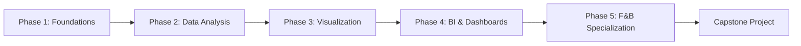

# Data Analysis & Business Intelligence Curriculum
## Your Complete Learning Path to Building Exceptional BI Dashboards

> [!IMPORTANT]
> **Your Goal**: Build a beautifully working, easy-to-use, and engaging business intelligence & analytics dashboard for the everyman.
> 
> **Estimated Timeline**: 6-9 months of focused learning (adjustable based on your pace)
>
> **🤖 AI-Aided Learning**: Throughout this curriculum, you'll find AI assistance markers showing exactly where and how to use AI to accelerate your learning. Look for these icons:
> - **💡 Ask AI**: Questions to ask AI for explanations
> - **⚡ AI Generate**: Tasks AI can generate for you (data, code, queries)
> - **🔎 AI Explain**: Concepts AI can explain in different ways
> - **🤖 AI Debug**: When to use AI for debugging
> - **🤖 AI Review**: Have AI review your work
>
> See [AI_LEARNING_GUIDE.md](../AI_LEARNING_GUIDE.md) for full details on effective AI-aided learning.
> 
> **Philosophy**: Learn by doing. Each module includes hands-on projects that build toward your final dashboard.

---

## 📊 Curriculum Overview

This curriculum is structured in **5 Phases**, progressing from foundational skills to specialized expertise:

---

## Phase 1: Data Foundations (Weeks 1-3)

### Module 1.1: Understanding Data & Business Intelligence
**Duration**: 3 days

**Learning Objectives**:
- Understand what Business Intelligence is and why it matters
- Learn the BI ecosystem: data sources → storage → analysis → visualization → insights
- Understand the difference between data analysis, data analytics, and business intelligence
- Identify stakeholder needs and how BI serves them

**Topics**:
- The BI value chain
- Types of analytics: Descriptive, Diagnostic, Predictive, Prescriptive
- Understanding business questions and KPIs
- The role of dashboards in decision-making
- Introduction to the "everyman" user: designing for non-technical audiences

**Hands-on Project**: 
- Create a concept map of how BI would work in a small restaurant
- Define 10 key questions a restaurant owner would want answered
- Sketch (paper/digital) what insights would be most valuable

**Resources**:
- Read: "The Data Warehouse Toolkit" by Kimball (Chapters 1-2)
- Watch: Introduction to Business Intelligence (YouTube/Coursera)

---

### Module 1.2: Spreadsheet Mastery - Excel/Google Sheets
**Duration**: 2 weeks

**Learning Objectives**:
- Master spreadsheet fundamentals for data manipulation
- Understand data types, structures, and cleanliness
- Perform basic to intermediate analysis
- Create simple visualizations

**Topics**:

**Week 1 - Fundamentals**:
- Data entry and formatting best practices
- Cell references (relative, absolute, mixed)
- Essential functions: SUM, AVERAGE, COUNT, MIN, MAX
- Logical functions: IF, AND, OR, NOT, IFS
- Text functions: CONCATENATE, LEFT, RIGHT, MID, TRIM, UPPER, LOWER
- Date/Time functions: TODAY, NOW, DATE, DATEDIF

**Week 2 - Intermediate Skills**:
- Lookup functions: VLOOKUP, HLOOKUP, INDEX, MATCH, XLOOKUP
- Data validation and dropdown lists
- Conditional formatting for visual insights
- Pivot Tables and Pivot Charts
- Data cleaning: removing duplicates, handling blanks
- Named ranges for cleaner formulas
- Introduction to array formulas

**Hands-on Projects**:
1. **Week 1**: Sales data cleanup - Take messy sales data and clean it properly
2. **Week 2**: Create a sales analysis with pivot tables showing revenue by product, region, and time
3. **Mini-Dashboard**: Build a simple Excel dashboard using pivot tables and charts

**Practice Datasets**:
- Retail sales data (provided/found online)
- Restaurant transaction logs (simulated)

**Resources**:
- ExcelJet tutorials
- Chandoo.org for dashboard inspiration
- Practice datasets from Kaggle

---

### Module 1.3: Data Thinking & Business Metrics
**Duration**: 4 days

**Learning Objectives**:
- Think like an analyst: question → data → insight → action
- Understand common business metrics across industries
- Learn to identify meaningful KPIs
- Understand data granularity and aggregation

**Topics**:
- The analytics mindset: curiosity + skepticism
- Common business metrics:
  - Revenue metrics: Total revenue, revenue growth, revenue per customer
  - Profitability: Gross margin, net margin, operating margin
  - Customer metrics: CAC, LTV, churn rate, retention rate
  - Operational metrics: Inventory turnover, labor cost %, efficiency ratios
- Metrics specific to F&B (preview):
  - Table turnover rate
  - Average check size
  - Food cost percentage
  - Labor cost percentage
  - RevPASH (Revenue Per Available Seat Hour)
- How to define a "good" metric: actionable, accessible, auditable

**Hands-on Project**:
- Take a real business scenario (e.g., coffee shop) and define:
  - 5 critical KPIs to track
  - How you'd calculate each
  - What questions each answers
  - What actions might result from insights

**Resources**:
- Read: "Lean Analytics" by Croll & Yoskovitz
- Refer to industry KPI libraries online

---

## Phase 2: Data Analysis Deep Dive (Weeks 4-7)

### Module 2.1: Statistical Thinking for Business
**Duration**: 1.5 weeks

**Learning Objectives**:
- Understand descriptive statistics
- Identify trends, patterns, and outliers
- Make data-driven comparisons
- Understand correlation vs. causation

**Topics**:
- Measures of central tendency: mean, median, mode
- Measures of dispersion: range, variance, standard deviation, percentiles
- Distributions: normal, skewed, bimodal
- Understanding outliers and when they matter
- Time series basics: trends, seasonality, cycles
- Correlation and its limitations
- Statistical significance (conceptual understanding)

**Hands-on Project**:
- Analyze restaurant sales data:
  - Calculate summary statistics
  - Identify seasonal patterns
  - Find outliers and investigate why
  - Determine which products correlate with high revenue days
  
**Tools**: Excel/Google Sheets, introduction to Google Data Studio

**Resources**:
- Khan Academy Statistics
- "Naked Statistics" by Charles Wheelan (book)

> **🤖 AI Assistance**:
> - **🔍 AI Explain**: "Explain standard deviation and why it matters for business analytics with F&B examples"
> - **💡 Ask AI**: "When should I use median vs mean for restaurant sales analysis?"
> - **⚡ AI Generate**: "Generate sample restaurant sales data (100 days) with seasonal patterns and outliers"

---

### Module 2.2: Data Cleaning & Preparation
**Duration**: 1 week

**Learning Objectives**:
- Master the data cleaning process (80% of analyst work!)
- Handle missing data, inconsistencies, and errors
- Transform data into analysis-ready formats
- Document your data pipeline

**Topics**:
- The data cleaning workflow
- Identifying data quality issues:
  - Missing values
  - Duplicates
  - Inconsistent formatting
  - Incorrect data types
  - Outliers and errors
- Techniques for handling missing data
- Data normalization and standardization
- Reshaping data: wide vs. long format
- Creating derived fields
- Data documentation best practices

**Hands-on Project**:
- **The Messy Dataset Challenge**: Clean a deliberately messy F&B dataset
  - Fix date formats
  - Handle missing values
  - Standardize product names
  - Create calculated fields (profit margin, etc.)
  - Document all transformations

**Tools**: Excel Power Query, Google Sheets, introduction to SQL concepts

**Resources**:
- Data Cleaning tutorials (Kaggle Learn)
- Real-world messy datasets for practice

> **🤖 AI Assistance**:
> - **💡 Ask AI**: "What are the best practices for handling missing values in sales data?"
> - **🤖 AI Debug**: "My data has inconsistent date formats (MM/DD/YYYY and DD-MM-YY). How do I standardize them?"
> - **⚡ AI Generate**: "Create a checklist for data quality assessment"

---

### Module 2.3: Introduction to SQL & Databases
**Duration**: 1.5 weeks

**Learning Objectives**:
- Understand relational database concepts
- Write SQL queries to extract and analyze data
- Join multiple data sources
- Use SQL for aggregation and analysis

**Topics**:

**Week 1 - SQL Basics**:
- What is a database and why use one?
- Relational database concepts: tables, rows, columns, primary keys, foreign keys
- SQL SELECT statements
- Filtering with WHERE
- Sorting with ORDER BY
- Basic aggregations: COUNT, SUM, AVG, MIN, MAX, GROUP BY
- HAVING clause for filtered aggregations

**Week 2 - Intermediate SQL**:
- JOINs: INNER, LEFT, RIGHT, FULL OUTER
- Subqueries
- CASE statements for conditional logic
- Date/time functions in SQL
- String manipulation in SQL
- CTEs (Common Table Expressions) for readable queries
- Window functions: ROW_NUMBER, RANK, LAG, LEAD

**Hands-on Projects**:
1. Set up a sample database (restaurant operations)
2. Write queries to answer business questions:
   - What are our top 10 selling items?
   - Which servers generate the most revenue?
   - What's our daily average check size by day of week?
   - Calculate month-over-month growth rates
3. Build a data extract that could feed a dashboard

**Tools**: 
- SQLite (lightweight, easy to start)
- PostgreSQL (industry standard)
- DB Browser for SQLite (GUI tool)
- Online SQL playgrounds

**Resources**:
- SQLBolt (interactive tutorials)
- Mode Analytics SQL Tutorial
- LeetCode SQL problems

> **🤖 AI Assistance**:
> - **🔍 AI Explain**: "Explain JOIN types (INNER, LEFT, RIGHT, FULL) with restaurant order/customer example"
> - **⚡ AI Generate**: "Write SQL query: Get each server's total sales for last month, sorted highest first. Tables: sales(id, date, server_id, total), servers(id, name)"
> - **💡 Ask AI**: "Show me 5 examples of GROUP BY with HAVING clause"
> - **🤖 AI Debug**: "This SQL gives syntax error: [paste query]. What's wrong?"
> - **⚡ AI Generate**: "Create sample restaurant database schema with sales, products, servers, customers tables"
> - **💡 Ask AI**: "Explain what this SQL query does line by line: [paste complex query]"

---

### Module 2.4: Introduction to Python for Data Analysis (Optional but Recommended)
**Duration**: 2 weeks

> [!NOTE]
> This module is optional but highly recommended. Python will give you superpowers for data manipulation and can complement your dashboard building. You can skip this if you want to focus purely on BI tools, but revisit it later.

**Learning Objectives**:
- Use Python for data manipulation
- Leverage pandas for analysis
- Create basic visualizations
- Automate repetitive data tasks

**Topics**:

**Week 1 - Python Basics**:
- Python syntax fundamentals
- Data types: numbers, strings, lists, dictionaries
- Control flow: if/elif/else, loops
- Functions
- Reading/writing files
- Introduction to libraries

**Week 2 - Pandas & Data Analysis**:
- pandas DataFrames
- Reading data: CSV, Excel, SQL
- Data selection and filtering
- Grouping and aggregation
- Merging and joining data
- Handling missing values
- Creating visualizations with matplotlib/seaborn

**Hands-on Project**:
- Recreate your spreadsheet analysis in Python
- Build a data pipeline that:
  - Loads raw data
  - Cleans it
  - Calculates KPIs
  - Outputs a clean dataset for visualization
  - Generates a simple report

**Tools**: 
- Jupyter Notebooks
- pandas, numpy, matplotlib, seaborn libraries

**Resources**:
- Python for Data Analysis by Wes McKinney
- DataCamp/Codecademy Python courses
- Kaggle Python tutorials

> **🤖 AI Assistance**:
> - **⚡ AI Generate**: "Write Python code to: 1) Load restaurant_sales.csv, 2) Convert date to datetime, 3) Calculate daily total sales, 4) Plot trend. Use pandas and matplotlib"
> - **🤖 AI Debug**: "This pandas code throws KeyError: [paste code]. Why?"
> - **💡 Ask AI**: "Show me 5 common pandas operations for analyzing sales data"
> - **⚡ AI Generate**: "Write pandas code to group by category and calculate sum, mean, and count"
> - **🔍 AI Explain**: "Explain pandas DataFrames in simple terms with restaurant data example"

---

## Phase 3: Data Visualization & Design (Weeks 8-11)

### Module 3.1: Data Visualization Principles
**Duration**: 1 week

**Learning Objectives**:
- Understand how humans perceive visual information
- Learn when to use which chart type
- Design visualizations that communicate clearly
- Avoid common visualization mistakes

**Topics**:
- **The Purpose of Visualization**: exploration vs. explanation
- **Visual Perception**:
  - Preattentive attributes (color, size, position)
  - Gestalt principles (proximity, similarity, enclosure)
  - How we compare: position, length, angle, area, color
- **Chart Types & When to Use Them**:
  - Comparison: bar charts, column charts
  - Distribution: histograms, box plots
  - Composition: pie charts (used sparingly!), stacked bars, treemaps
  - Relationship: scatter plots, bubble charts
  - Trends over time: line charts, area charts
  - Part-to-whole: waterfall charts, funnel charts
- **Color Theory**:
  - Color psychology in business
  - Accessibility (colorblind-friendly palettes)
  - Using color meaningfully (not decoratively)
  - Sequential vs. diverging vs. categorical palettes
- **Common Mistakes to Avoid**:
  - Misleading axes
  - Chartjunk and clutter
  - 3D charts (almost always bad)
  - Using pie charts for many categories
  - Poor color choices

**Hands-on Project**:
- **Visualization Makeover**: Take 5 poorly designed charts and redesign them
- Create a chart type selection guide for your own reference
- Design a color palette for your future dashboard

**Resources**:
- "Storytelling with Data" by Cole Nussbaumer Knaflic (MUST READ)
- "The Visual Display of Quantitative Information" by Edward Tufte
- From Data to Viz (website - chart selection guide)

> **🤖 AI Assistance**:
> - **💡 Ask AI**: "When should I use bar chart vs line chart vs scatter plot? Give decision criteria"
> - **🤖 AI Review**: Share chart image: "Is this the right chart type for showing sales trends? What could be better?"
> - **💡 Ask AI**: "Give me a colorblind-friendly color palette for business dashboards (5 colors with hex codes)"
> - **💡 Ask AI**: "What are the most common data visualization mistakes and how to avoid them?"

---

### Module 3.2: Dashboard Design Principles
**Duration**: 1.5 weeks

**Learning Objectives**:
- Understand what makes a dashboard effective
- Learn dashboard design patterns
- Design for your audience (the everyman!)
- Create wireframes and mockups

**Topics**:
- **Dashboard Types**:
  - Strategic (executive) dashboards: high-level KPIs, trends
  - Analytical dashboards: deep-dive exploration
  - Operational dashboards: real-time monitoring
  - Tactical dashboards: department-specific metrics
- **Design Principles for Dashboards**:
  - The 5-second rule: can you grasp the main insight in 5 seconds?
  - Information hierarchy: most important info gets prime real estate
  - White space is your friend
  - Consistency in design language
  - Progressive disclosure: overview first, details on demand
- **Layout Best Practices**:
  - F-pattern and Z-pattern reading
  - Grid systems for alignment
  - Grouping related metrics
  - Effective use of space
- **Interactivity Design**:
  - When to use filters
  - Drill-down patterns
  - Tooltips and details
  - Reset and refresh patterns
- **Designing for "The Everyman"**:
  - Avoid jargon
  - Provide context (comparisons, benchmarks, targets)
  - Use familiar metaphors
  - Include help/guidance
  - Make insights obvious
- **Mobile Considerations**: responsive dashboard design

**Hands-on Projects**:
1. **Analyze Existing Dashboards**: Review 10 public dashboards, critique them
2. **Wireframe Creation**: Design wireframes for 3 different dashboard types
3. **User Persona Development**: Create personas for your target "everyman" users
4. **Dashboard Mockup**: Create a detailed mockup (Figma/Sketch/Paper) for an F&B dashboard

**Tools**:
- Figma or Adobe XD (for mockups)
- Pen and paper (wireframing)
- Dashboard inspiration sites

**Resources**:
- "Information Dashboard Design" by Stephen Few
- Dashboard design galleries (Tableau Public, Dribbble)
- Andy Kriebel's Makeover Monday

> **🤖 AI Assistance**:
> - **🤖 AI Review**: Share wireframe/mockup: "Review this dashboard layout for an F&B operator. Is the hierarchy clear?"
> - **💡 Ask AI**: "What are the best practices for designing mobile-responsive dashboards?"
> - **⚡ AI Generate**: "Generate 3 dashboard wireframe layout ideas for restaurant operations"

---

### Module 3.3: BI Tools - Hands-on with Visualization Platforms
**Duration**: 2.5 weeks

**Learning Objectives**:
- Master at least one major BI tool
- Create interactive visualizations
- Build your first dashboard
- Understand tool selection criteria

**Topics**:

**Week 1 - Tool Overview & Selection**:
- **Popular BI Tools Comparison**:
  - Tableau: powerful, intuitive, expensive
  - Power BI: Microsoft ecosystem, affordable, growing
  - Google Data Studio: free, cloud-based, limited
  - Metabase: open-source, simple, self-hosted
  - Apache Superset: open-source, powerful, technical
- Choosing the right tool for your project
- Tool setup and environment

**Weeks 2-3 - Deep Dive (Pick Your Tool)**:

**For Tableau/Power BI**:
- Connecting to data sources
- Creating calculated fields
- Building individual visualizations
- Using filters and parameters
- Creating dashboards
- Adding interactivity
- Publishing and sharing
- Performance optimization

**For Google Data Studio**:
- Data source connections
- Blending data
- Creating charts
- Filters and date ranges
- Calculated fields with formulas
- Dashboard creation
- Sharing and permissions

**For Open-Source (Metabase/Superset)**:
- Installation and setup
- Database connections
- Query builder
- Creating questions/charts
- Building dashboards
- User management
- Embedding options

**Hands-on Projects**:
1. **Connect to Your Data**: Use your cleaned dataset from Phase 2
2. **Build Individual Visualizations**: Create 10-15 different charts exploring your data
3. **First Dashboard**: Build a complete dashboard with:
   - 5-7 key visualizations
   - Filters for interactivity
   - Clear title and context
   - Consistent design
4. **User Testing**: Show to a non-technical friend, get feedback, iterate

**Recommended Focus**: **Power BI** or **Tableau** for career prospects, **Google Data Studio** for free/quick solutions, **Metabase** for open-source/customizable needs

**Resources**:
- Tableau Public gallery
- Power BI community
- Official tool documentation
- YouTube tutorials for your chosen tool

> **🤖 AI Assistance**:
> - **💡 Ask AI**: "Compare Tableau vs Power BI vs Google Data Studio for small F&B business - which should I learn first?"
> - **🤖 AI Debug**: "My dashboard is slow to load (5+ seconds). What are common performance issues and fixes?"
> - **⚡ AI Generate**: "Create DAX formula for calculating Year-over-Year growth percentage"

---

## Phase 4: Business Intelligence & Advanced Dashboards (Weeks 12-15)

### Module 4.1: Data Storytelling
**Duration**: 1 week

**Learning Objectives**:
- Transform data into compelling narratives
- Structure insights for maximum impact
- Present to different audiences
- Create action-oriented recommendations

**Topics**:
- **The Data Story Arc**:
  - Setting: context and background
  - Rising action: the problem or question
  - Climax: the insight or finding
  - Resolution: the recommendation
- **Structuring Your Story**:
  - Start with the ending (the "so what?")
  - Support with evidence
  - Anticipate questions
  - Call to action
- **Audience Adaptation**:
  - Executives: concise, strategic, business impact
  - Managers: actionable, operational, detailed
  - Peers: technical, methodological
  - Non-technical: simplified, visual, relatable
- **Visual Storytelling Techniques**:
  - Annotation and highlighting
  - Progressive reveal
  - Comparison and context
  - Using metaphors and analogies
- **Presenting Insights**:
  - Structure of a data presentation
  - Handling questions
  - Live demos vs. static reports

**Hands-on Project**:
- **Create a Data Story**: Take your dashboard and create a presentation
  - 5-minute presentation
  - Tell a story with your data
  - Include recommendations
  - Practice presenting to someone

**Resources**:
- "Storytelling with Data" by Cole Nussbaumer Knaflic
- TED talks about data
- Data journalism examples (The Pudding, FiveThirtyEight)

> **🤖 AI Assistance**:
> - **🤖 AI Review**: "Review my data presentation outline. Is the story clear and compelling?"
> - **💡 Ask AI**: "How do I present negative findings (declining sales) in a constructive way?"

---

### Module 4.2: Advanced Dashboard Techniques
**Duration**: 1.5 weeks

**Learning Objectives**:
- Implement advanced interactivity
- Create dynamic and responsive dashboards
- Optimize dashboard performance
- Build reusable templates

**Topics**:
- **Advanced Interactivity**:
  - Drill-down/drill-through patterns
  - Cross-filtering across visuals
  - Dynamic titles and text
  - Bookmarks and saved views
  - Mobile layouts
- **Parameters and Dynamic Elements**:
  - What-if analysis
  - Date range selectors
  - Dynamic measure selection
  - Dynamic benchmarking
- **Calculated Fields & DAX/Formulas**:
  - Time intelligence: YTD, MTD, prior period
  - Ratio and percentage calculations
  - Moving averages and trends
  - Ranking and top N
  - Conditional formatting based on logic
- **Performance Optimization**:
  - Data model design
  - Reducing query load
  - Efficient calculations
  - Extract vs. live connections
- **Dashboard Organization**:
  - Multiple pages/tabs
  - Navigation design
  - Consistent style guides
  - Reusable templates

**Hands-on Project**:
- **Dashboard 2.0**: Rebuild your earlier dashboard with:
  - Advanced interactivity
  - Multiple pages
  - Dynamic date filtering
  - Drill-through functionality
  - Performance optimizations
  - Professional polish

**Tools**: Your chosen BI platform (Tableau/Power BI/etc.)

> **🤖 AI Assistance**:
> - **⚡ AI Generate**: "Write DAX formula to calculate: Prior Year same month sales for comparison"
> - **🔍 AI Explain**: "Explain the difference between calculated columns and measures in Power BI with examples"

---

### Module 4.3: Data Modeling for BI
**Duration**: 1.5 weeks

**Learning Objectives**:
- Understand dimensional modeling
- Design star and snowflake schemas
- Build efficient data models
- Understand ETL concepts

**Topics**:
- **Dimensional Modeling Concepts**:
  - Fact tables vs. dimension tables
  - Grain of a fact table
  - Star schema design
  - Snowflake schema design
  - Slowly changing dimensions (SCD)
- **Building a Data Model**:
  - Identifying facts and dimensions
  - Creating relationships
  - Surrogate keys
  - Date dimensions
  - Role-playing dimensions
- **Data Warehousing Basics**:
  - OLTP vs. OLAP
  - ETL (Extract, Transform, Load) concepts
  - Data refresh strategies
  - Historical data tracking
- **Best Practices**:
  - Naming conventions
  - Documentation
  - Data lineage
  - Testing and validation

**Hands-on Project**:
- **Design a Data Model for F&B**:
  - Create a dimensional model for a restaurant
  - Identify fact tables (Sales, Inventory, etc.)
  - Design dimension tables (Products, Customers, Time, Location, etc.)
  - Implement in your BI tool
  - Load sample data
  - Build a dashboard on top of it

**Resources**:
- "The Data Warehouse Toolkit" by Ralph Kimball
- Dimensional modeling patterns

> **🤖 AI Assistance**:
> - **⚡ AI Generate**: "Create a star schema design for F&B analytics (fact and dimension tables)"
> - **🔍 AI Explain**: "Explain slowly changing dimensions (SCD) with restaurant menu example (prices change over time)"
> - **💡 Ask AI**: "When should I use snowflake schema vs star schema for BI?"

---

## Phase 5: F&B Operations Management & Analytics Specialization (Weeks 16-20)

### Module 5.1: F&B Industry Deep Dive
**Duration**: 1 week

**Learning Objectives**:
- Understand F&B business operations
- Learn industry-specific metrics and challenges
- Identify key data sources in F&B
- Understand regulatory and compliance aspects

**Topics**:
- **F&B Business Models**:
  - Quick Service (QSR)
  - Fast Casual
  - Full Service / Fine Dining
  - Cafes & Bakeries
  - Catering
  - Cloud kitchens
- **Operational Workflows**:
  - Front of house: ordering, serving, payment
  - Back of house: prep, cooking, inventory
  - Supply chain: ordering, receiving, storage
  - Staff management: scheduling, performance
- **Key Stakeholders & Their Needs**:
  - Owner/GM: profitability, growth
  - Chef: food cost, waste, menu performance
  - Front-of-house manager: service quality, table turnover
  - Marketing: customer behavior, promotions effectiveness
- **Data Sources in F&B**:
  - POS (Point of Sale) systems
  - Inventory management systems
  - Employee scheduling systems
  - Reservation systems
  - Customer feedback (reviews, surveys)
  - Third-party delivery platforms
- **Industry Challenges**:
  - Thin margins (3-5% typical)
  - High labor turnover
  - Seasonality
  - Food waste
  - Competition

**Hands-on Activity**:
- **Shadow a Restaurant**: If possible, spend a day observing a restaurant
- Interview someone in F&B about their data needs
- Map out the complete data flow in a restaurant
- Identify 20 questions a dashboard should answer

**Resources**:
- "Restaurant Success by the Numbers" by Roger Fields
- National Restaurant Association resources
- F&B industry reports

> **🤖 AI Assistance**:
> - **💡 Ask AI**: "What are the key differences in metrics between QSR, fast casual, and fine dining?"
> - **⚡ AI Generate**: "Create list of 30 questions an F&B dashboard should answer for different stakeholder roles"

---

### Module 5.2: F&B Specific Metrics & KPIs
**Duration**: 1 week

**Learning Objectives**:
- Master F&B specific metrics
- Calculate and interpret these metrics
- Understand benchmarks and targets
- Build a comprehensive F&B KPI framework

**Topics**:
- **Revenue Metrics**:
  - Total sales (by time period, location, channel)
  - Average check / ticket size
  - Revenue per table
  - RevPASH (Revenue Per Available Seat Hour)
  - Sales mix by category (food vs. beverage)
  - Dine-in vs. takeout vs. delivery split
- **Cost Metrics**:
  - **Food Cost %**: (COGS / Food Revenue) × 100
    - Target: 28-35% typically
    - By item, category, overall
  - **Beverage Cost %**: similar to food cost
    - Target: 18-24% for beer/wine, 15-20% for liquor
  - **Prime Cost**: (COGS + Labor) × 100 / Revenue
    - Target: under 60%
  - **Labor Cost %**: (Total Labor / Revenue) × 100
    - Target: 25-35% depending on service model
  - **Occupancy/Rent %**: typically 6-10%
- **Profitability Metrics**:
  - Gross profit margin
  - Operating profit margin
  - Net profit margin
  - EBITDA
  - Break-even point
- **Operational Efficiency**:
  - Table turnover rate: sittings per table per shift
  - Seat occupancy rate
  - Average wait time
  - Order fulfillment time
  - Service time (from order to delivery)
  - Staff productivity (revenue per labor hour)
- **Inventory Metrics**:
  - Inventory turnover ratio: COGS / Average Inventory
  - Days of inventory on hand
  - Waste percentage
  - Theft/variance
- **Customer Metrics**:
  - Customer acquisition cost (CAC)
  - Customer lifetime value (CLV)
  - Repeat customer rate
  - Average frequency
  - Net Promoter Score (NPS)
  - Review ratings (Yelp, Google, etc.)
- **Menu Analytics**:
  - Menu item popularity (itemsold)
  - Menu item profitability (profit per item)
  - Menu engineering matrix (star/plow horse/puzzle/dog)
  - Contribution margin by item

**Hands-on Projects**:
1. Build a KPI calculator in Excel for each metric
2. Analyze sample F&B data and calculate all key metrics
3. Create benchmarks and alerts (what's good vs. concerning)
4. Build a "KPI Dashboard" in your BI tool

**Resources**:
- Restaurant Owner's Operating Manual
- F&B KPI databases and benchmarks
- Toast, Square, or other POS company resources

> **🤖 AI Assistance**:
> - **💡 Ask AI**: "Explain why prime cost % is more important than just food cost % or labor cost % alone"
> - **💡 Ask AI**: "What are typical target ranges for food cost %, labor cost %, and prime cost % by restaurant type?"
> - **⚡ AI Generate**: "Create formula templates for calculating all major F&B KPIs (food cost %, RevPASH, table turnover, etc.)"
> - **💡 Ask AI**: "Explain menu engineering matrix - how to classify items as Stars, Plow Horses, Puzzles, and Dogs"

---

### Module 5.3: F&B Analytics & Dashboards
**Duration**: 2 weeks

**Learning Objectives**:
- Design dashboards for different F&B roles
- Implement F&B specific analyses
- Create actionable insights for F&B operations
- Build a complete F&B BI solution

**Topics**:

**Week 1 - Analytics Use Cases**:
- **Sales Analysis**:
  - Sales trends (daily, weekly, monthly, seasonal)
  - Day-part analysis (breakfast, lunch, dinner)
  - Product mix analysis
  - Promotion effectiveness
- **Menu Optimization**:
  - Menu engineering (profitability vs. popularity matrix)
  - Pricing analysis
  - Cross-sell and upsell patterns
  - Menu item lifecycle
- **Operational Analysis**:
  - Labor scheduling optimization
  - Peak hour identification
  - Service speed analysis
  - Capacity planning
- **Financial Analysis**:
  - Prime cost tracking and alerts
  - Variance analysis (actual vs. budget)
  - Cash flow monitoring
  - Profitability by location/channel
- **Customer Analysis**:
  - Customer segmentation
  - Behavior patterns
  - Loyalty program effectiveness
  - Feedback analysis

**Week 2 - Dashboard Building**:
- **Executive Dashboard**: High-level KPIs for owner/GM
- **Operations Dashboard**: Real-time operational metrics
- **Kitchen/Chef Dashboard**: Food cost, waste, menu performance
- **Marketing Dashboard**: Customer behavior and promotions
- **Financial Dashboard**: Detailed P&L and financial health

**Hands-on Project**:
- **Build a Complete F&B Analytics Solution**:
  - Get/create realistic F&B dataset (or use real anonymized data)
  - Design data model
  - Build 3-5 specialized dashboards
  - Include drill-down capabilities
  - Add alerts and notifications
  - Create a user guide
  - Present to a mock stakeholder

**Tools**: Your chosen BI platform + potential integrations

**Resources**:
- F&B dashboard templates (Tableau Public, Power BI gallery)
- Case studies from BI vendors
- Restaurant analytics platforms (Toast, Upserve, etc.) for inspiration

> **🤖 AI Assistance**:
> - **⚡ AI Generate**: "Generate realistic F&B transaction dataset (1000 rows) with: date, item, category, price, quantity, payment method"
> - **🤖 AI Review**: "Review my F&B dashboard design. Does it answer the key operational questions?"
> - **💡 Ask AI**: "What alerts/thresholds should I set for F&B KPI monitoring?"

---

### Module 5.4: Advanced F&B Analytics
**Duration**: 1 week

**Learning Objectives**:
- Implement predictive analytics for F&B
- Conduct basket analysis
- Build forecasting models
- Optimize inventory and pricing

**Topics**:
- **Demand Forecasting**:
  - Time series forecasting for sales
  - Seasonality adjustment
  - Event impact analysis
  - Weather impact correlation
- **Inventory Optimization**:
  - Par level calculations
  - Reorder point optimization
  - ABC analysis (high/medium/low value items)
  - Waste reduction strategies
- **Pricing Optimization**:
  - Price elasticity analysis
  - Dynamic pricing opportunities
  - Combo deal effectiveness
- **Market Basket Analysis**:
  - Item affinity (what sells together)
  - Upsell opportunities
  - Menu bundling recommendations
- **Predictive Maintenance**:
  - Equipment failure prediction
  - Maintenance scheduling optimization
- **Staff Analytics**:
  - Performance scoring
  - Optimal scheduling
  - Turnover prediction

**Hands-on Project**:
- Choose 2-3 advanced topics and implement:
  - Sales forecasting model
  - Market basket analysis
  - Inventory optimization recommendation engine
- Build a dashboard showing the predictions/recommendations

**Tools**: 
- Your BI tool + potentially Python for modeling
- Forecasting features in Tableau/Power BI

> **🤖 AI Assistance**:
> - **🔍 AI Explain**: "Explain market basket analysis for restaurants - how to find which items sell together"
> - **⚡ AI Generate**: "Create Python code for simple sales forecasting using moving average"
> - **💡 Ask AI**: "What factors should I consider when forecasting restaurant sales (seasonality, weather, events)?"

---

## Phase 6: Capstone Project - Your BI Dashboard for the Everyman (Weeks 21-24)

### The Ultimate Project: Build Your Production-Ready BI Dashboard

**Objective**: Create a beautifully working, easy-to-use, and engaging business intelligence & analytics dashboard specifically designed for F&B operators who are not data experts.

**Project Requirements**:

1. **Target User**: Small to medium F&B business owner or manager (the "everyman")
2. **Use Case**: Complete operational and financial oversight
3. **Features**:
   - Multiple dashboard views (summary, sales, operations, financial, customer)
   - Interactive filtering and drill-down
   - Mobile-friendly design
   - Automated data refresh (if possible)
   - Alerts for important thresholds
   - Export/share capabilities
   - Help/onboarding for new users

**Deliverables**:
1. **Data Layer**:
   - Sample database with realistic F&B data (or connect to real data)
   - Documented data model
   - ETL process or data preparation scripts
2. **Dashboard Application**:
   - 5+ interconnected dashboards
   - Professional design with consistent theme
   - Full interactivity
   - Performance optimized
3. **Documentation**:
   - User guide
   - KPI definitions and calculations
   - Data dictionary
   - Setup/deployment guide
4. **Presentation**:
   - Demo video (5-10 minutes)
   - Use case walkthrough
   - Design decisions explanation
   - Future enhancements roadmap

**Timeline**:
- **Week 1**: Planning, data gathering, wireframing
- **Week 2**: Data modeling and preparation
- **Week 3**: Dashboard building
- **Week 4**: Testing, refinement, documentation, presentation

**Success Criteria**:
- [ ] A non-technical person can navigate and understand the dashboard
- [ ] Answers the 20+ key questions F&B operators have
- [ ] Looks professional and modern
- [ ] Performs well (loads quickly, responsive)
- [ ] You're proud to show it in a portfolio or interview!

> **🤖 AI Assistance**:
> - **⚡ AI Generate**: "Create comprehensive sample F&B dataset with all tables needed for complete analytics (sales, inventory, staff, customers)"
> - **🤖 AI Review**: "Review my complete capstone project. What's missing? What could be improved?"
> - **💡 Ask AI**: "What are must-have features for an F&B dashboard targeting small restaurant owners?"
> - **💡 Ask AI**: "How do I explain technical concepts (like YoY growth) to non-technical users in my dashboard?"

---

## 🎯 Learning Resources & Tools Summary

### Must-Read Books
1. **"Storytelling with Data"** by Cole Nussbaumer Knaflic - Visualization bible
2. **"The Data Warehouse Toolkit"** by Ralph Kimball - Data modeling essential
3. **"Information Dashboard Design"** by Stephen Few - Dashboard design
4. **"Lean Analytics"** by Alistair Croll & Benjamin Yoskovitz - Metrics thinking

### Online Learning Platforms
- **Coursera**: Google Data Analytics Certificate, IBM Data Analyst
- **DataCamp**: Hands-on data analysis and BI courses
- **Udemy**: Tool-specific courses (Tableau, Power BI)
- **LinkedIn Learning**: Business intelligence pathways
- **YouTube**: Free tutorials for everything

### Practice Datasets
- **Kaggle**: Thousands of datasets including restaurant/retail
- **data.world**: Curated datasets
- **Google Dataset Search**: Find specific data
- **Mock Data Generators**: Mockaroo, Generatedata

### Communities
- **Reddit**: r/BusinessIntelligence, r/dataisbeautiful, r/tableau
- **Tableau Community**: Forums, Makeover Monday
- **Power BI Community**: Forums, custom visuals
- **Stack Overflow**: For technical questions

### Tools You'll Use
- **Spreadsheets**: Excel or Google Sheets
- **Database**: PostgreSQL or SQLite
- **BI Platform**: Tableau, Power BI, Google Data Studio, or Metabase
- **Design**: Figma (for mockups)
- **Optional**: Python with Jupyter, pandas, matplotlib
- **Sample Data**: POS systems test data, Kaggle datasets

---

## 📅 Sample Study Schedule

### Full-Time Learning (40 hours/week):
- **Duration**: 6 months
- **Weekly Structure**:
  - Monday-Thursday: New content, tutorials, learning (6 hours/day)
  - Friday: Hands-on project work (8 hours)
  - Weekend: Review, catch-up, exploration (4 hours)

### Part-Time Learning (10-15 hours/week):
- **Duration**: 9-12 months
- **Weekly Structure**:
  - Weekday evenings: 1-2 hours/day (learning + practice)
  - Weekends: 4-6 hours (project work)
  - Focus on depth over speed

### Intensive Bootcamp Style (60+ hours/week):
- **Duration**: 3-4 months
- **Not recommended unless you can fully commit**

---

## 🎓 Assessment & Milestones

### Phase Checkpoints:
After each phase, you should be able to:

**Phase 1**: 
- [ ] Explain what BI is and why it matters
- [ ] Create complex spreadsheet analyses with pivot tables
- [ ] Define meaningful KPIs for a business

**Phase 2**:
- [ ] Clean and prepare data for analysis
- [ ] Write SQL queries to extract insights
- [ ] Perform statistical analysis
- [ ] Optionally: manipulate data with Python

**Phase 3**:
- [ ] Choose the right chart for any scenario
- [ ] Design effective dashboards
- [ ] Build interactive visualizations in a BI tool
- [ ] Critique and improve existing dashboards

**Phase 4**:
- [ ] Tell compelling stories with data
- [ ] Build advanced, performant dashboards
- [ ] Design proper data models
- [ ] Create action-oriented insights

**Phase 5**:
- [ ] Understand F&B operations thoroughly
- [ ] Calculate and interpret all key F&B metrics
- [ ] Build specialized F&B dashboards
- [ ] Provide strategic recommendations from data

**Phase 6**:
- [ ] Deliver a portfolio-worthy project
- [ ] Demonstrate end-to-end BI skills
- [ ] Explain technical decisions to non-technical audiences

---

## 💡 Tips for Success

### Learning Strategies:
1. **Project-Based Learning**: Build something with each new skill immediately
2. **Practice Daily**: Even 30 minutes a day is better than 8 hours once a week
3. **Learn in Public**: Share your work, get feedback, iterate
4. **Join Communities**: Ask questions, help others, stay motivated
5. **Build a Portfolio**: Document everything you build
6. **Seek Feedback**: Show your dashboards to real users early and often

### Avoiding Common Pitfalls:
- **Don't over-analyze**: Done is better than perfect, especially for practice projects
- **Don't tool-hop**: Pick one BI tool and master it before trying others
- **Don't skip the fundamentals**: Spreadsheet and SQL skills are essential
- **Don't ignore design**: Dashboard aesthetics matter for "everyman" users
- **Don't work in isolation**: Real users will reveal issues you never imagined

### Staying Motivated:
- Set small, achievable weekly goals
- Celebrate completions (each module, each project)
- Connect with others on the same journey
- Remind yourself of your ultimate goal
- Take breaks when needed - this is a marathon, not a sprint

---

## 🚀 What Comes After This Curriculum?

### Career Paths:
- **Business Intelligence Analyst**
- **Data Analyst**
- **Dashboard Developer**
- **Analytics Consultant**
- **F&B Business Analyst**
- **Self-employed BI Consultant** (build dashboards for small businesses)
- **Product Manager** (data-driven products)

### Continuing Education:
- **Data Engineering**: Learn to build robust data pipelines
- **Advanced Analytics**: Machine learning, AI
- **Leadership**: Grow into analytics management
- **Specialization**: Industry-specific expertise deepening

### Building Your Business:
If you want to offer BI dashboards as a service:
1. Build an impressive portfolio (3-5 complete projects)
2. Create templates/starter kits for common industries
3. Develop a clear service offering
4. Market to small businesses who need analytics but lack expertise
5. Consider a SaaS model or consulting services

---

## 📝 Final Notes

> [!TIP]
> **Remember Your Goal**: Build a beautifully working, easy-to-use, and engaging business intelligence & analytics dashboard for the everyman.
> 
> Every skill in this curriculum serves that goal. When in doubt, think: "Will this make my dashboard more beautiful, easier to use, or more engaging for someone who isn't a data expert?"

**Your unique value proposition**: You're not just building dashboards - you're making data accessible to everyone. You're democratizing business intelligence. That's powerful.

**This curriculum is a living document**: As you progress, you might find you want to go deeper in certain areas or skip others. That's okay! Adapt it to your needs, pace, and interests.

**Most importantly**: Enjoy the journey. Data analysis and BI are incredibly rewarding fields. You're learning to turn raw numbers into insights that drive real business decisions. That's genuinely valuable work.

---

## Ready to Start?

Your first assignment:
1. Set up your learning environment (spreadsheet software, pick a BI tool to try)
2. Find or create a small F&B dataset to work with throughout the curriculum
3. Complete Module 1.1 this week
4. Share your progress with someone (accountability!)

**Good luck on your BI journey! You've got this.** 🎉📊

---

*Last Updated: January 2026*
*Created for: Your personalized BI learning journey*
